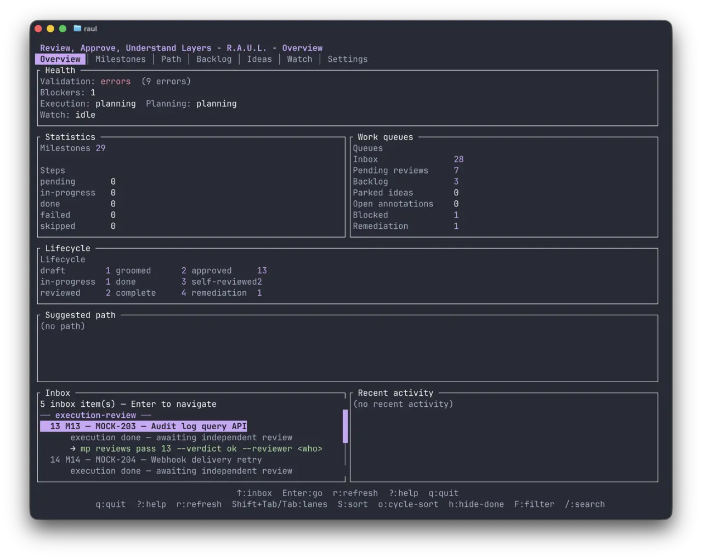
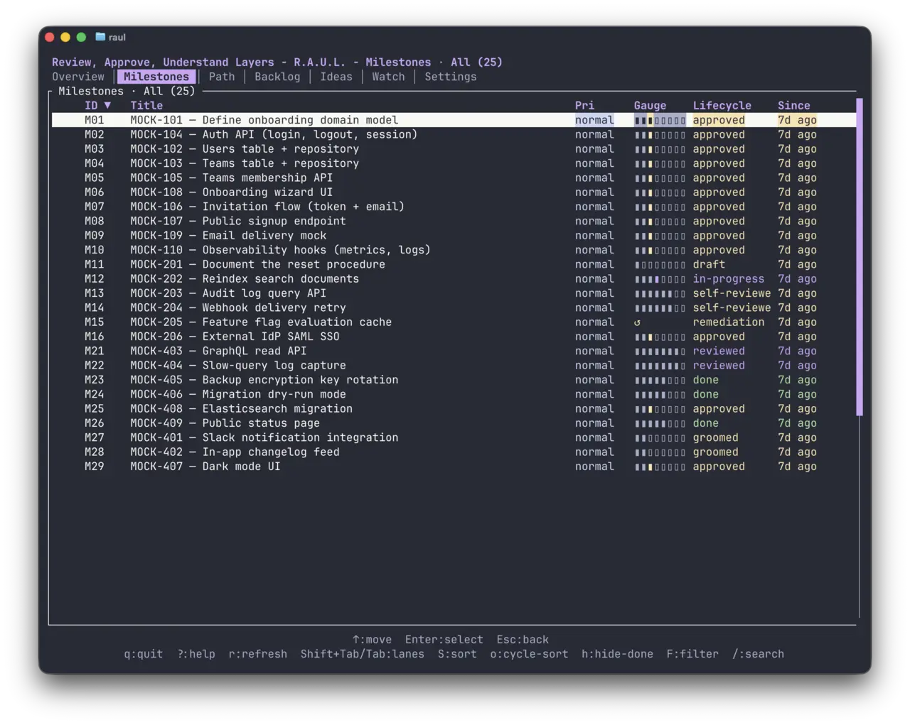
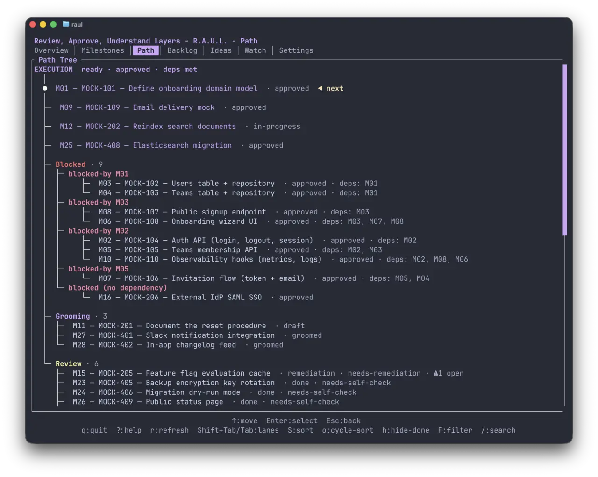
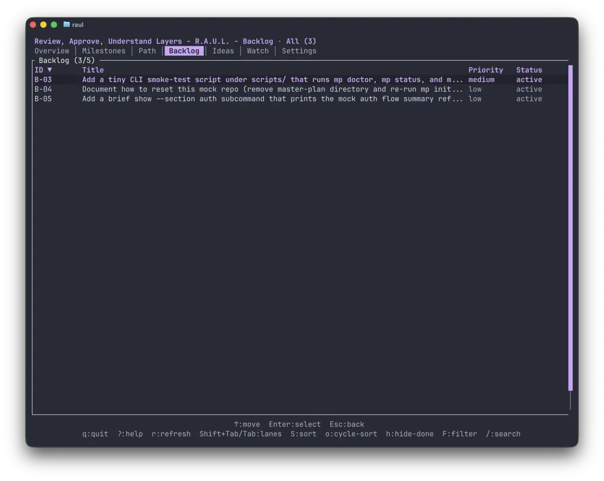
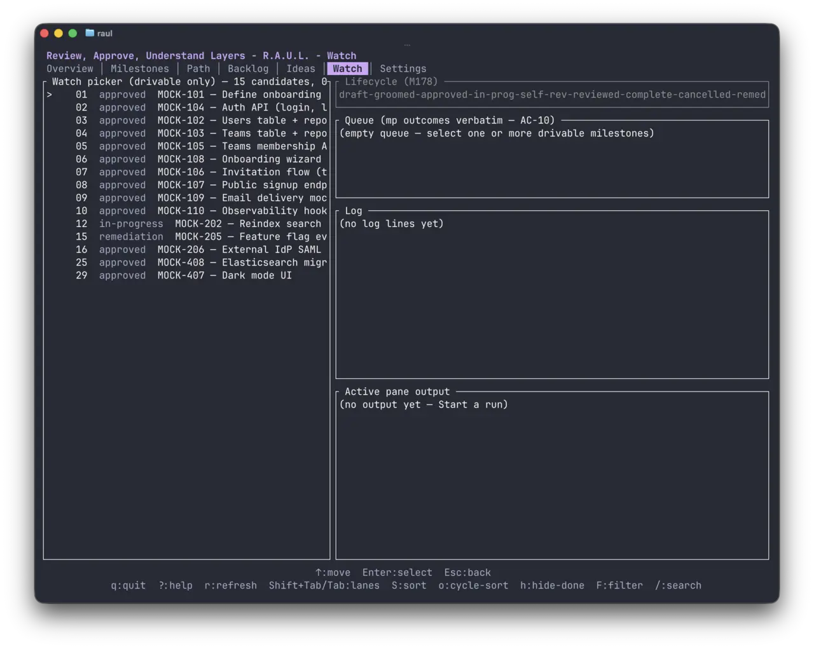
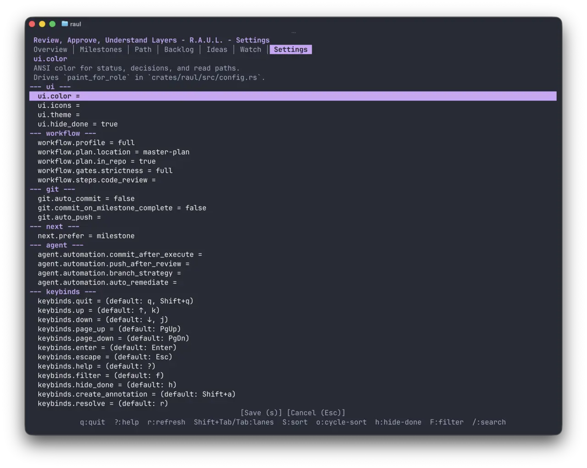
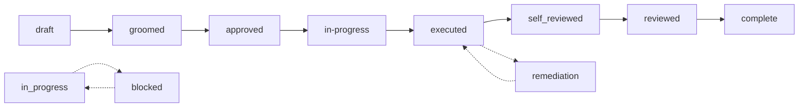

<p align="center">
  
</p>

# master-plan

> **A project management tool for coding agents, with a TUI for humans.**

master-plan is a toolkit that turns [crafted prompts](https://github.com/lthiagol/crafted-prompt-development)
into shipped work. The **`mp`** CLI is for coding agents; the **`raul`** terminal UI is
for human review. Humans stay the real users, working through agents that call `mp` on
their behalf — every interaction is meant to be AI-assisted. The plan is a directory of
JSON files owned by `mp`, never hand-edited, validated on every write, and reviewed through `raul`.

## Contents

1. [What is master-plan?](#1-what-is-master-plan)
2. [Why use it?](#2-why-use-it)
3. [The two CLIs at a glance](#3-the-two-clis-at-a-glance)
4. [Screenshots](#4-screenshots)
5. [Installation](#5-installation)
6. [Quick start (60 seconds)](#6-quick-start-60-seconds)
7. [How it works (the model)](#7-how-it-works-the-model)
8. [Documentation](#8-documentation)
9. [Releases & changelog](#9-releases--changelog)
10. [Contributing](#10-contributing)
11. [License](#11-license)

## 1. What is master-plan?

master-plan is the **implementation of [Crafted-Prompt Development (CPD)](https://github.com/lthiagol/crafted-prompt-development)**
for projects that use coding agents. CPD treats the prompt as the primary durable artifact — a
structured, reviewed, agent-friendly brief that captures intent, scope, acceptance criteria, and
the audit trail from execution. master-plan is the storage and tooling that makes CPD real in
your repository.

It ships as two CLIs over one source of truth:

- `mp` — the writer. Used by coding agents (and by anyone scripting). JSON in, JSON out by
  default.
- `raul` — the reader. Used by humans to browse, review, and triage. Styled terminal UI,
  read-only.

The plan itself is a directory of JSON files (the `master-plan/` folder in your project) that
`mp` mediates. Agents create and mutate the plan through `mp`; humans inspect it through `raul`
or the generated reports.

## 2. Why use it?

Because agentic coding rarely fails at code generation — it fails at keeping intent, scope, and
review in sync across many short-lived executions. master-plan gives every execution a durable
home: a structured prompt that captures what was asked, what was done, what was reviewed, and
what remains.

- **Crafted prompts, not specs.** Each unit of work is a prompt — intent, scope, falsifiable
  acceptance criteria, suggested steps — that an agent consumes and executes.
- **Mediated, not hand-edited.** Every read and write goes through `mp`. No drift, no forgotten
  gates, no audit gap.
- **Two-round review built in.** Round 1 is the runner self-review; round 2 is an external
  agent review with a fresh lens. Findings, remediations, and re-review are tracked on the
  prompt itself.
- **Minimal ceremony by default.** One-line tracks for tiny fixes; full prompts with work
  packages only when scope justifies them. You never write more ceremony than the work needs.
- **Audit trail survives.** Discoveries, deviations, deferrals, and remaining work all live on
  the prompt — so the next execution starts with full context.

## 3. The two CLIs at a glance

| Tool   | Audience                | Default output | Purpose                                    |
|--------|-------------------------|----------------|--------------------------------------------|
| `mp`   | Agents (and scripters)  | JSON           | Create, mutate, and read the plan          |
| `raul` | Humans                  | Styled TUI     | Browse, review, and triage the plan (read-only) |

**Rule of thumb:** if you're an agent, reach for `mp`. If you're a human checking what's going
on, reach for `raul`. For the upstream methodology — the 13 stages, the coordinator/runner
roles, the review loop — see
[Crafted-Prompt Development](https://github.com/lthiagol/crafted-prompt-development).

## 4. Screenshots


*`raul` — overview board.*


*`raul` — milestone list with lifecycle lanes.*


*`raul` — execution path (`mp path`).*


*`raul` — backlog.*


*`raul` — live updates (watch mode).*


*`raul` — settings.*

## 5. Installation

Pick the channel that matches what you want. **Stable** ships released, tagged
versions — production-grade, matches what the docs describe. **DEV** tracks the
latest commits on `wip` — newest features, but may contain bugs.

### Homebrew

The [`lthiagol/homebrew-tap`](https://github.com/lthiagol/homebrew-tap) repo
carries both formulas. Tap it once, then pick one.

> **Install one at a time.** Both formulas install binaries named `mp` and
> `raul`, so Homebrew refuses to have them installed simultaneously. To switch
> channels, `brew uninstall` the current formula before installing the other.
> If you need both available at once, install one from source into a separate
> `CARGO_TARGET_DIR` per branch instead.

#### Stable tap (recommended)

```bash
brew tap lthiagol/tap https://github.com/lthiagol/homebrew-tap
brew install master-plan
mp install --harness opencode,cursor,pi   # adds skills + harness hooks for OpenCode / Cursor / Pi
mp doctor                                  # sanity-check the install
```

#### DEV tap

Latest development version. May contain bugs.

```bash
brew tap lthiagol/tap https://github.com/lthiagol/homebrew-tap
brew install master-plan-dev
mp install
mp doctor
```

### From source

#### Stable branch

Released, tagged versions.

```bash
git clone --branch stable https://github.com/lthiagol/master-plan.git
cd master-plan
cargo install --path crates/mp --locked
mp install
mp doctor
```

#### DEV source

Latest development version. May contain bugs.

```bash
git clone --branch wip https://github.com/lthiagol/master-plan.git
cd master-plan
cargo install --path crates/mp --locked
mp install
mp doctor
```

### Updating / uninstalling

```bash
# update
brew upgrade master-plan            # or master-plan-dev
mp install                          # idempotent — redeploys skills + harness hooks

# uninstall
brew uninstall master-plan
```

## 6. Quick start (60 seconds)

Once installed (see §5), **restart your coding harness** so the master-plan
skills get picked up by the agent.

After the restart, just **prompt your agent in natural language**. The agent
drives `mp` for you — you don't need to learn the CLI commands yourself. Try
prompts like:

- *"Initialize master-plan in this folder."*
- *"Create a milestone for shipping user signup."*
- *"Add an acceptance criterion: users can sign up with email and password."*
- *"Groom the milestone, decompose it into steps, then start executing."*
- *"Approve the milestone so the runner can pick it up."*
- *"Refine by tightening the error-handling requirements."*
- *"Open the TUI and show me where the plan stands."*

At each lifecycle gate — **approve**, **refine**, or **groom** — your judgment
is what keeps the plan honest. The agent handles execution; you stay in the
loop at the seams.

See [`docs/`](./docs/) for the full `mp` surface, [`docs/skills/`](./docs/skills/)
for the skills your agent is using, and
[CPD](https://github.com/lthiagol/crafted-prompt-development) for the upstream
methodology.

## 7. How it works (the model)

The plan is a directory of JSON files that `mp` owns. You never edit it by hand. Every `mp`
write passes through validation gates; `mp validate` reports the whole plan's health.

master-plan's vocabulary maps onto CPD's vocabulary:

| master-plan concept                                  | CPD concept                                                | Notes                                                                                          |
|------------------------------------------------------|------------------------------------------------------------|------------------------------------------------------------------------------------------------|
| Milestone                                            | Crafted prompt                                             | The durable unit of work. Carries intent, scope, ACs, and the audit trail.                     |
| Steps, work packages                                 | Suggested execution approach                               | Implementation hints the agent follows (or deviates from, with a note on the prompt).          |
| Lifecycle (planning → execution → review → remediate) | The CPD lifecycle                                          | A streamlined version of the 13-stage timeline, tuned for everyday use.                         |
| `mp reviews` + `finding`                             | Two-round review                                           | Round 1: runner self-review. Round 2: external agent review with a fresh lens and session boundary. |
| Ideas, backlog, tracks                               | Size-aware routing                                         | Pick the smallest artifact that fits the work.                                                  |
| Notes, findings, deferrals                           | Audit trail                                                | Captured on the prompt itself; survives across executions.                                      |

For the full methodology (stages, roles, principles), see
[Crafted-Prompt Development](https://github.com/lthiagol/crafted-prompt-development).

### The milestone lifecycle

A milestone moves through a single linear lifecycle field. Eight stages in
the forward path, with two overlay loops (`blocked` / `unblock` and the
review / remediation cycle):



| Stage | What happens | Who drives it |
|---|---|---|
| `draft` | Spec exists but is rough | Coordinator (planner) |
| `groomed` | Spec is interview-checked, gap-free | Coordinator (groomer) |
| `approved` | Spec is approved; ready to implement | Human (approver) |
| `in-progress` | Actively being implemented | Runner |
| `executed` | All steps done + ACs verified with evidence | Runner |
| `self-reviewed` | Executor self-reviewed their work | Runner |
| `reviewed` | Independent review passed, no findings | Reviewer (different session) |
| `complete` | **Terminal.** Verified + reviewed | — |

`complete` and `cancelled` are the only terminal states. `cancelled` can be
reached from any non-terminal stage and is irreversible (restore from
archive to re-open).

Overlays (`blocked`, `deferred`, `cancelled`, `needs_regrooming`) ride
alongside the lifecycle as separate boolean fields — they can sit on top of
any lifecycle state without being one themselves.

> **Vocabulary:** the executor's end-state is `executed` (renamed from
> `done` so it could not be confused with the terminal-reviewed
> `complete`). Step status remains `done` — only the milestone lifecycle
> was renamed.

For the full state machine, gates, and overlay semantics, see
[`docs/milestones/`](./docs/milestones/).

Core concepts (each has a deeper page under [`docs/`](./docs/)):

- **Milestone** — a unit of work with its own spec, acceptance criteria, steps, and work
  packages. Moves through a lifecycle: planning → execution → review → remediate. See
  [`docs/milestones/`](./docs/milestones/).
- **Step** — a discrete unit of work inside a milestone.
- **Work package** — a batch of steps owned by one person or agent.
- **Idea** — a vague "someday" note with no commitment.
- **Backlog item** — concrete but not-now work, prioritized and promotable.
- **Track** — a one-line bug or tweak with a verification command.
- **Review** — an external pass over a milestone's spec or execution.

For the field-level anatomy of a milestone document, see
[`docs/milestones/`](./docs/milestones/).

## 8. Documentation

The end-user reference lives in [`docs/`](./docs/):

- [`docs/README.md`](./docs/README.md) — entry point for the docs tree.
- [`docs/mp/`](./docs/mp/) — `mp` CLI reference.
- [`docs/raul/`](./docs/raul/) — `raul` TUI reference.
- [`docs/tui/`](./docs/tui/) — TUI usage: mouse, keyboard, terminal-emulator notes.
- [`docs/milestones/`](./docs/milestones/) — what a milestone is, the document's parts, lifecycle phases and flow.
- [`docs/skills/`](./docs/skills/) — the skills that ship with the toolkit.
- [`docs/workflows/`](./docs/workflows/) — recipes and prompt patterns for day-to-day use.
- [`docs/autopilot/`](./docs/autopilot/) — `mp autopilot` orchestration surface: session schema and topology.
- [`docs/agent-guide/`](./docs/agent-guide/) — orientation for coding agents driving `mp`.

Other useful files at the repo root:

- [`ARCHITECTURE.md`](./ARCHITECTURE.md) — codebase map (for contributors).
- [`AGENTS.md`](./AGENTS.md) — agent contract and toolchain.
- [`CONTRIBUTING.md`](./CONTRIBUTING.md) — contribution workflow, branch model, and test
  commands.

## 9. Releases & changelog

- [`CHANGELOG.md`](./CHANGELOG.md) — every release.
- `RELEASE-NOTES-*.md` — what changed in each notable release.

### Branch / release model

- **`stable`** — default branch. Receives release tags (`vX.Y.Z`). CI must be green; one
  approving review required.
- **`wip`** — working branch. Day-to-day commits and milestone batches land here first. CI
  must be green before merge to `stable`.

Tags land on `stable` via PR from `wip`. The `master-plan` Homebrew formula is bumped
automatically on every stable tag; `master-plan-dev` is bumped on every `wip` push.

## 10. Contributing

See [`CONTRIBUTING.md`](./CONTRIBUTING.md). Short version: plan with `mp`, validate with
`make test`, PR from `wip`.

## 11. License

See [`LICENSE`](./LICENSE).