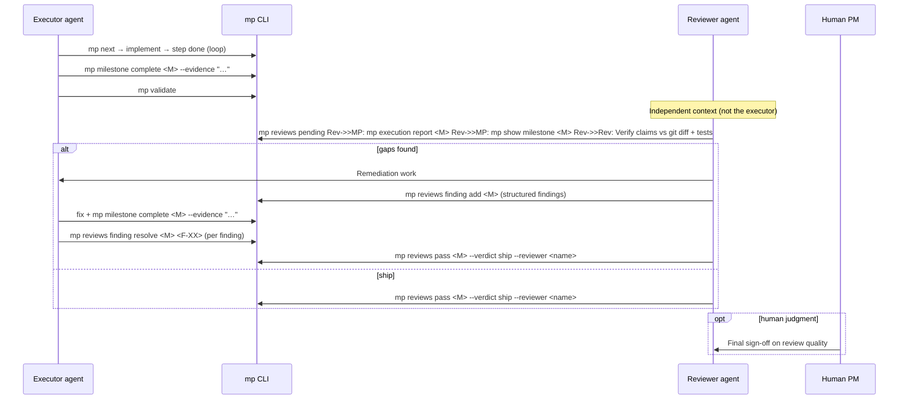
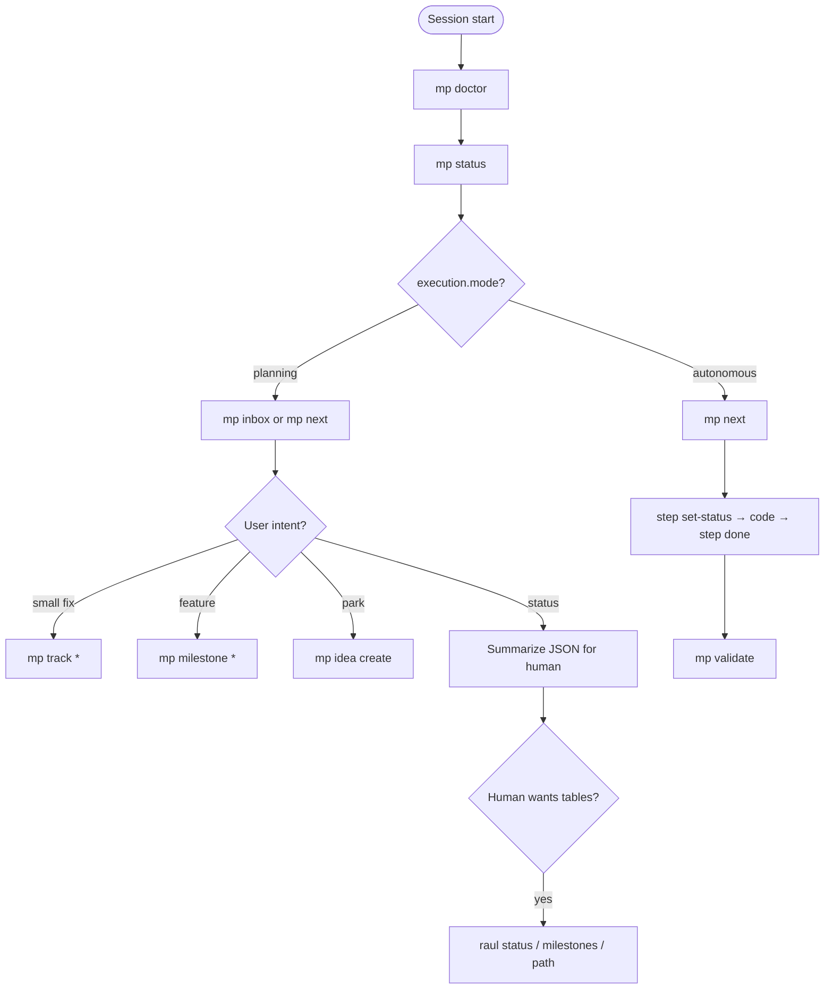

# Agent Playbook — When to Use `mp` and How to Update State

Canonical instructions for coding agents: **when** to call `mp`, **which command** for each
lifecycle transition, and **what to update** when finishing work.

**Per-project copy:** rules also live in `master-plan/AGENTS.md` (from
[templates/AGENTS-TEMPLATE.md](../templates/AGENTS-TEMPLATE.md)).  
**Skill:** [templates/skills/master-planner/SKILL.md](../templates/skills/master-planner/SKILL.md)

See also [EXECUTION-MODES.md](./EXECUTION-MODES.md), [WALKTHROUGH.md](./WALKTHROUGH.md),
[ADOPTION-PROFILES.md](./ADOPTION-PROFILES.md).

---

## 1. Golden rules

| # | Rule |
|---|------|
| 1 | **All plan I/O via `mp`** — never read/write plan files by hand (path from `config.workflow.plan.location`) |
| 2 | **Reads:** `mp <cmd>` — JSON default; omit `--format json` |
| 2a | **Health rollup:** `mp show milestone <id> --summary` — not `mp show \| jq` |
| 2b | **Findings:** `mp reviews finding list/resolve` — not `milestone update` |
| 3 | **After every write:** `mp validate` |
| 3a | **Index recovery:** `mp sync` rebuilds the `plan.json` milestone index if it falls out of sync (manual recovery path) |
| 4 | **Spec before code:** no app source edits until milestone `spec_status >= ready` |
| 5 | **Check mode:** `mp execution status` — planning vs autonomous (see §6) |
| 6 | **Check profile:** `mp config show` — `workflow.profile` gates which lanes to use (see §1a) |
| 7 | **Code zone** (src, tests) is separate — see [BROWNFIELD.md](./BROWNFIELD.md) |

### 1a. Adoption profile (session start)

Read merged config before choosing brief vs session vs track:

```bash
mp config showmp doctor```

| `workflow.profile` | Default path | Skip |
|--------------------|--------------|------|
| `full` | brief → charter → milestones | — |
| `hybrid` | track / idea / `session start` | brief, backlog unless user asks |
| `session` | `session start` → groom → spec | brief, charter, backlog |

If `workflow.plan.in_repo = false`, **do not** `git add` plan files unless the user asks.

**User intent routing (all profiles):**

| User says | Use |
|-----------|-----|
| “quick fix”, “small bug” | `track` |
| “park this”, “idea for later” | `idea` (if enabled) |
| “plan this branch / PR” | `session start` or milestone per profile |
| “roadmap”, “next milestone” | milestone (requires `full` or promoted session) |

---

## 2. When to use `mp`

### Always use `mp` for

| Situation | Command |
|-----------|---------|
| Session start / unsure plan exists | `mp doctor` |
| Before picking work | `mp execution status`, `mp next` or `mp inbox` |
| Reading plan state | `mp show milestone`, `mp status`, `mp list *` |
| Any plan change | create, update, set-status, step done, track done, etc. |
| After any plan change | `mp validate` |
| User asks status / what's next | `mp status`, `mp path`, `mp next` |

### Do not use `mp` for

| Situation | Instead |
|-----------|---------|
| Reading application source | Read files, ripgrep, LSP |
| Implementing code | Edit `src/`, `tests/` (after gates pass) |
| Casual chat not about work | No `mp` needed |

### Routing: which entity?

For the full decision matrix and 2×2 chart (clarity × size), see
[Getting Started → SIZE-ROUTING.md](../02 - Getting Started/SIZE-ROUTING.md).
Quick reference (smallest artifact first; pick `track` when in doubt):

```text
User request
    ├─ vague / later        → mp idea create
    ├─ small fix / polish   → mp track add → track start/done
    ├─ defer scope          → mp backlog add
    ├─ review / annotate    → mp annotation create → addressed → resolve
    └─ feature / phase      → mp milestone * (full lifecycle)
```

---

## 3. State machines (what exists today)

### 3.1 Milestone — spec axis (`spec_status`)

Controls **whether coding is allowed**.

```text
draft → interview → review → ready → implemented → verified
```

| Transition | Who | Command |
|------------|-----|---------|
| → `interview` | Agent | `mp milestone set-spec-status <id> interview` |
| → `review` | Agent | `mp milestone set-spec-status <id> review` |
| → `ready` | **Human approves** | `mp milestone approve <id>` |
| → `implemented` | Agent | Auto or `set-spec-status` when all steps done |
| → `verified` | Agent | `mp milestone complete <id>` (sets verified) |

**Agent:** do not set `ready` without user approval. Do not skip to `verified` without AC evidence.

### 3.2 Milestone — execution axis (`execution_status`)

Controls **delivery progress**.

```text
planned → in-progress → done
            │ blocked | deferred | cancelled
```

| Transition | When | Command |
|------------|------|---------|
| → `in-progress` | **Starting first step** on this milestone | `mp milestone set-status <id> in-progress` |
| → `blocked` | Cannot proceed (external dep, ambiguity) | `mp milestone block <id> --reason "..."` |
| → `planned` | Unblocked, not active | `mp milestone unblock <id>` |
| → `deferred` | PM postpones | `mp milestone defer <id> --reason "..."` |
| → `cancelled` | Will not ship | `mp milestone set-status <id> cancelled` |
| → `done` | All ACs verified | `mp milestone complete <id>` |

**Completion order:** mark steps `done` → `mp milestone criterion pass` (each AC) →
`mp milestone complete`. Do **not** expect `execution_status: done` until `complete` —
all steps done leaves the milestone `in-progress` (G7: `done` requires `verified`).

**Rule:** set milestone `in-progress` when you **start** the first step (or when resuming).
Leave `planned` if only spec/decompose work.

### 3.3 Step (`steps[].status`)

```text
pending → in-progress → done | skipped
```

| Transition | When | Command |
|------------|------|---------|
| → `in-progress` | **Before** editing code for this step | `mp step set-status <m> <s> in-progress` |
| → `done` | Tests pass, `done_when` met | `mp step done <m> <s> --evidence "..."` |
| → `skipped` | User agrees step unnecessary | `mp step set-status <m> <s> skipped` |

Alias: `mp step done` = set `done` + optional evidence.

**Order matters:**

```text
1. mp next                    # confirm this is the right step
2. mp step set-status … in-progress
3. [implement in code zone]
4. mp step done … --evidence "…"
5. mp validate
```

### 3.4 Track item (`tracks/*.json` items)

No spec gate. Shorter lifecycle.

```text
pending → in-progress → done
              │ cancelled → archived
```

| Transition | When | Command |
|------------|------|---------|
| → `in-progress` | Starting fix | `mp track start <kind> <id>` |
| → `done` | Fix verified | `mp track done <kind> <id> --evidence "..."` |
| → cancelled | Won't fix | `mp track cancel <kind> <id>` |

**Today:** `track start` / `track done` are **implemented** in Rust.

### 3.5 Acceptance criteria (`acceptance_criteria[].status`)

```text
pending → passed | failed
```

| Transition | When | Command |
|------------|------|---------|
| → `passed` | Verification succeeded | `mp milestone criterion pass <m> <ac> --evidence "..."` |
| → `failed` | Verification failed | `mp milestone criterion fail <m> <ac> --evidence "..."` |

Run **after** steps covering that AC are done (check `covers_ac`).

---

## 4. Recipes

### 4.1 Start working on a milestone step

```bash
mp execution status          # planning or autonomous?
mp next               # confirm head of queue
mp show milestone <id>     # context if needed

# First step on this milestone? Also:
mp milestone set-status <id> in-progress

mp step set-status <id> <step> in-progress
# → implement
mp step done <id> <step> --evidence "cargo test … ok"
mp validate
```

### 4.2 Finish a milestone (full checklist)

Do **not** call `complete` until all steps and ACs are satisfied.

```bash
mp list steps --milestone <id>   # all done or skipped?
mp plan gaps <id>              # AC coverage

# For each AC:
mp milestone criterion pass <id> AC-01 --evidence "…"
mp milestone criterion pass <id> AC-02 --evidence "…"

mp milestone complete <id> --evidence "summary / PR link"
mp validate
```

**`complete` sets:** `spec_status: verified`, `execution_status: done`, pending ACs checked.

Optional: `mp archive milestone <id>` if removing from active set.

### 4.3 Blocked

```bash
# Stop claiming progress — update plan first
mp step set-status <id> <step> pending     # if abandoning partial step
# or leave step in-progress if resumable

mp milestone block <id> --reason "Waiting on API key from PM"
mp execution pause --reason "Blocked on M03"   # if autonomous
mp validate
```

Tell the **human PM** what unblocks you. Do not implement unrelated work that changes spec.

### 4.4 Unblocked / resume

```bash
mp milestone unblock <id>
mp execution handoff                        # if resuming autonomous
mp nextmp step set-status <id> <step> in-progress
```

### 4.5 Track item (fast lane)

```bash
mp track add bugfix --title "…" --problem "…" --verification "cargo test …"
mp track start bugfix BF-02
# fix code
mp track done bugfix BF-02 --evidence "test output"
mp validate
```

### 4.6 Session-scoped work (hybrid / session profile)

```bash
mp session start --branch "$(git branch --show-current)"
mp interview checklist --type milestone# groom → spec review → approve
mp execution handoff                    # if user wants autonomous on branch
# implement on branch
mp session export <id> --format pr-body
# user opens PR (code only if plan gitignored)
mp session archive <id>                 # after merge
```

See [ADOPTION-PROFILES.md](./ADOPTION-PROFILES.md).

### 4.7 Plan-only session (no code)

```bash
mp interview checklist --type milestone# … create / update spec …
mp milestone set-spec-status <id> review
# user approves
mp milestone approve <id>
mp validate
# STOP — do not touch application code
```

---

### 4.8 Annotation loop (review + approval)

Annotations let humans and agents comment on milestones/steps without modifying plan files.

**Agent reads open queue:**
```bash
mp annotation list --open         # find work to address
# or check inbox for annotation items
mp inbox```

**Agent addresses then resolves:**
```bash
# For review requests: do the review, then mark addressed
mp annotation addressed AN-01
# Once human confirms, resolve
mp annotation resolve AN-01
```

**Agent creates review requests:**
```bash
mp annotation create M03 review-request "Please review the approach" agent
```

**Human creates approval requests (blocks ready):**
```bash
mp annotation create M04 approval-request "Must get sign-off before ready" alice
# This blocks mp milestone set-spec-status 04 ready (G14 gate)
# Once approved:
mp annotation resolve AN-02
# Now the milestone can be approved
```

**Open approval-request annotations block `spec_status: ready` (Gate G14).** Other annotation kinds (review-request, note, etc.) do not block.

### 4.9 Remediation (review findings)

After `mp reviews fail` or structured findings exist:

```bash
mp show milestone <id> --summary              # health rollup (no jq)
mp reviews finding list <id> --open           # open findings
# fix code, re-run tests
mp reviews finding resolve <id> --all           # or per F-XX
mp milestone complete <id> --evidence "cargo test … exit 0"
mp validate
```

**Do not** use `mp milestone update --json` with a `findings` field — it is rejected.
**Loop guard:** same write succeeds but state unchanged → stop after 2 tries and escalate.

---

## 5. Autonomous mode loop

When `execution.mode = autonomous` (after `mp execution handoff`):

```text
loop:
  mp next  if none: exit loop
  if blocked: mp milestone block … ; mp execution pause ; escalate human
  mp step set-status … in-progress
  implement
  mp step done … --evidence
  mp validate
end loop
when all steps done on milestone:
  criterion pass each AC
  mp milestone complete
```

**Escalate (pause + ask human):** new scope, spec wrong, validate fail, ambiguous `done_when`.

---

## 6. Planning vs autonomous

| `execution.mode` | Agent may implement? |
|------------------|----------------------|
| `planning` | Only when user **explicitly** directs a step/milestone/track |
| `autonomous` | Drain `mp next` until escalate |

Check at **session start** and after user says “just plan” or “go execute”.

See [EXECUTION-MODES.md §5.1](./EXECUTION-MODES.md#51-handoff-sequence-m70-baseline) for handoff + baseline diff.

---

## 7. Quick reference — state updates

| Event | Update |
|-------|--------|
| Pick up milestone step | `milestone set-status in-progress` (first step), `step set-status in-progress` |
| Finish step | `step done` + evidence |
| Stuck | `milestone block --reason`, `execution pause` |
| Unstuck | `milestone unblock`, `execution handoff` |
| All steps done | `criterion pass` each AC |
| Milestone shipped | `milestone complete` |
| Small fix | `track start` → `track done` |
| Cancel scope | `milestone set-status cancelled` or `archive` |

**Always:** `mp validate` after writes.

---

## 8. Coverage vs gaps

| Topic | Status |
|-------|--------|
| When to use `mp`, zones, routing | **Implemented** (v1 RC) |
| Step start / done / fail | **Implemented** |
| Milestone complete / reopen | **Implemented** |
| Track start / done | **Implemented** |
| Block / handoff | **Implemented** |
| What works today | **[AGENT-READINESS.md](./AGENT-READINESS.md)** — sole runtime matrix |

Check [AGENT-READINESS.md](./AGENT-READINESS.md) before calling commands. Autonomous handoff requires human review per [EXECUTION-MODES.md](./EXECUTION-MODES.md); path engine is implemented (verify with `mp path`).
([ADR-006](./DECISIONS.md#adr-006-autonomous-handoff-gate)).

---

## 9. Process diagrams

### 9.1 Execute → review → remediate (M64)

Autonomous execution is **always** followed by an independent review pass. The executor's
claims (execution report, step evidence) are verified against the diff and tests.



Tooling: `pending_review_count` in `mp status` / `raul status` · Reviewer records verdict via
`mp reviews pass <M> --verdict ship --reviewer <name>` · Full contract in root `AGENTS.md`.

### 9.2 Agent session start



Profile routing (`full` / `hybrid` / `session`): see §1a and [ADOPTION-PROFILES.md](../02%20-%20Getting%20Started/ADOPTION-PROFILES.md).

---

## 10. References

- [AGENT-READINESS.md](./AGENT-READINESS.md)
- [EDGE-CASES.md](./EDGE-CASES.md)
- [WALKTHROUGH.md](./WALKTHROUGH.md) — OAuth example
- [MP-COMMANDS.md](../06 - Reference/MP-COMMANDS.md) — full CLI
- [SPEC.md §4](./SPEC.md#4-lifecycles) — lifecycle definitions
