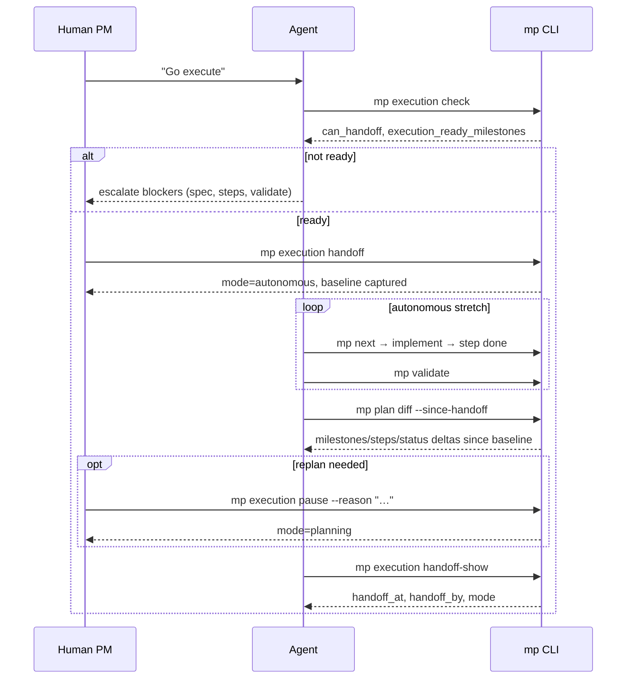

# Execution Modes — PM Collaboration vs Autonomous Agent

How the **human PM** and **agent** share responsibility: collaborative planning until
scope is tight, then **autonomous execution** against steps already defined in the plan.

See also [PM-WORKFLOWS.md](./PM-WORKFLOWS.md), [SPEC.md §4](./SPEC.md#4-lifecycles),
[EXECUTION-PATH.md](./EXECUTION-PATH.md), [GROOMING.md](./GROOMING.md).

**Status:** Documented — Rust implements handoff checks with P1 + P1.8 + P1.9.

---

## 1. Does this model sound right?

**Yes.** It matches how Master Plan is designed:

| Phase | Who leads | Agent does |
|-------|-----------|------------|
| **Planning** | Human PM (with agent facilitator) | Interviews, drafts specs, tracks, triage — **no app code** until approved |
| **Handoff** | Human confirms “go execute” | `mp execution handoff` — checks gates, sets autonomous mode |
| **Execution** | Agent (human on-call) | `next-step` → implement → `step done` → `validate` — loop until blocked or done |

The plan is the **contract**. Autonomy is safe because work is already decomposed with
ACs, files, tests, and `done_when`. The agent does not invent scope — it drains the queue.

**Human stays PM for:** intake, approvals, blockers, priority changes, cancel/defer, and
anything that changes spec. **Agent runs the factory** when `execution.mode = autonomous`.

---

## 2. Two modes

```text
┌─────────────────────────────────────────────────────────────────┐
│  PLANNING MODE (default)                                        │
│  Human + agent: brief, specs, tracks, grooming, decisions       │
│  Gate: no application code until milestone spec_status = ready  │
│  Agent: mp * on plan; code zone only for research               │
└────────────────────────────┬────────────────────────────────────┘
                             │ mp execution handoff (human confirms)
                             ▼
┌─────────────────────────────────────────────────────────────────┐
│  AUTONOMOUS MODE                                                │
│  Agent loop: next-step → code → step done → validate            │
│  Escalate to human: block, spec gap, validate fail, ambiguity   │
│  Human can: mp execution pause, path pin, milestone block       │
└─────────────────────────────────────────────────────────────────┘
```

Stored in `plan.json`:

```json
[execution]
strategy = "resume_then_ready"
mode = "planning"       # planning | autonomous
handoff_at = ""         # set by mp execution handoff
handoff_by = ""         # user | agent-with-confirm
```

| Mode | `execution.mode` | Code changes |
|------|------------------|--------------|
| Planning | `planning` | Only after per-milestone `ready` + user intent to implement |
| Autonomous | `autonomous` | Agent may implement **runnable** steps from `mp next` |

`mp execution pause` returns to `planning` without losing plan state.

---

## 3. “Ready for execution” — what we already have

There is **no single enum** named `ready-for-execution` on milestones or steps. Readiness
is **derived** from existing lifecycles plus gates.

### Project level (`plan.json`)

| Field | Value | Meaning |
|-------|-------|---------|
| `planning_status` | `ready-for-execution` | ≥1 milestone has `spec_status: ready` |
| `planning_status` | `in-execution` | Active implementation underway |
| `planning_phase` | `execution` | Pipeline stage: delivering approved work |

### Milestone level — two axes

**Spec axis** (`spec_status`) — *may we code?*

```text
draft → interview → review → ready → implemented → verified
                              ▲
                         human approves here (mp milestone approve)
```

**Execution axis** (`execution_status`) — *where in delivery?*

```text
planned → in-progress → done
              │ blocked | deferred | cancelled
```

| Milestone state | Spec | Execution | Meaning |
|-----------------|------|-----------|---------|
| **Spec in progress** | draft…review | planned | PM + agent planning only |
| **Approved, not started** | ready | planned | Spec done; **waiting for decompose or start** |
| **Ready to run** | ready | planned | Spec + steps + AC coverage → **execution_ready** (computed) |
| **Active** | ready…implemented | in-progress | Agent/human implementing |
| **Blocked** | any | blocked | Needs PM — see `block_reason` |
| **Done** | verified | done | Closed |

### Step level (`steps[].status`)

```text
pending → in-progress → done | skipped
```

A step is **runnable** when:

- Parent milestone is **execution_ready** (computed)
- Step `status = pending`
- `depends_on_steps` satisfied (P1.8)
- Milestone not `blocked` / `deferred` / `cancelled`

`mp next` returns the first runnable step on `mp path`.

### Track items (fast lane)

No `spec_status`. **Runnable** when `status = pending` and fields satisfy T1/T2.

Tracks fit **PM + agent daily** without full milestone ceremony.

---

## 4. Computed: `execution_ready`

**Not stored on disk** — computed by `mp status`, `mp show milestone`, `mp execution check`.

A milestone is `execution_ready: true` when **all** hold:

| # | Check | Gate |
|---|-------|------|
| 1 | `spec_status >= ready` | G1 |
| 2 | `execution_status` ∈ `planned`, `in-progress` | — |
| 3 | ≥1 step defined | decomposition done |
| 4 | Every AC has ≥1 step in `covers_ac` | G10 |
| 5 | No unresolved open questions | G2 |
| 6 | Dependencies `done` (if any) | G8 |
| 7 | Not `blocked`, `deferred`, `cancelled` | — |

**JSON (on `mp show milestone` / `mp status`):**

```json
{
  "id": "03",
  "spec_status": "ready",
  "execution_status": "planned",
  "execution_ready": true,
  "execution_ready_blockers": [],
  "steps": { "total": 5, "done": 0 },
  "ac_coverage": { "covered": 3, "total": 3 }
}
```

If false, `execution_ready_blockers` lists human-readable reasons (e.g. `"AC-02 uncovered"`,
`"no steps defined"`).

---

## 5. Handoff ceremony

See also the [handoff sequence diagram](#51-handoff-sequence-m70-baseline) below.

### When the human says “go execute yourself”

```bash
mp execution check     # readiness report
mp execution handoff   # human confirms; sets mode=autonomous; captures baseline
mp execution handoff-show   # inspect last handoff metadata
mp plan diff --since-handoff   # semantic plan changes since baseline
```

**`mp execution check`** returns:

```json
{
  "ok": true,
  "mode": "planning",
  "planning_status": "ready-for-execution",
  "execution_ready_milestones": ["02", "03"],
  "not_ready": [
    { "id": "04", "reasons": ["spec_status interview", "no steps"] }
  ],
  "track_pending": 1,
  "validate_ok": true,
  "can_handoff": true,
  "warnings": ["M04 still in interview — will not be scheduled"]
}
```

**`mp execution handoff`** requires `can_handoff: true` (validate ok + ≥1 execution_ready
milestone or explicit `--allow-tracks-only` for track-only work).

**Rust gate ([ADR-006](./DECISIONS.md#adr-006-autonomous-handoff-gate)):** refuse handoff
(or require `--force` with warning) until P1.8 path engine drives `next-step`. Today's
simplified `next-step` is **not** safe for unattended autonomous loops.

Sets:

- `execution.mode = autonomous`
- `planning_status = in-execution` (if not already)
- `handoff_at`, `handoff_by`

### Autonomous agent loop

```text
while true:
  r = mp next
  if r.type == "none": break or sleep
  if r.escalation: ask human; mp milestone block ...; break
  implement step in code zone
  mp step done <m> <s> --evidence "..."
  mp validate
```

### Escalate to human (leave autonomous for this item)

| Trigger | Action |
|---------|--------|
| Step `done_when` ambiguous | `mp milestone question add` + pause |
| Validate fails | Fix plan or code; human if spec wrong |
| Need spec change | `mp execution pause`; PM mode |
| External blocker | `mp milestone block --reason "..."` |
| AC fail | `criterion` failed; human decides |
| New scope | **Not** in autonomous — `mp idea create`; pause |

### Pause

```bash
mp execution pause --reason "Replanning M4"
```

Agent must stop code changes until human runs handoff again or directs a single milestone.

### 5.1 Handoff sequence (M70 baseline)

At handoff, `mp execution handoff` stores a **baseline snapshot** of plan state. Agents and
PMs use `mp plan diff --since-handoff` (or `raul digest --since-handoff`) to see what changed
during an autonomous stretch.



Human-readable digest: `raul digest --since-handoff` · Agent report: `mp execution report <M>`.

---

## 6. PM + agent division (summary)

| Activity | Planning mode | Autonomous mode |
|----------|---------------|-----------------|
| Triage intake | Human + agent (`mp inbox`) | Agent captures ideas only; no new milestones |
| Write specs | Agent drafts; **human approves** | No spec writes |
| Track bugs | Both | Agent may close tracks |
| Implement steps | Per user request | **Agent default** |
| Path / priority | Human pins | Human only (agent suggests) |
| Validate | After every write | After every step |

---

## 7. Rust phase mapping

| Capability | Phase |
|------------|-------|
| `execution_ready` on status/show | P1 + P1.8.2 |
| `mp execution check/handoff/pause` | **P1.9** |
| `mp inbox`, block/unblock | **P1.9** |
| Autonomous loop in skill | Skill + AGENTS.md (now) |

---

## 8. References

- [PM-WORKFLOWS.md](./PM-WORKFLOWS.md) — cadences, inbox
- [AGENT-PLAYBOOK.md §9](./AGENT-PLAYBOOK.md#9-process-diagrams) — execute → review → remediate
- [WALKTHROUGH.md](./WALKTHROUGH.md) — worked example (OAuth M03)
- [MP-COMMANDS.md § P1.9](../06 - Reference/MP-COMMANDS.md#19-pm-surface-p19) — command specs
- [templates/AGENTS-TEMPLATE.md](../templates/AGENTS-TEMPLATE.md) — mode rules
