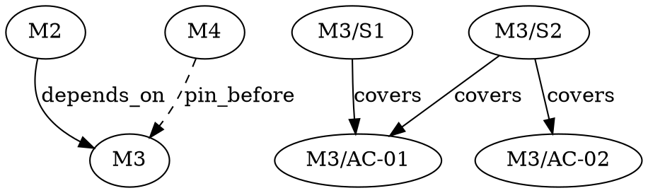

# Execution Path — Suggested Work Order

How Master Plan decides **what to do next** and **in what order** — including overrides,
blockers, partial milestones, and interleaved steps.

**Status:** Implemented (v1 RC). M08: session milestones not yet in hybrid path queue.

See also [IDS.md](./IDS.md), [GROOMING.md](./GROOMING.md), [SPEC.md](./SPEC.md).

---

## 1. Problem

Real work rarely follows a straight `M1 → M2 → M3 → M4` line:

| Situation | Need |
|-----------|------|
| Default roadmap | Respect `depends_on` (M2 waits for M1) |
| M4 before M3 | Soft preference — M4 is ready and more valuable now |
| New milestone mid-flight | M5 appears and **blocks** M3 |
| Partial progress | Do `M1/S1–S2`, finish **M2**, return to `M1/S3` |

We need **one suggested path** that merges hard constraints with practical preference —
without lying about blockers.

---

## 2. Design: three layers

```text
┌─────────────────────────────────────────────────────────┐
│  Layer 3 — Suggested path (computed)                    │
│  mp path / mp status.suggested_path / mp next      │
└───────────────────────────┬─────────────────────────────┘
                            │ uses
┌───────────────────────────▼─────────────────────────────┐
│  Layer 2 — Preferences (soft, editable)                 │
│  priority, adoption_order, focus, interleave strategy   │
└───────────────────────────┬─────────────────────────────┘
                            │ constrained by
┌───────────────────────────▼─────────────────────────────┐
│  Layer 1 — Constraints (hard)                           │
│  depends_on, blocks, spec gates, step depends_on_steps  │
└─────────────────────────────────────────────────────────┘
```

| Layer | Mutable by | Violation |
|-------|------------|-----------|
| **Constraints** | `mp milestone update`, deps on create | `mp validate` fails; `in-progress` blocked (G8) |
| **Preferences** | `mp path pin`, `priority`, `focus` | Path changes; work still legal |
| **Suggested path** | `mp path` (recompute) | Read-only output |

**Rule:** the path never recommends illegal work. Overrides reorder **among ready work only**.

---

## 3. Where it lives (not only `status`)

| Surface | Role |
|---------|------|
| **`mp path`** | Primary — full suggested queue, reasons, overrides |
| **`mp status`** | Summary metrics **plus** `suggested_path` preview (next ~5 actions) |
| **`mp next`** | Next **milestone-level** candidates (coarse) |
| **`mp next`** | Head of the action queue (one step or track item) |
| **`plan.json` `[execution]`** | Persisted preferences and manual ordering hints |

Putting the full queue only in `status` would bloat a command meant for dashboards.
**`mp path`** owns depth; **`status`** links to it.

---

## 3.1 Automatic vs manual

What `mp` does **without asking** vs what **you or the agent must set explicitly**.

### Automatic (recompute on read)

The path engine runs whenever you call `mp path`, `mp status` (preview), `mp next`, or
`mp next`. It **does not** store a separate queue file — it derives the suggestion
from current milestone files + `plan.json` preferences.

| Event | Path adjusts automatically |
|-------|----------------------------|
| `mp step done` / milestone completes | Next action moves forward |
| New milestone or dependency added | Blocked/ready sets recalculated |
| `depends_on` / `blocks` updated | Waiting milestones drop in/out of queue |
| Milestone → `in-progress` | `resume_then_ready` surfaces it earlier |
| AC covering steps all `done` | `ready_to_verify` surfaced in coverage summary |

| Check (automatic) | Command |
|-------------------|---------|
| Dependency order legal? | `mp validate` (G8), `mp graph explain` |
| Cycles in milestone DAG? | `mp validate`, `mp graph` |
| AC coverage gaps? | `mp plan gaps`, `mp path` coverage summary |
| Why is M3 blocked? | `mp graph explain 03` |

**Important:** automatic adjustment changes the **suggestion output only**. It never
silently edits `plan.json` pins, `priority`, or `depends_on`.

### Manual (explicit commands)

| Intent | Command | Persists |
|--------|---------|----------|
| M4 before M3 (soft) | `mp path pin 04 --before 03` | `plan.json` adoption_order |
| Remove soft override | `mp path unpin 04` | plan.json |
| Sprint focus on M4 | `mp path focus 04` | plan.json |
| Clear focus | `mp path clear-focus` | plan.json |
| Raise priority | `mp milestone update 04 --priority high` | milestone file |
| M5 must finish before M3 (hard) | `mp milestone update 05 --blocks 03` | milestone files |
| M3 waits on M2 (hard) | `mp milestone update 03 --depends-on 02` | milestone file |
| Step interleaving style | `mp config set execution.interleave step` | config / plan.json |
| Sort strategy | `mp config set execution.strategy priority_first` | plan.json |

Agents should use **manual** commands when the user states ordering intent (“do M4
before M3”). Use **automatic** reads when the user asks “what’s next?”.

### Semi-automatic (planned: `mp path suggest`)

Proposes soft ordering changes **without applying** them:

```bash
mp path suggest
# → [{ "action": "pin", "milestone": "04", "before": "03", "reason": "…" }]

mp path pin 04 --before 03    # user/agent confirms
```

Use after challenge, decompose, or when a new milestone reshapes the roadmap.

### Quick reference

```text
AUTOMATIC                    MANUAL
─────────                    ──────
mp path                      mp path pin / unpin
mp next                 mp path focus / clear-focus
mp graph explain             mp milestone update (deps, priority)
mp validate                  mp config set execution.*
Recompute when facts change  Pins persist until removed
```

---

## 4. Hard constraints

### 4.1 Milestone `depends_on`

Milestone **B** cannot start (`planned` → `in-progress`) until every id in
`depends_on` has `execution_status = done`.

```json
[milestone]
id = "03"
depends_on = ["01", "02"]
```

On disk: `03`, `03.1`. Display: M3, M3.1.

### 4.2 Milestone `blocks` (planned)

Ergonomic inverse when a **new** milestone must delay existing work:

```json
[milestone]
id = "05"
title = "Auth schema migration"
blocks = ["03", "04"]    # equivalent to adding 05 to depends_on of 03 and 04
```

`mp milestone create` / `update` normalizes `blocks` → updates blocked milestones'
`depends_on` (with confirmation in human flow).

### 4.3 Step `depends_on_steps` (within milestone)

```json
[[steps]]
id = "S4"
depends_on_steps = ["S2", "S3"]
```

Steps cannot start until dependencies are `done` (or `skipped`).

### 4.4 Spec gates

No implementation steps until `spec_status >= ready` (G5). Grooming items appear in
path as `type: groom` actions, not steps.

---

## 5. Soft preferences

Stored in **`plan.json`** and per-milestone fields.

### 5.1 `plan.json` — `[execution]`

```json
[execution]
strategy = "resume_then_ready"   # see §6
interleave = "milestone"           # milestone | step | none
focus_milestone = ""             # e.g. "04" — boost, does not bypass deps
focus_through_step = ""          # e.g. "S3" — optional bound

# Manual soft ordering among milestones that are already dependency-ready
[[execution.adoption_order]]
milestone = "04"
before = "03"
reason = "CLI foundation needed before search UI"

[[execution.adoption_order]]
milestone = "02"
rank = 1                         # lower rank = earlier (optional alternative to before)
```

| Field | Purpose |
|-------|---------|
| `strategy` | How to sort the ready set (§6) |
| `interleave` | Whether path rotates across milestones or drains one first |
| `focus_milestone` | Temporary boost for “we’re mainly working on M4 this week” |
| `adoption_order` | Explicit “do M4 before M3” without fake dependencies |

### 5.2 Per-milestone `priority`

```json
[milestone]
id = "04"
priority = "high"    # low | normal | high | urgent
```

Tie-breaker among **dependency-ready** milestones. Default: `normal`.

### 5.3 Active / partial work

Milestones with `execution_status = in-progress` or any step `in-progress` are
**resume candidates**. Default strategy finishes or advances them before starting new
milestones — unless `interleave = step` (§6.3).

---

## 6. Path algorithm (default: `resume_then_ready`)

### 6.1 Build the milestone DAG

1. Nodes = non-archived milestones with `spec_status >= ready` (for execution) or all
   (for planning preview).
2. Edges = `depends_on` (+ `blocks` normalized).
3. Detect cycles → `mp validate` error.

### 6.2 Baseline order

Topological sort → `baseline_milestone_order` (e.g. `["01", "02", "03", "04"]`).

### 6.3 Ready set

Milestones where:

- All `depends_on` are `done`
- `spec_status >= ready`
- `execution_status` ∈ `planned`, `in-progress`
- Not `blocked`, `deferred`, `cancelled`

### 6.4 Sort ready set (`strategy`)

| Strategy | Order |
|----------|-------|
| `deps_only` | Baseline topo order (ignore priority) |
| `resume_then_ready` | **(default)** ① in-progress first ② `priority` ③ `adoption_order` ④ topo |
| `priority_first` | priority → adoption_order → topo |
| `manual` | `adoption_order` only, then topo for ties |

**Focus:** if `focus_milestone` set and ready, move it to front (still respect step deps).

### 6.5 Expand to action queue

For each milestone in sorted order, append actions:

| `interleave` | Behavior |
|--------------|----------|
| `milestone` | All pending steps of M1, then all of M2, … |
| `step` | Round-robin: next step from each in-progress/ready milestone in turn |
| `none` | Same as `milestone` (alias) |

**Partial milestone example** (`interleave = step`):

```text
M1: S1✓ S2✓ S3 pending S4 pending
M2: S1 pending S2 pending

Suggested path:
  M1/S3 → M2/S1 → M1/S4 → M2/S2
```

With `interleave = milestone` (default):

```text
  M1/S3 → M1/S4 → M2/S1 → M2/S2
```

(Configurable in `plan.json` / `mp config set execution.interleave step`.)

### 6.6 Track items

Insert per `[next]` config (`prefer = milestone | track | balanced`). Default: after
current milestone step queue head, or parallel lane in JSON.

---

## 7. CLI

### `mp path`

Full suggested execution path.

```bash
mp path
mp path
raul path
mp path --horizon 20          # limit actions (default 50)
mp path --include grooming    # add spec/decompose tasks
```

**Human output:**

```text
Suggested execution path (strategy: resume_then_ready)

 #  Action                    Why
──  ────────────────────────  ─────────────────────────────
 1  M2 / S1                   in-progress, resume
 2  M2 / S2                   sequential in M2
 3  M4 / S1                   priority=high, before M3 (adoption_order)
 4  M3 / S1                   deps satisfied
 5  M1 / S3                   in-progress, return after M2

Blocked:
  M5 — waiting on M4 (depends_on)
```

**JSON output:**

```json
{
  "strategy": "resume_then_ready",
  "interleave": "step",
  "baseline_milestone_order": ["01", "02", "03", "04", "05"],
  "ready_milestones": ["02", "04", "01", "03"],
  "actions": [
    {
      "rank": 1,
      "type": "step",
      "milestone": { "id": "02", "display": "M2 — Config" },
      "step": { "id": "S1", "action": "Add config schema" },
      "reason": "resume_in_progress"
    },
    {
      "rank": 2,
      "type": "step",
      "milestone": { "id": "04", "display": "M4 — CLI" },
      "step": { "id": "S1", "action": "Scaffold clap" },
      "reason": "adoption_order_before:03"
    }
  ],
  "blocked": [
    {
      "milestone": { "id": "05", "display": "M5 — Migration" },
      "waiting_on": ["04"],
      "reason": "depends_on"
    }
  ]
}
```

Action `type` values: `step`, `track`, `groom`, `milestone_start`.

### `mp path pin`

Soft reorder — dependency-ready milestones only.

```bash
mp path pin 04 --before 03 --reason "CLI before search"
mp path pin 02 --rank 1
mp path unpin 04
mp path list-pins
```

Writes to `plan.json` → `[[execution.adoption_order]]`.

### `mp path focus`

Temporary boost (session / sprint).

```bash
mp path focus 04
mp path focus 04 --through S3
mp path clear-focus
```

### `mp status` (extended)

Existing metrics **plus**:

```json
{
  "planning_status": "in-execution",
  "milestones": { "...": "..." },
  "suggested_path": {
    "strategy": "resume_then_ready",
    "next_action": { "type": "step", "milestone": "02", "step": "S1" },
    "preview": [ "... ranks 1–5 ..." ],
    "blocked_count": 1,
    "path_command": "mp path"
  }
}
```

### `mp next` / `mp next` (aligned)

| Command | Returns |
|---------|---------|
| `mp next` | Distinct milestones appearing in the next N path actions |
| `mp next` | `actions[0]` from the same path computation |

Single source of truth: **path engine** powers all three.

---

## 8. Scenario playbook

### 8.1 Simple line (M1→M2→M3→M4)

```json
# M2 depends_on M1, M3 on M2, M4 on M3
```

Path = topo order. No pins needed.

### 8.2 M4 before M3 (both ready)

M3 does **not** depend on M4. Both ready after M2.

```bash
mp path pin 04 --before 03 --reason "CLI shell first"
# or
# milestone 04 priority = high
```

Path: `… M2 … → M4 → M3 …`

### 8.3 New M5 blocks M3

```bash
mp milestone create --title "Schema migration" --json @-
mp milestone update 05 --blocks 03,04
```

M3, M4 show under `blocked` until M5 is `done`. Path skips them.

### 8.4 Partial M1, complete M2, return to M1

```bash
mp config set execution.interleave step
```

While M1 `in-progress` and M2 becomes ready, path rotates steps (§6.5).  
With default `interleave = milestone`, agent finishes remaining M1 steps before M2
unless user sets focus or pin.

---

## 9. Cache & drift

`mp sync` refreshes `plan.json` milestone index (ids, statuses, blocked_by summary).
Path is **computed on read** from milestone files + `plan.json` preferences — no
separate cache file required for P1.8.

Optional future: `.cache/path.json` with `computed_at` for large plans.

---

## 10. Agent workflow

> **M81: before sizing up a milestone workplan, check whether the work is a
> track item instead.** See [Getting Started → SIZE-ROUTING.md](../02 - Getting Started/SIZE-ROUTING.md).
> A one-line bug fix should not enter this path; `mp track add bugfix …`
> ships the same change in minutes.

```text
1. mp status          # quick health + preview
2. mp path            # full queue when planning session
3. mp next       # execute head
4. … work …
5. mp step done 02 S1
6. mp path            # path shifts automatically
```

When user asks “what’s next?” → `mp path` (or `status` preview). For ordering intent
(“M4 before M3”) → `mp path pin`. See [§3.1 Automatic vs manual](#31-automatic-vs-manual).

---

## 11. AC coverage in the path engine

The path engine does **not** block execution solely for uncovered ACs (that is `mp plan gaps`
/ gate G10), but it **surfaces** coverage in output so agents and users do not drift.

### Per-milestone summary in `mp path`

```json
{
  "milestone": { "id": "03", "display": "M3 — OAuth Login" },
  "coverage": {
    "ok": false,
    "uncovered": ["AC-03"],
    "ready_to_verify": ["AC-01"]
  }
}
```

| Field | Meaning |
|-------|---------|
| `uncovered` | ACs with no `covers_ac` reference — plan gap |
| `ready_to_verify` | All covering steps `done`, AC still `pending` — suggest `criterion pass` |

### Optional path modes

```bash
mp path --prioritize coverage    # boost steps that cover uncovered ACs (among ready steps)
mp path --include coverage-gaps  # insert groom actions for uncovered ACs before steps
```

**`coverage-gaps` actions** appear in the queue as:

```json
{
  "type": "groom",
  "action": "cover_ac",
  "milestone": "03",
  "ac": "AC-03",
  "reason": "uncovered_ac",
  "suggested": "mp step add 03 --wp WP1 --covers-ac AC-03 ..."
}
```

### Relationship to verification

```text
covers_ac (plan)  →  steps done  →  criterion pass (evidence)  →  milestone complete
```

Coverage ensures the **plan** accounts for every AC. Verification proves they pass.

---

## 12. `mp graph` integration

`mp graph` is the **structural view**; `mp path` is the **execution queue**. Both use the
same underlying graph builder (P1.8.1).

### Node types

| Node | Id example | Source |
|------|------------|--------|
| `milestone` | `03`, `03.1` | milestone files |
| `step` | `03/S3` | `[[steps]]` within milestone |
| `ac` | `03/AC-01` | `[[acceptance_criteria]]` |
| `track` | `bugfix/BF-01` | track files |

### Edge types

| Edge | From → To | Meaning |
|------|-----------|---------|
| `depends_on` | milestone → milestone | hard — must finish first |
| `blocks` | milestone → milestone | normalized to `depends_on` on target |
| `depends_on_steps` | step → step | within milestone |
| `covers` | step → ac | from `covers_ac` |
| `adoption_order` | milestone → milestone | soft — `before` preference (dashed in DOT) |

### Commands

```bash
mp graph
mp graph
mp graph --format dot              # Graphviz
mp graph --milestone 03            # subgraph one milestone
mp graph --with steps              # include step nodes
mp graph --with ac                 # include AC + covers edges
mp graph explain 03                # why blocked / what waits on what
```

### `mp graph explain`

```bash
mp graph explain 03
```

```json
{
  "milestone": "03",
  "display": "M3 — OAuth Login",
  "blocked": true,
  "waiting_on": [
    { "id": "02", "display": "M2 — Config", "reason": "depends_on", "status": "in-progress" }
  ],
  "unblocks_when": ["M2 execution_status = done"],
  "downstream": ["04", "05"],
  "coverage": { "uncovered": ["AC-03"] }
}
```

### How path uses the graph

```text
1. mp graph build (milestones + depends_on + blocks)
2. topo sort → baseline_milestone_order
3. For each ready milestone, load steps → step DAG (depends_on_steps)
4. topo sort steps → outline order (S1, S2, S3.1, …)
5. Apply execution.strategy + pins + coverage prioritize
6. Emit action queue
```

**Single builder** avoids `mp path` and `mp graph` disagreeing on blockers.

### Human DOT example (conceptual)



---

## 13. Agent workflow (graph + coverage + path)

```text
1. mp graph --with ac     # see deps + coverage structure
2. mp plan gaps 03       # uncovered ACs before execution
3. mp step add 03 ... --covers-ac AC-03
4. mp path               # queue with coverage summary
5. mp next → implement
6. mp step done 03 S2
7. mp graph explain 03                 # if blocked, why
8. mp milestone criterion pass 03 AC-01 --evidence "..."
```

---

## 14. Implementation phase

| Phase | Deliverable |
|-------|-------------|
| **P1.8** | `mp path`, `path pin/focus`, `status.suggested_path`, unified `next`/`next-step` |
| **P1.8.1** | `blocks`, `depends_on_steps`, `mp graph` + path shared builder, AC in graph |
| **P1.8.2** | `interleave = step`, `path --prioritize coverage`, `plan coverage`, `path suggest` |

---

## 15. References

- [PLANNING-STATUS.md](./PLANNING-STATUS.md) — design snapshot
- [GROOMING.md](./GROOMING.md) — AC coverage (§5.1), plan gaps
- [SPEC.md](./SPEC.md) — gates G8–G10, plan.json index
- [MP-COMMANDS.md](../06 - Reference/MP-COMMANDS.md) — command signatures
- [IDS.md](./IDS.md) — M/S id rules
