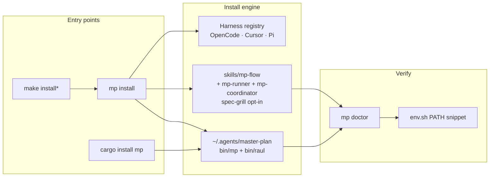

# Install & Harness Integration — v1 (OpenCode, Cursor, Pi)

How to install Master Plan on a developer machine and wire it into **OpenCode**,
**Cursor**, and **[Pi](https://pi.dev)** — the three harnesses targeted for **v1**.

**Status:** v1.3 — **self-contained binary** (templates + schemas embedded); `cargo install` / Homebrew work zero-config. `MP_HOME` is now an *optional* override only. `mp install` / `mp uninstall` implemented; `make install` remains the dev-repo shortcut.  
**Related:** [BRANDING.md](./BRANDING.md), [ADOPTION-CHECKLIST.md](./ADOPTION-CHECKLIST.md), [DECISIONS.md ADR-009](./DECISIONS.md#adr-009-v1-harness-targets-cursor--opencode).

> **v1.3 — zero-config binary (M29).** `templates/` and `schemas/` are compiled into
> the `mp` binary. `mp init`, `mp validate`, and `mp doctor` work with **no asset
> files on disk and no `MP_HOME` set**. The simplest install is now:
>
> ```bash
> cargo install --path crates/mp   # or: cargo install mp
> mp doctor                         # green, no setup
> ```
>
> `MP_HOME` is still honored as an override (a file under `$MP_HOME` wins over the
> embedded copy), and `make install` / `mp install` still lay down on-disk copies
> for the harness skill — but neither is required for `mp` itself to function.

---

## 1. V1 goal

| In scope (v1) | Out of scope (later) |
|---------------|----------------------|
| Install toolkit + `mp` binary | Generic “any harness” marketplace |
| Install CPD skills (`mp-flow`, `mp-runner`, `mp-coordinator`) | Custom slash commands beyond skill discovery |
| **OpenCode** — `~/.agents/skills/` discovery | Claude Code–only installer |
| **Cursor** — `~/.cursor/skills/` (+ optional project skill) | VS Code Copilot, Windsurf, etc. |
| **Pi** — shared `~/.agents/skills/` + `~/.pi/agent/AGENTS.md` | Pi extensions (TypeScript modules) |
| `mp doctor` harness checks | Auto-update from GitHub releases (v1.1) |
| Shell `PATH` snippet | Homebrew formula (optional follow-up) |
| Project `AGENTS.md` on `mp init` | IDE extension |

**Principle:** `mp` and the skill body are **harness-agnostic**. v1 installer only
places files where each harness already looks.

---

## 2. Layout after install

```text
~/.agents/
├── master-plan/                 # toolkit (MP_HOME)
│   ├── bin/mp                   # agent CLI
│   ├── bin/raul                 # human-facing PM CLI
│   ├── env.sh                   # source in agent shells (MP_HOME + PATH)
│   ├── templates/
│   ├── schemas/
│   └── docs/                    # optional copy or symlink to repo docs
└── skills/                       # M158: each skill ships as a full
    │                              # package (SKILL.md + siblings + scripts/)
    ├── mp-flow/
    │   ├── SKILL.md              # CPD orchestration
    │   ├── flow-stages.md        # per-stage checklist
    │   └── stages.toml           # canonical stage manifest
    ├── mp-runner/
    │   ├── SKILL.md
    │   ├── executing.md          # stages 5–7 deep dive
    │   ├── fixing.md             # stage 9 deep dive
    │   └── atomic-writes.md      # cross-cutting contract
    └── mp-coordinator/
        ├── SKILL.md
        ├── planning.md           # stages 1–4 deep dive
        ├── spec-co-design.md
        └── reviewing.md          # stages 8, 10 deep dive

~/.cursor/skills/                # Cursor — v1 installer mirrors CPD skill packages:
├── mp-flow/
│   ├── SKILL.md
│   ├── flow-stages.md
│   └── stages.toml
├── mp-runner/
└── mp-coordinator/

~/.pi/agent/                     # Pi (pi.dev) — v1 installer adds:
└── AGENTS.md                    # global agent instructions

# Pi discovers Master Plan skills from the shared OpenCode path:
# ~/.agents/skills/mp-flow/ (and other registered CPD skills)
# Pi-native ~/.pi/agent/skills/ remains for Pi-only skills, not duplicated copies.
```

**Per project** (from `mp init`):

```text
<project>/
├── AGENTS.md                    # snippet → plan dir
├── master-plan/   OR   .mp/     # artifact (profile-dependent)
│   └── AGENTS.md
├── .cursor/skills/mp-flow/          # optional team share (Cursor; + runner/coordinator)
├── .opencode/skills/mp-flow/        # optional team share (OpenCode)
└── .pi/skills/mp-flow/              # optional team share (Pi; requires project trust)
```

---

## 3. Harness comparison

| | **OpenCode** | **Cursor** | **Pi** |
|--|--------------|------------|--------|
| **Global skill path** | `~/.agents/skills/<name>/SKILL.md` | `~/.cursor/skills/<name>/SKILL.md` | `~/.agents/skills/<name>/SKILL.md` (shared; Pi also scans `~/.pi/agent/skills/` for Pi-only skills) |
| **Project skill path** | `.agents/skills/`, `.opencode/skills/` | `.cursor/skills/` | `.pi/skills/` |
| **Agent instructions** | `.opencoderules` in skill dir | `.cursorrules` in skill dir | `~/.pi/agent/AGENTS.md` |
| **v1 default install** | Yes | Yes | Yes |
| **Discovery** | Native `skill` tool | Agent Skills (description triggers) | Agent Skills standard + `/skill:name` |
| **Plan artifact** | Same `mp` CLI | Same `mp` CLI | Same `mp` CLI |

OpenCode and Pi both scan `~/.agents/skills/` — **Master Plan uses that shared path as the
canonical global skill install target for Pi** so a full OpenCode+Pi install does not create
same-name skill collisions at Pi startup. Pi still uses native `~/.pi/agent/` paths for global
instructions and for Pi-only skills; see [pi.dev skills docs](https://pi.dev/docs/latest/skills).

Cursor uses a **different** global skills directory — v1 installer **mirrors** the skill into
`~/.cursor/skills/`.

---

## 4. Install flows

### 4.0 Harness install path



### 4.1 Target UX (`mp install` — P0.9)

**Today:** `make install` delegates to `mp install` (single install engine).

```bash
make install              # toolkit + OpenCode + Cursor + Pi (v1 trio)
make install-global       # toolkit only (~/.agents/master-plan, no skills)
make install-opencode     # toolkit + OpenCode harness
make install-cursor       # toolkit + Cursor harness
make install-pi           # toolkit + Pi harness
make doctor               # verify (dev: MP_HOME = repo)
make uninstall            # remove global install (mp uninstall --purge)
```

Equivalent `mp install` (from a built repo):

```bash
mp install --dev --source /path/to/master-plan --harness opencode,cursor,pi
mp install --toolkit-only --dev --source /path/to/master-plan
mp install --harness pi --dev --source /path/to/master-plan
mp doctor
```

After install, agent shells often skip login rc files — source `~/.agents/master-plan/env.sh`
or add `$MP_HOME/bin` to PATH. `make install` prints doctor-backed remediation via
`scripts/install-summary.sh`.

**`mp install` steps (spec):**

1. Ensure `~/.agents/master-plan/` exists (copy or sync templates, schemas, `bin/mp`).
2. Install skill **package** → `~/.agents/skills/mp-flow/` (SKILL.md + flow-stages.md + stages.toml).
3. If harness includes Cursor: mirror skill package → `~/.cursor/skills/mp-flow/`.
4. Print shell snippet for `PATH` and `MP_HOME`.
5. Run `mp doctor`.

**Idempotent:** re-run updates skill package + binary; does not overwrite project plans.
A wipe-then-rewrite deploy (M158) clears stale siblings from a removed-upstream file
(e.g. `mp-flow/stages.toml` was added in M150 — a re-install on a pre-M150 install would
have left it absent).

### 4.2 Manual install (without Make)

Since v1.3 the binary is self-contained — **the only required artifact is `mp` itself**.
You only need the steps below if you also want the **harness skill** on disk, or an
on-disk `MP_HOME` override tree.

```bash
git clone …/master-plan ~/src/master-plan
cd ~/src/master-plan
cargo build --release
# mp is ready: target/release/mp doctor → green, zero config.

# --- optional: harness skill package + on-disk override tree ---
mkdir -p ~/.agents/master-plan/bin
cp target/release/mp ~/.agents/master-plan/bin/
# M158: install the full skill package (SKILL.md + siblings + scripts/),
# not just SKILL.md. Two `cp` modes are useful:
#   cp -R  — recursive copy, follows symlinks at the source tree's
#            leaves (most common; matches `mp install`'s byte-copy)
#   cp -RL — recursive, dereferences every symlink in the source
#            before copying (use this if `templates/skills/mp-flow/`
#            itself is a symlink to a shared skill directory)
cp -R templates/skills/mp-flow ~/.agents/skills/

mkdir -p ~/.cursor/skills
cp -R templates/skills/mp-flow ~/.cursor/skills/

# optional: make this tree the asset override
export MP_HOME="$HOME/.agents/master-plan"
export PATH="$MP_HOME/bin:$PATH"
# Agent / IDE terminals (often skip login rc): source "$MP_HOME/env.sh"
source "$MP_HOME/env.sh"
mp doctor
```

> Templates and schemas no longer need to be copied anywhere — they are embedded.
> `MP_HOME` is purely an override/development convenience.

### 4.3 Dev loop (contributors)

```bash
cargo build --release
./target/release/mp doctor          # works zero-config
```

Optionally point `MP_HOME` at the repo to override embedded assets with the working
tree during development:

```bash
export MP_HOME="$(pwd)"             # optional override
export PATH="$(pwd)/target/release:$PATH"
mp doctor
```

No copy to `~/.agents` is required — `MP_HOME` simply selects the repo tree as the
override source.

### 4.4 Homebrew (macOS)

```bash
brew tap lthiagol/tap
brew install lthiagol/tap/mp
```

The formula builds from source using `cargo install --path crates/mp` from the tagged
v1.0.0 source. Requires Rust (installed automatically via Homebrew dependency).

**When brew install fails with git authentication errors**, configure git to use SSH
for the tap's GitHub remote:

```bash
git config --global url."git@github.com:".insteadOf "https://github.com/"
```

### 4.5 sccache (optional local opt-in)

Cold `cargo build` of the master-plan workspace (~140 transitive crates for
`mp` + `raul` + the test-only `jsonschema` tree) takes most of a minute on a
fresh checkout. **`sccache`** wraps `rustc` and reuses previously-compiled
artifacts across builds. On this Mac, dropping the test profile from
`opt-level = 1` → `opt-level = 0` already reclaimed ~17 s (see M159); adding
`sccache` on top eliminates most of the remaining dep-compile wall-clock on
the **second** run.

**This is opt-in only.** Nothing in the default install path wraps `rustc`.

#### 4.5.1 Install sccache

```bash
# macOS (Homebrew — pinned to the formula's current version)
brew install sccache

# Linux (Debian / Ubuntu — sccache is in main since at least Debian 10 / Ubuntu 22.04)
sudo apt-get install sccache

# Linux (Fedora / RHEL)
sudo dnf install sccache

# Anywhere — install from source via cargo (no system package needed)
cargo install sccache --locked
```

Verify:

```bash
sccache --version
```

#### 4.5.2 Wire it into cargo (3 lines)

Create `~/.cargo/config.toml` (or merge into an existing one) with:

```toml
# ~/.cargo/config.toml — opt-in sccache wrapper for rustc
[build]
rustc-wrapper = "/usr/local/bin/sccache"   # macOS Homebrew; see notes for Linux paths
```

> **Path varies by install method:**
>
> | Install | Binary path |
> |---------|-------------|
> | `brew install sccache` (Apple Silicon) | `/opt/homebrew/bin/sccache` |
> | `brew install sccache` (Intel Mac) | `/usr/local/bin/sccache` |
> | `apt-get install sccache` | `/usr/bin/sccache` |
> | `cargo install sccache` | `$HOME/.cargo/bin/sccache` |
>
> Run `which sccache` if unsure.

#### 4.5.3 Sanity check

```bash
cargo clean
time cargo build --release -p mp      # cold: full compile, populates the cache
time cargo build --release -p mp      # warm: drop varies; see note below
```

The warm-drop varies widely:

- **Local file backend, single machine** (this section's setup): on this
  repo the warm drop is **~17 s / 19 %** (see
  [mp-dogfood-log.md entry 26](../../../../mp-dogfood-log.md#entry-26--2026-07-13--m160-ships-sccache-wiring-local-warm-cache-drop-is-19-not-the-ac-01-50-target--points-at-m160-)
  — link target: `mp-dogfood-log.md` in the repo root). Cold-link + test-run
  phases dominate local wall-clock and are not shrunk by sccache.
- **CI shared backend (S3 / GCS / MinIO)**: the cold-link/test phase is a
  much smaller share of CI wall-clock, so the warm drop is expected to be
  larger. The exact number for this repo's CI is not measured yet — it
  ships with M160 and will be captured after the first PR run (see
  [M160 AC-01 evidence](../../../master-plan/milestones/160-wire-sccache-into-ci-and-document-local-opt-in.json)).

`sccache -s` shows the local cache hit rate:

```bash
sccache -s
# Compile stats: hits, misses, cache size, …
```

#### 4.5.4 Cache invalidation rules

`sccache` keys each cached artifact on a hash of:

| Component | Notes |
|-----------|-------|
| **rustc version** | `rustc --version` → bump invalidates **everything** (one cold run per toolchain bump) |
| **Target triple** | `rustc -vV \| grep host` → cross-arch runners (x86_64 vs aarch64) use disjoint keys |
| **Profile** | `--release` vs debug → distinct caches; switching profile does NOT invalidate the other |
| **Crate fingerprint** | crate metadata + the precise `rustc` invocation (env vars, flags, source mtime) |

**Practical implications:**

- Bumping the toolchain (`rustup update`) → one cold run, then warm again.
- Switching between debug and release builds → only the matching profile cold-compiles.
- Editing one workspace file → only that crate and downstream rebuild (sccache is per-crate, not per-workspace).
- **Behavior parity:** `sccache` does not change the produced artifact — `target/release/mp` is byte-for-byte identical modulo build-timestamps (RUSTC_WRAPPER is invisible to the linker; see [AC-02 of M160](../../../master-plan/milestones/160-wire-sccache-into-ci-and-document-local-opt-in.json)).

#### 4.5.5 CI parallel

CI is wired separately — see [`.github/workflows/plan.yml`](../../../.github/workflows/plan.yml) and milestone M160. The CI image
(`ci/Dockerfile`) installs `sccache` and exports `RUSTC_WRAPPER=sccache`; backend
creds come from repository secrets (`SCCACHE_BUCKET`, `SCCACHE_AWS_*`).

---

## 5. OpenCode setup

### 5.1 Minimal (v1)

After `mp install` (or manual §4.2), OpenCode discovers `mp-flow` (plus `mp-runner`, `mp-coordinator`) from
`~/.agents/skills/mp-flow/SKILL.md` automatically.

Agent session:

```text
User: "What's next on the master plan?"
→ OpenCode loads CPD skills (mp-flow / mp-runner / mp-coordinator) (on-demand via skill tool)
→ Skill: mp doctor → mp status → mp next
```

### 5.2 Optional `opencode.json`

Only if you keep skills elsewhere or want an explicit path:

```json
{
  "skills": {
    "paths": ["~/.agents/skills"]
  }
}
```

Usually **unnecessary** — global `~/.agents/skills/` is already scanned.

### 5.3 Project-local skill (team repos)

Commit a thin skill for contributors who use OpenCode without global install:

```bash
mkdir -p .opencode/skills/mp-flow
# Symlink or copy SKILL.md — mp init --with-project-skill (planned)
```

Prefer symlink to toolkit skill in docs; copy for offline teams.

### 5.4 `mp` on PATH in OpenCode terminal

OpenCode agents invoke shell — `mp` must be on `PATH` (§4.2 shell snippet) or set in
the environment OpenCode inherits. `mp doctor` should report `mp` not found if missing.

---

## 6. Cursor setup

### 6.1 Minimal (v1)

1. Install skill to `~/.cursor/skills/mp-flow/SKILL.md` (§4.2).
2. Add `mp` to `PATH` (same shell profile Cursor / Cursor Agent uses).
3. Open a project with `master-plan/` or `.mp/` + `AGENTS.md`.

Cursor discovers skills from the `description` frontmatter — no slash command required
for v1. User can say: *“use the master plan”*, *“run mp status”*, *“groom the next milestone”*.

### 6.2 Optional project skill

For repos where teammates use Cursor without global install:

```text
.cursor/skills/mp-flow/SKILL.md
```

`mp init --with-cursor-skill` (planned) creates symlink or copies from toolkit.

### 6.3 Optional Cursor rule (lightweight)

v1 **optional** file `.cursor/rules/master-plan.mdc`:

```markdown
---
description: Spec-driven planning — use mp CLI and CPD skills (mp-flow / mp-runner / mp-coordinator) for plan work
globs:
alwaysApply: false
---

Read plan-dir AGENTS.md. All plan I/O via `mp` — never edit plan JSON by hand.
See CPD skills (mp-flow / mp-runner / mp-coordinator) for workflows.
```

Rules are **supplementary** — the skill carries the full contract. Installer may offer
`--with-cursor-rule` (default off) to avoid rule sprawl.

### 6.4 Cursor CLI / Agent

If using **Cursor CLI** (`agent` in terminal), ensure:

- Same `PATH` as IDE agent
- Sandbox allows `mp` subprocess ([Cursor CLI config](https://cursor.com) — `permissions.allow` may need `Shell(mp)` pattern when documented)

`mp doctor --harness cursor` (planned) checks skill file presence under `~/.cursor/skills/`.

---

## 7. Pi setup

[Pi](https://pi.dev) implements the [Agent Skills standard](https://agentskills.io). v1 install
deploys Pi instructions under `~/.pi/agent/` and installs Master Plan skills to the shared OpenCode path `~/.agents/skills/`.

### 7.1 Minimal (v1)

After `make install` or `mp install --harness pi`:

1. **Global skill:** `~/.agents/skills/mp-flow/SKILL.md` (shared with OpenCode and scanned by Pi)
2. **Global instructions:** `~/.pi/agent/AGENTS.md` (installer-written convention snippet)
3. **No Pi-native duplicate:** `~/.pi/agent/skills/` is left for Pi-only skills so Pi does not warn about same-name Master Plan skill collisions
4. **Shell:** source `~/.agents/master-plan/env.sh` or add `$MP_HOME/bin` to PATH

Pi discovers skills automatically; users can also invoke `/skill:mp-flow`.

### 7.2 Project-local skill

```text
.pi/skills/mp-flow/SKILL.md
```

Pi loads project `.pi/skills/` only after the project is **trusted** (interactive prompt on
first run, or entry in `~/.pi/agent/trust.json`). Document this for teammates adopting
Master Plan on a shared repo.

### 7.3 Optional settings

Pi can load extra skill directories via `~/.pi/agent/settings.json`:

```json
{
  "skills": ["~/.agents/skills"]
}
```

Usually unnecessary — Pi already scans `~/.agents/skills/` natively.

### 7.4 Environment overrides

| Variable | Effect |
|----------|--------|
| `PI_CODING_AGENT_DIR` | Override `~/.pi/agent` (Pi config root) |
| `MP_PI_SKILL_DIR` | Override install target for Pi Master Plan skills (tests/advanced). Production defaults to shared `~/.agents/skills` to avoid duplicate Pi skill warnings. |

**Out of scope (v1):** Pi [extensions](https://pi.dev/docs/latest/extensions) (`~/.pi/agent/extensions/*.ts`) — skills-only integration.

---

## 8. Project bootstrap + harness

```bash
cd my-project
mp init --profile full              # or hybrid for work
mp init --with-cursor-skill         # planned: .cursor/skills/mp-flow
mp init --with-opencode-skill       # planned: .opencode/skills/mp-flow
```

Root [ROOT-AGENTS-SNIPPET.md](../templates/ROOT-AGENTS-SNIPPET.md) → project `AGENTS.md`
points agents at the plan directory.

**Hybrid work repos:** plan in `.mp/` — update snippet to say `.mp/AGENTS.md` when profile
is hybrid ([ADOPTION-CHECKLIST.md](./ADOPTION-CHECKLIST.md)).

---

## 9. `mp doctor` harness checks

| Check | OpenCode | Cursor | Pi |
|-------|----------|--------|-----|
| Embedded templates/schemas (v1.3) | ✓ (always) | ✓ (always) | ✓ (always) |
| `MP_HOME` resolvable (optional override) | if set | if set | if set |
| `bin/mp` + `bin/raul` executable | ✓ | ✓ | ✓ |
| `~/.agents/skills/mp-flow/SKILL.md` | ✓ | ✓ (shared) | ✓ (shared canonical) |
| `~/.cursor/skills/mp-flow/SKILL.md` | — | ✓ | — |
| `~/.pi/agent/skills/mp-flow/SKILL.md` | — | — | — (not duplicated; use for Pi-only skills) |
| `~/.pi/agent/AGENTS.md` | — | — | ✓ |
| `env.sh` present after install | ✓ | ✓ | ✓ |
| `mp` on `PATH` (runtime check) | ✓ | ✓ | ✓ |
| Project `AGENTS.md` | if in project | if in project | if in project |

JSON shape (sketch):

```json
{
  "ok": true,
  "harness": {
    "opencode": { "skill_installed": true },
    "cursor": { "skill_installed": true, "rule_present": false },
    "pi": { "skill_installed": true, "convention_file_installed": true }
  }
}
```

---

## 10. Implementation phase

| Piece | Phase | Notes |
|-------|-------|-------|
| This doc + ADR-009 | **P0.9** | Planning |
| `mp install` | **P0.9** | Rust or `install.sh` wrapper |
| `mp doctor` harness section | **P0.9** | Extend existing doctor |
| `mp init --with-*-skill` | **P3.1** | Project-local symlinks |
| GitHub release + `install.sh` | **P0.9** / v1.0 | Binary + file copy |
| Homebrew | post-v1 (M14) | see §4.4 |

---

## 11. Troubleshooting

| Symptom | Fix |
|---------|-----|
| Agent doesn’t use `mp` | Ensure skill installed; mention “master plan” / load skill |
| OpenCode sees skill, Cursor doesn’t | Copy skill to `~/.cursor/skills/mp-flow/` |
| `mp: command not found` in agent | Source `~/.agents/master-plan/env.sh` or add `bin/` to PATH; restart IDE |
| Pi doesn’t see skill | Trust the project; confirm `~/.agents/skills/mp-flow/SKILL.md` exists (Pi scans the shared path) |
| Skill outdated after git pull | Re-run `make install` or `mp install` |
| Plan dir not found | `--plan-dir .mp` for hybrid; check `config.workflow.plan.location` |

---

## 12. References

- OpenCode skills: [opencode.ai/docs/skills](https://opencode.ai/docs/skills)
- Cursor skills: Cursor docs / `create-skill` skill (`~/.cursor/skills/`)
- Master Plan skill: [templates/skills/mp-flow/SKILL.md](../templates/skills/mp-flow/SKILL.md)
- Adoption: [ADOPTION-CHECKLIST.md](./ADOPTION-CHECKLIST.md)
