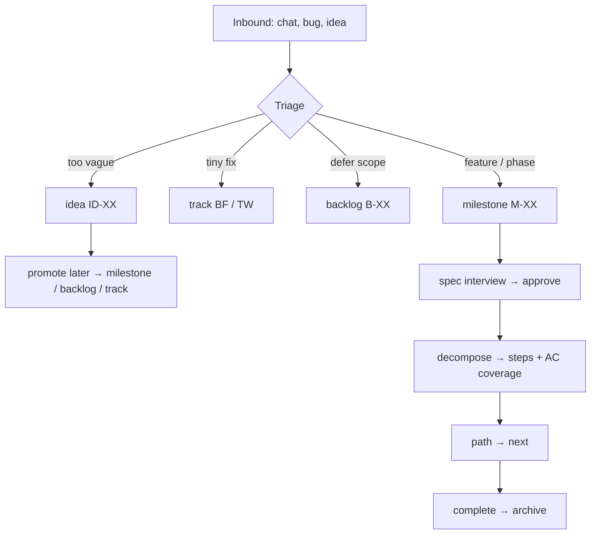

# PM Workflows — Day-to-Day with `mp`

How a **project manager** (human or agent) uses Master Plan to run the backlog:
cadences, flows, and what works in **v1 RC**.

**Audience:** You managing a repo; an agent acting as planning partner. 
**Rust truth:** [AGENT-READINESS.md](./AGENT-READINESS.md) · **Roadmap:** v0.3 M11–M15 in [PLANNING-STATUS §14](./PLANNING-STATUS.md#14-v03-roadmap).

See also [PLANNING-STATUS.md](./PLANNING-STATUS.md), [MP-COMMANDS.md](../06 - Reference/MP-COMMANDS.md),
[GROOMING.md](./GROOMING.md), [EXECUTION-PATH.md](./EXECUTION-PATH.md), [ADOPTION-PROFILES.md](./ADOPTION-PROFILES.md).

---

## 1. PM mental model

> **M81: smallest artifact first.** Before reaching for `milestone` —
> which carries the most ceremony — check the [size-routing decision
> matrix](../02 - Getting Started/SIZE-ROUTING.md). One workflow for
> every size produces 16-step milestones for one-line bugs and buries
> real features. `mp` ships separate intake surfaces per size.

### What `mp` is for

| You manage… | Artifact | Primary commands |
|-------------|----------|------------------|
| **Direction** | `brief.json`, charter in `plan.json` | `brief *`, `plan *` |
| **Committed work** | `milestones/*.json` | `milestone *`, `step *`, `path` |
| **Fast lane** | `tracks/*.json` | `track *` |
| **Parking lot** | `ideas.json`, `backlog.json` | `idea *`, `backlog *` |
| **History** | `archive/` | `archive *`, `list archived` |
| **Health** | gates G1–G10 | `validate`, `doctor` |

### Funnel (intake → delivery)



**Rule:** One source of truth per item. Promote across lanes; don't duplicate.

### Adoption profile (per repo)

Set once in `master-plan/config.json` (or `.mp/config.json`). See [ADOPTION-PROFILES.md](./ADOPTION-PROFILES.md).

| Profile | PM focus |
|---------|----------|
| `full` | Brief, backlog grooming, milestone roadmap |
| `hybrid` | Tracks + ideas daily; `session` for branch-sized work |
| `session` | Single PR scope; archive after merge |

Personal projects → `full`. Work repos → `hybrid` with gitignored plan dir.

**Day-one setup:** [ADOPTION-CHECKLIST.md](./ADOPTION-CHECKLIST.md).

---

## 2. Cadences

### Daily (5–10 min) — “Where are we?”

**Human**

```bash
mp doctor # toolkit + project OK (JSON; summarize for user)
raul status # counts, blockers preview
raul next # single next action
raul tracks # anything hot in fast lane?
raul validate # gate health (human-readable)
```

**Agent**

```bash
mp status
mp next
mp list milestones # full scan until filters ship
mp list tracks
```

Agent summarizes: WIP milestone/step, track items in progress, validate errors, suggested
next action. Escalate blockers to the user.

**Today:** `status`, `next`, `path`, `suggested_path`, list filters, and tracks work. Hybrid session milestones: use `mp session show` until M08 path integration.

---

### Weekly (30–60 min) — Grooming & backlog hygiene

**Goals:** Nothing stale; specs ready before dev starves; backlog ordered.

```bash
mp list milestones --filter grooming 
mp list milestones --filter partial 
mp interview gaps 
mp list backlog 
mp idea list 
mp milestone groom <id> 
mp path 
mp validate
```

**PM actions (human decisions):**

- Promote ideas → backlog or milestone draft
- Defer milestones (`execution_status: deferred`) or pin path order
- Run challenge on risky milestones (P1.7)
- Archive cancelled scope (P2 works for milestones)

**Agent:** Run checklist, present grooming table, propose promotions — user confirms writes.

---

### Per intake — “Something new landed”

Use when: user message, bug report, feature request, production incident.

| Size | PM decision | Commands |
|------|-------------|----------|
| One-liner reminder | Idea | `mp idea create` |
| Fix now, small | Track | `mp track add bugfix` → `start` → `done` |
| Defer formally | Backlog | `mp backlog add` |
| Needs spec | Milestone | `mp milestone create` → interview |
| Changes existing system | Brownfield | See [BROWNFIELD.md](./BROWNFIELD.md); track or delta milestone |

**Agent triage script (conceptual):**

```text
1. mp doctor 
2. Classify: idea | track | backlog | milestone
3. If milestone: mp interview checklist --type milestone 
4. Code zone: gather evidence (not plan edits)
5. mp <create command> --json @-
6. mp validate
```

---

### Per milestone — Spec → approve → ship

Already the core pipeline; PM owns **gates** and **approval**.

| Phase | PM role | Commands |
|-------|---------|----------|
| **Spec** | Run interview; ensure out-of-scope + ACs | `milestone create`, `set-spec-status review`, `approve` |
| **Plan** | Confirm decomposition covers ACs | `decompose`, `plan gaps`, `step add` |
| **Execute** | Protect WIP; unblock | `path`, `next`, `step set-status`, `track *` |
| **Verify** | Evidence on ACs | `criterion pass`, `milestone complete` |
| **Close** | Archive if cancelled | `archive milestone` |

**PM stop points:** approve spec (before code), approve impl plan (before `in-progress`),
complete (before marking verified).

---

### Release / milestone complete — “What shipped?”

```bash
raul milestones --filter done
raul show 03
mp metrics set --coverage-percent 72
mp git commit # optional; respects config
```

Agent drafts release notes from `show milestone` JSON (intent, ACs, evidence).

---

## 3. Flows by scenario

### A. Bootstrap new project

```text
mp init → mp doctor → mp brief todo → … → mp brief done
→ charter interview → first milestones
```

**PM:** Own brief sessions and charter sign-off. **Agent:** Facilitate interviews, never
skip brief without user OK.

---

### B. Fast bugfix (no milestone)

```text
mp track add bugfix --title "…" --problem "…" --verification "cargo test …"
mp track start bugfix BF-02
# dev fixes code
mp track done bugfix BF-02 --evidence "…"
mp validate
```

**Works today.** Best daily PM path for small brownfield.

---

### C. Plan feature without coding

```text
mp interview checklist --type milestone 
mp milestone create --json @-
mp milestone set-spec-status 04 review
# user approves
mp milestone approve 04
mp validate
# STOP — no application code
```

**Works today (v1 RC).** PM + agent run the full spec lifecycle via `mp`.

---

### D. Re-prioritize queue

```text
mp path 
mp path pin 04 --before 03 --reason "CLI before search UI"
mp path focus 04
mp next
```

**Works today.** PM records **why** in pin reason (audit trail for future you).

---

### E. Something is blocked

```bash
mp milestone block 03 --reason "Waiting on design review"
mp status # blockers[] populated
mp list milestones --filter blocked
mp milestone unblock 03
```

---

### F. Descope / cancel

```text
mp milestone set-status 05 cancelled # P1
mp archive milestone 05 # P2 works
# or
mp backlog add --desc "…" --source descoped-from-M05
```

---

### G. Park for later

```text
mp idea create --title "…" --body "…"
# later
mp idea promote ID-03 --to-backlog # P1.6
mp idea promote ID-03 --to-milestone # spawns draft milestone
```

---

### H. Stakeholder status (read-only)

```bash
raul status
raul milestones
mp execution report 03
```

Human shares rendered output; no Jira export required for plan truth.

---

## 4. Human vs agent split

| Task | Human (PM) | Agent |
|------|------------|-------|
| Approve spec / impl plan | **Yes** | Propose only |
| Triage intake size | **Yes** | Recommend route |
| Run interviews | Collaborate | Facilitate, `mp interview *` |
| `mp validate` after writes | Optional | **Always** |
| Code implementation | Dev or agent | Code zone only after `ready` |
| Path pins / defer | **Yes** | Suggest via `path suggest`; user confirms with `path pin` |
| Grooming meeting | **Yes** | Prepare lists, gaps, challenge audit |

**Agent contract:** [templates/AGENTS-TEMPLATE.md](../templates/AGENTS-TEMPLATE.md) 
**Skill:** [templates/skills/master-planner/SKILL.md](../templates/skills/master-planner/SKILL.md)

---

## 5. What works today (Rust v1 RC)

| PM need | Covered? | Command |
|---------|----------|---------|
| Init project | ✅ | `init` (+ `--profile`, `--from-repo`) |
| Toolkit + project health | ✅ | `doctor` (+ `--project`, harness) |
| Dashboard counts | ✅ | `status` (+ `inbox_count`, `blockers`, `suggested_path`) |
| List / show milestones | ✅ | `list milestones`, `show milestone` |
| What's next | ✅ | `path`, `next`, `next` |
| Fast lane bugs/tweaks | ✅ | `track *` (+ `promote`) |
| Brief / ideas / backlog | ✅ | `brief *`, `idea *`, `backlog *` |
| Milestone lifecycle | ✅ | `milestone *`, `step *`, `wp add` |
| Archive / restore | ✅ | `archive`, `restore`, `purge` |
| Gate check | ✅ | `validate` (G1–G13) |
| Interview prompts | ✅ | `interview checklist`, `plan gaps` |
| PM surface | ✅ | `inbox`, `hygiene`, `digest`, `groom`, `challenge *` |
| Publish | ✅ | `export`, `git *` |
| Session (branch work) | ⚠️ partial | `session *` — not in hybrid `path` queue yet (M08) |

Full matrix: [AGENT-READINESS.md](./AGENT-READINESS.md).

---

## 6. Gaps — v0.3 and backlog

### Shipped (v0.2 — M07–M10)

| Capability | Status | Milestone |
|------------|--------|-----------|
| JSON schema on write | **Shipped** | M07 |
| Official GHA validate workflow | **Shipped** | M07 |
| Session milestones in hybrid `path` | **Shipped** | M08 |
| Optimistic concurrency | **Shipped** | M09 |
| `idea dup-check`, `mp note` | **Shipped** | M09 |

### Active (v0.3 — M11–M15)

| Capability | Status | Milestone |
|------------|--------|-----------|
| v1.0.0 release + Gitea publish | Planned | M11 |
| Doc truth sync | In progress | M12 |
| `mp session focus` | Planned | M13 |
| Homebrew (`lthiagol/homebrew-tap`) | Planned | M14 |
| MP-COMMANDS completeness | Planned | M15 |

### Parked (backlog B-17–B-28)

Portfolio dashboard, capacity/sprint, `blocks_external`, multi-writer locks, P4.1 multi-domain delta, doctor schema-version check, and related P5 items — see [PLANNING-STATUS §14](./PLANNING-STATUS.md#14-v03-roadmap).

Full command specs: [MP-COMMANDS.md](../06 - Reference/MP-COMMANDS.md).

---

## 7. Planning mode vs autonomous execution

The human acts as **PM** until scope is approved and decomposed; then the agent may run
**autonomous execution** against `mp next`.

| Mode | Who | Doc |
|------|-----|-----|
| Planning | Human approves specs; agent facilitates | [EXECUTION-MODES.md](./EXECUTION-MODES.md) |
| Autonomous | Agent implements runnable steps; escalates blockers | `mp execution handoff` |

**Ready for execution** is computed (`execution_ready`) — not a single stored enum. See
[EXECUTION-MODES.md §3–4](./EXECUTION-MODES.md#3-ready-for-execution--what-we-already-have).

---

## 8. Suggested Rust batch (when you code)

Single pass grouped by PM cadence:

| Batch | Commands | Unlocks |
|-------|----------|---------|
| **PM daily** | full `doctor`, `status`+blockers, `inbox`, list filters, `execution check` | Standup + triage |
| **PM handoff** | `execution handoff/pause`, `execution_ready` | Autonomous loop |
| **PM intake** | `brief *`, `idea *`, `backlog *`, `milestone create` | Funnel |
| **PM execute** | `step *`, `milestone set-status`, `criterion pass`, `complete` | Delivery |
| **PM weekly** | `groom`, `plan gaps`, `path pin`, `challenge *` | Grooming |
| **PM report** | `export`, `digest`, `decision *`, `git *` | Comms |

---

## 9. Quick reference card

```text
DAILY doctor · status · inbox · next · validate
HANDOFF execution check · execution handoff | pause
INTAKE idea | track add | backlog add | milestone create
TRIAGE inbox · interview checklist · BROWNFIELD routing
WEEKLY hygiene · digest · list --filter grooming · path · groom
EXECUTE path · next · step done · track done
CLOSE criterion pass · milestone complete · archive
REPORT raul status · raul show · mp execution report
```

---

## 10. References

- [MP-COMMANDS.md](../06 - Reference/MP-COMMANDS.md) — full CLI spec
- [GROOMING.md](./GROOMING.md) — filters, challenge, decompose
- [EXECUTION-PATH.md](./EXECUTION-PATH.md) — queue and pins
- [BROWNFIELD.md](./BROWNFIELD.md) — change-type routing
- [EXECUTION-MODES.md](./EXECUTION-MODES.md) — planning vs autonomous, execution_ready
- [SPEC.md §3](./SPEC.md#when-to-use-what) — idea vs track vs backlog vs milestone
