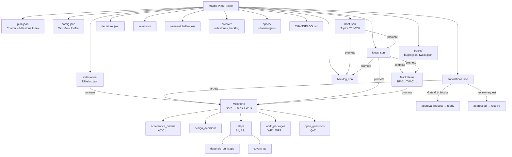
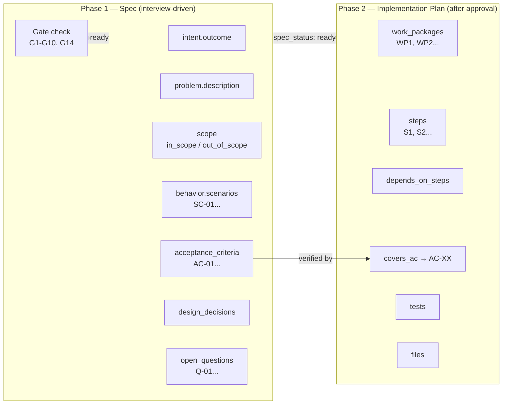

# Master Plan — Spec-Driven Development Model

This document defines the canonical data model, lifecycles, gates, and workflows for
projects using the `master-plan/` directory and the `mp` CLI.

**Status:** Normative for data model and gates. CLI surface in [MP-COMMANDS.md](../06 - Reference/MP-COMMANDS.md);
implementation snapshot in [AGENT-READINESS.md](./AGENT-READINESS.md).

---

## 1. Principles

1. **Spec before code.** Application code must not change until a milestone spec is
   approved (`spec_status: ready`).
2. **Helper owns I/O.** Agents and humans interact with the plan through `mp`, not
   by editing plan files directly.
3. **Interview, then structure.** Agents gather requirements in conversation, then
   write structured specs via `mp`.
4. **Two-phase milestones.** Phase 1 is the spec (what/why). Phase 2 is the
   implementation plan (how), generated only after spec approval.
5. **Verifiable acceptance.** Every milestone has numbered acceptance criteria
   (`AC-XX`) with explicit verification methods.
6. **Agnostic tooling.** The model works with any agent harness; harness-specific
   wiring lives outside this spec.

---

## 2. Directory Layout

### Toolkit (installed once)

```text
~/.agents/
├── master-plan/
│   ├── bin/mp
│   ├── templates/
│   └── schemas/
│       ├── plan.schema.json
│       ├── milestone.schema.json
│       └── interview-checklist.json
├── skills/
│   └── master-planner/
│       └── SKILL.md
└── config.json              # global preferences (optional)
```

### Per-project plan (created by `mp init`)

```text
<project-root>/
├── AGENTS.md                  # pointer to master-plan/AGENTS.md (snippet from template)
└── master-plan/
    ├── AGENTS.md              # project-local agent contract (from template)
    ├── config.json            # project preferences (overrides global)
    ├── plan.json              # charter, planning status, index summary
    ├── brief.json             # bootstrap brainstorm (placeholders → filled topics)
    ├── ideas.json             # quick captures / reminders (planned — see §9)
    ├── backlog.json
    ├── milestones/
    │   ├── 01-environment.json
    │   └── 02-feature.json
    ├── tracks/
    │   ├── bugfix.json        # perpetual — created at init
    │   └── tweak.json
    ├── archive/               # soft-deleted entities (trash bin)
    │   ├── milestones/
    │   ├── backlog/
    │   └── meta.json
    ├── decisions.json
    ├── reviews/               # optional
    │   └── challenges/        # challenge sessions (P1.7)
    └── .cache/                # optional, gitignored — derived indexes
```

**Storage:** JSON on disk (canonical) **and** at the CLI boundary — one `serde_json` path
through `mp::store`. Agents read/write the same shape `mp` persists.
See [STORAGE.md](./STORAGE.md).

**Human views:** v2.0: human display moved to raul CLI/TUI. `mp` is agent-only (``). `templates/views/` is deprecated.
Never the write path.

### Resource model



### Milestone anatomy (two-phase structure)



**Gate summary:**
| Gate | Rule |
|------|------|
| G1–G5 | Structural: spec before code, no open Qs, ACs required, scope required |
| G6–G7 | Completion: verified needs evidence, done needs verified |
| G8–G10 | Execution: dependency order, step deps, AC coverage |
| G11–G13 | Delta: domain spec merge, version conflict |
| G14 | Approval: open approval-request blocks `ready` |
| R1 | Annotation: valid kinds, status lifecycle |
| T1–T2 | Track: minimal fields, steps required |
| B1–B3 | Brief: required topics, done terminal, charter after brief |

> **M118 S3 / B-53 (per-AC evidence semantics):** Each `AcceptanceCriterion.evidence`
> field is **intentionally preserved** across clean re-completions. A
> successful `mp milestone complete` re-run rewrites `verification.evidence`
> (the milestone-level run record) but leaves per-AC `evidence` strings alone,
> including historical `[force-bypassed: ...]` / `[skip-verify: ...]` markers.
> Reviewers and follow-up audits should compare against `verification.evidence`
> as the current-state channel, not the per-AC field. (Rationale: the M107
> design choice preserves the historical completion record rather than
> overwriting it; see `crates/mp/docs/verifier-cancellation.md` for the
> underlying cancel contract.) When a follow-up milestone adds an
> `evidence_history: []` field, this contract is preserved (the array
> accumulates, the scalar reflects the latest clean run).
>
> The annotation `[block-cleared-on-complete: <reason>]` may also appear
> in `verification.evidence` after a milestone is re-blocked post-completion
> and re-completed — it records the **most recent** block context, replacing
> any prior annotation (M118 CR F-3 fix). The `verification.evidence` field
> always reflects the latest state; historical block context lives only in
> git history via the prior milestone-file revisions.

---

## 3. Vocabulary

| Term | ID format | Description |
|------|-----------|-------------|
| **Plan** | — | The entire `master-plan/` tree for one project |
| **Brief** | `T01`, `T02`, … | Bootstrap brainstorm in `brief.json` — before charter |
| **Charter** | — | Product-level spec in `plan.json` |
| **Milestone** | `03`, `03.1`, … | Feature, epic, or phase (`03` on disk; display `M3`, `M3.1`) |
| **Step** | `S1`, `S3.1`, … | Atomic implementation action (scoped to one milestone) |
| **Work package** | `WP1` | Merge-friendly grouping metadata (not part of step ID) |
| **Scenario** | `SC-01` | Behavior spec entry (given/when/then, priority P1–P3) |
| **Functional requirement** | `FR-01` | System MUST/SHALL statement (spec-kit style) |
| **Needs clarification** | `NC-01` | Unresolved requirement (spec-kit marker) |
| **Success criterion** | `SSC-01` | Measurable outcome (spec-kit style) |
| **Acceptance criterion** | `AC-01` | Testable verification for milestone completion |
| **Backlog item** | `B-01` | Deferred scope |
| **Finding** | `F-01` | Issue from a review or challenge session |
| **Challenge** | `CH-03-01` | Structured audit session (`reviews/challenges/`) |
| **Decision** | `D-001` | Logged architectural or planning choice |
| **Open question** | `Q-01` | Unresolved item from interview |
| **Track** | `bugfix`, `tweak` | Perpetual container for lightweight work |
| **Track item** | `BF-01`, `TW-01` | Independent item inside a track |
| **Idea** | `ID-01` | Quick reminder to refine or work on later |

**Display names** (CLI output only): `M3 — OAuth Login`, `S3.1`, `T01 — Problem`, `AC-01`, `BF-01`.  
Full rules: [IDS.md](./IDS.md).

### ID strategy (summary)

- **Milestones:** on disk `03`, display `M3`; splits → `03.1`, `M3.1` (parent keeps id).
- **Steps:** `S1`, `S2`, `S3` per milestone; split → `S3`, `S3.1`, `S3.2` (no renumbering `S4`).
- **Decimals = derived from parent**, not “insert between” unrelated items.
- **Sort:** outline / natural numeric order (`S3 < S3.1 < S3.10 < S4`).

### When to use what

| | Brief topic | Idea | Track item | Backlog | Milestone |
|--|-------------|------|------------|---------|-----------|
| **Purpose** | Orient the project | Remember for later | Small actionable fix | Formal deferred scope | Feature / phase |
| **Capture** | Day zero brainstorm | Mid-conversation | Ready to fix soon | During grooming | Planned work |
| **Required fields** | `title` + `body` or skip | `title` only | title, problem, steps, verification | description, priority | full spec |
| **Interview** | Guided placeholders | None | 1 round (3 questions) | None | Full |
| **CLI** | `mp brief *` | `mp idea *` | `mp track *` | `mp backlog *` | `mp milestone *` |

### Milestone vs track

| | Milestone | Track |
|--|-----------|-------|
| Purpose | Feature, epic, phase | Ongoing bugfixes, tweaks |
| Lifecycle | Ends (`verified` / `done`) | Never ends |
| Spec | Full interview + gates | Minimal fields only |
| Listed by | `mp list milestones` | `mp list tracks` |

---

## 4. Lifecycles

### 4.1 Brief status (project — `brief.json`)

Controls the bootstrap brainstorm phase before charter and milestones.

```text
in_progress → done
```

| Status | Meaning |
|--------|---------|
| `in_progress` | Placeholders may remain; agent fills topics with user |
| `done` | Required topics filled, skipped, or marked N/A; charter phase unlocked |

Topic-level status (`[[topics]]`):

| Status | Meaning | In `todo`? | In `list`? |
|--------|---------|------------|------------|
| `pending` | Empty placeholder | Yes | No |
| `filled` | Body written | No | Yes |
| `skipped` | Explicitly deferred | No | No |
| `na` | Not applicable | No | No |

### 4.2 Spec status (milestone)

Controls whether implementation is allowed.

```text
draft → interview → review → ready → implemented → verified
```

| Status | Meaning | Implementation allowed? |
|--------|---------|-------------------------|
| `draft` | Skeleton created | No |
| `interview` | Agent gathering requirements | No |
| `review` | Spec complete, awaiting human approval | No |
| `ready` | Spec approved | Yes |
| `implemented` | Code complete, not yet verified | Yes (finishing) |
| `verified` | All ACs passed with evidence | No (done) |

### 4.3 Execution status (milestone)

Tracks delivery progress.

```text
planned → in-progress → done | blocked | deferred | cancelled
```

| Status | Meaning |
|--------|---------|
| `planned` | Approved spec, not started |
| `in-progress` | Active implementation |
| `done` | Execution complete |
| `blocked` | Cannot proceed |
| `deferred` | Postponed to a later phase |
| `cancelled` | Will not be done |

**Block metadata (P1.9)** when `execution_status: blocked`:

| Field | Meaning |
|-------|---------|
| `block_reason` | Why work stopped |
| `blocked_at` | ISO timestamp |
| `blocked_by` | `user` or agent id |

### 4.3a Execution readiness (computed)

Not a stored status — derived for PM and handoff. See [EXECUTION-MODES.md](./EXECUTION-MODES.md).

| Field | True when |
|-------|-----------|
| **`execution_ready`** (milestone) | `spec_status >= ready`, steps exist, AC coverage (G10), deps done, not blocked/deferred/cancelled |
| **runnable** (step) | Parent `execution_ready`, step `pending`, step deps done |

`mp execution check` and `mp show milestone ` include `execution_ready` and
`execution_ready_blockers[]`.

### 4.4 Planning status (project — `plan.json`)

| Status | Meaning |
|--------|---------|
| `planning` | Charter or milestones being defined |
| `ready-for-execution` | At least one milestone spec is `ready` |
| `in-execution` | Active implementation underway |
| `release-candidate` | Feature-complete, stabilizing |

### 4.5 Planning phase (project — `plan.json`)

Tracks where the project is in the planning pipeline.

| Phase | Meaning |
|-------|---------|
| `brief` | Bootstrap brainstorm (`brief.json`) — default after `mp init` |
| `charter` | Structured product contract (`plan.json` charter fields) |
| `milestones` | Milestone specs and grooming |
| `execution` | At least one milestone approved and in delivery |

Set `planning_phase` to `charter` when `mp brief done` succeeds.

### 4.6 Execution mode (project — `plan.json [execution]`)

| Field | Values | Meaning |
|-------|--------|---------|
| `mode` | `planning` \| `autonomous` | Agent may implement runnable steps only when `autonomous` |
| `handoff_at` | ISO timestamp | Set by `mp execution handoff` |
| `handoff_by` | string | Who enabled autonomous mode |

Default: `planning`. See [EXECUTION-MODES.md](./EXECUTION-MODES.md).

### 4.7 Planning status vs planning phase (matrix)

Two fields — **do not conflate** ([DECISIONS.md ADR-002](./DECISIONS.md#adr-002-planning_status-vs-planning_phase)).

| planning_phase | Typical planning_status | Meaning |
|----------------|-------------------------|---------|
| `brief` | `planning` | Brainstorm in progress |
| `charter` | `planning` | Charter interview / `plan.json` goals |
| `milestones` | `planning` or `ready-for-execution` | Specs/grooming; ≥1 milestone `ready` → latter |
| `execution` | `in-execution` or `release-candidate` | Delivering approved work |

**Who updates:**

| Event | `planning_phase` | `planning_status` |
|-------|------------------|-------------------|
| `mp init` | `brief` | `planning` |
| `mp brief done` | `charter` | `planning` |
| First `milestone approve` | `milestones` | `ready-for-execution` (if first ready) |
| `mp execution handoff` | `execution` | `in-execution` |
| Release polish | `execution` | `release-candidate` |

---

## 5. Gates (enforced by `mp validate`)

| Gate | Rule |
|------|------|
| **G1 — Spec before code** | `lifecycle == "in-progress"` requires `lifecycle` >= `approved` (or legacy `execution_status: in-progress` requires `spec_status: ready` or later, during M100 migration window) |
| **G2 — No open questions at ready** | `lifecycle >= approved` requires zero unresolved open questions (legacy: `spec_status: ready`) |
| **G3 — ACs required** | `lifecycle >= groomed` requires at least one acceptance criterion (legacy: `spec_status: review`) |
| **G4 — Exclusions required** | `lifecycle >= groomed` requires at least two out-of-scope items (legacy: `spec_status: review`) |
| **G5 — No impl plan before ready** | `implementation_plan` must be empty unless `lifecycle >= approved` (legacy: `spec_status >= ready`) |
| **G6 — Verified needs evidence** | `lifecycle >= reviewed` requires all ACs `passed` with evidence (legacy: `spec_status: verified`) |
| **G7 — Done needs verified** | `lifecycle >= self-reviewed` requires `lifecycle >= reviewed` first; legacy: `execution_status: done` requires `spec_status: verified` |

> **M100 migration window:** Milestones with `spec_status` / `execution_status`
> still populated continue to gate against the legacy field reads. After
> `mp migrate lifecycle` (S10 of M100) clears the legacy fields, reads route
> through `effective_lifecycle()` and `MilestoneMeta.lifecycle`. Helper:
> `crates/mp-model/src/milestone.rs::effective_lifecycle`. Mapped via
> `legacy_spec_status_to_lifecycle` / `legacy_execution_status_to_lifecycle`.

| **G8 — Dependency order** | A milestone cannot be `in-progress` if dependencies are not `done` |
| **G9 — Step dependency order** | A step cannot be `in-progress` if `depends_on_steps` are not `done` (P1.8) |
| **G10 — AC coverage** | `execution_status: in-progress` warns if any AC has no step in `covers_ac` (strict: validate error) |

### Annotation gates

| Gate | Rule |
|------|------|
| **R1 — Annotation validation** | Every annotation must have non-empty `target`, `body`, `author`; `kind` must be in `[review-request, break-down, decouple, change-suggestion, approval-request, note]`; `status` must be in `[open, addressed, resolved]` |
| **G14 — Approval gate** | A milestone cannot reach `spec_status: ready` if any open (non-resolved) `approval-request` annotation targets it (including step-level targets like `M##/S##`) |

### Track gates (relaxed)

| Gate | Rule |
|------|------|
| **T1 — Minimal fields** | Track item must have `title`, `problem`, and (`done_when` or `verification`) |
| **T2 — Steps required** | At least one step before `in-progress` |
| **T3 — No spec gate** | Track items skip `spec_status`; go `pending → in-progress` directly |
| **T4 — No milestone deps** | Track items never block milestone dependency order |

### Brief gates (bootstrap)

| Gate | Rule |
|------|------|
| **B1 — Required topics** | `mp brief done` requires every `required = true` topic to be `filled`, `skipped`, or `na` |
| **B2 — Done is terminal** | While `brief.status = done`, `edit` and `add` warn unless `--reopen` |
| **B3 — Charter after brief** | `mp interview checklist --type charter` warns if `brief.status != done` (soft gate) |

### Delta gates (brownfield — P4)

| Gate | Rule |
|------|------|
| **G11 — Delta needs domain** | `change_kind: delta` requires `delta.domain` and `specs/{domain}.json` exists |
| **G12 — Valid delta targets** | MODIFIED/REMOVED `target` must exist in domain at `delta.base_version` |
| G13 — Merge conflict | `milestone complete` blocks if domain `version` ≠ `delta.base_version` (rebase required) |
| **G14 — Approval gate** | `spec_status: ready` blocked if any open `approval-request` annotation targets the milestone |

### 5.1 Gate enforcement matrix

What `mp validate` enforces **today** vs **planned** — see [AGENT-READINESS.md](./AGENT-READINESS.md).

| Gate | Planned | Rust today |
|------|---------|------------|
| G1 | ✓ | ✓ |
| G2 | ✓ | ✓ |
| G3 | ✓ | ✓ |
| G4 | ✓ | ✓ |
| G5 | ✓ | ✓ |
| G6 | ✓ | ✓ |
| G7 | ✓ | ✓ |
| G8 | ✓ | ✓ |
| G9 | ✓ (P1.8) | ✓ |
| G10 | ✓ (P1.8.2) | partial (warning unless `workflow.gates.strictness = full`) |
| G11–G13 | ✓ (P4) | ✓ |
| G14 | ✓ (M43) | ✓ |
| R1 | ✓ (M43) | ✓ |
| T1–T2 | ✓ | ✓ |
| B1 | ✓ (P0.5) | ✓ (`mp brief done` only) |
| W01 | ✓ | ✓ (warning) |

---

## 6. Project Brief (bootstrap brainstorm)

> **Implementation status:** Implemented (v1 RC). See [AGENT-READINESS.md](./AGENT-READINESS.md).

The **Project Brief** is the day-zero orientation doc: high-level ideas and expectations
before the structured charter or milestone specs. *Start messy. Structure later.*

**File:** `master-plan/brief.json` (created by `mp init`).

**Use when:**
- The project folder is new and direction is fuzzy
- The user has many ideas but doesn't know where to start
- You need context before charter or milestone interviews

**Do not use the brief when:**
- Charter is already complete → go to milestones
- Capturing a single parked thought mid-session → idea
- Ready to fix something small → track item

### Pipeline position

```text
mp init → brief (brainstorm) → charter (plan.json) → milestones → execution
```

### Built-in topics (seeded at init)

| ID | Key | Title | Required |
|----|-----|-------|----------|
| T01 | `problem` | Problem & motivation | yes |
| T02 | `audience` | Who is it for? | yes |
| T03 | `capabilities` | Rough capabilities | yes |
| T04 | `constraints` | Constraints | yes |
| T05 | `inspiration` | Inspiration & references | no |
| T06 | `unknowns` | Unknowns & open questions | yes |
| T07 | `success` | What success looks like | yes |
| T08 | `non_starters` | Explicit non-starters | yes |

Custom topics added via `mp brief add` get the next `Txx` ID and `builtin = false`.

### Agent workflow (first session)

```text
1. mp init
2. mp brief todo 
3. User brain-dumps; agent asks 1–2 questions per pending topic
4. mp brief edit T03 --body "..."  (repeat)
5. mp brief add --title "Mobile apps?" --prompt "Native or web-only?"
6. mp brief list       # context for charter / milestones
7. mp brief done
8. → mp interview checklist --type charter
```

### Promotion (planned P1.1)

| Command | Result |
|---------|--------|
| `mp brief promote T03 --to-idea` | Create idea from topic body |
| `mp brief promote T08 --to-backlog` | Create backlog item from non-starter |

### Brief vs idea

| | Brief topic | Idea |
|--|-------------|------|
| Shape | Fixed sections with prompts | Atomic capture |
| When | Day zero | Anytime |
| Output | Feeds charter and interviews | Promote to milestone/backlog/track |

---

## 7. Tracks (perpetual lightweight work)

Tracks are permanent containers for small, independent work. The track itself never
completes — only individual items do.

**Kinds:** `bugfix`, `tweak` (created at `mp init`).

**Item lifecycle:**

```text
pending → in-progress → done | cancelled | archived
```

**Required fields to start an item:** `title`, `problem`, `done_when` or `verification`,
at least one `step`.

**Interview:** One round, three questions (see `track_item` in interview-checklist.json).
Skip if the user already provided answers.

**Promotion:** `mp track promote bugfix BF-03 --to-milestone` creates a numbered
milestone from item fields and archives the track item.

---

---

## 8. Grooming, challenge & decomposition

> **Implementation status:** Documented (P1.7). See [GROOMING.md](./GROOMING.md).

Grooming keeps milestones right-sized and plans honest. Three complementary flows:

| Flow | Entry command | When |
|------|---------------|------|
| **List & scan** | `mp list milestones --filter <preset>` | Roadmap overview |
| **Decompose** | `mp milestone decompose <id>` | Approved spec → WPs/steps |
| **Challenge** | `mp challenge start <id>` | Stress-test spec or plan |
| **Split** | `mp step split` / `mp milestone split` | Step or milestone too large |
| **Route** | `mp groom milestone <id>` | “What should we do with M03?” |

### List filters

Presets: `all`, `pending`, `in-progress`, `partial`, `done`, `grooming`, `blocked`.
Human output is a compact table (id, title, statuses, step progress).

### Challenge sessions

Stored under `reviews/challenges/`. A session has scope (`spec`, `plan`, `full`,
`sequence`), findings (`F-01`…), and typed resolutions (`update-step`, `split-step`,
etc.). Challenge is **review with memory** — not silent edits.

### Decompose vs split

- **Decompose** — milestone has no (or incomplete) implementation plan.
- **Split step** — one step is too big; parent keeps id, children get `.1`, `.2`.
- **Split milestone** — milestone spans disconnected efforts; `03` + `03.1`, `03.2`.

### Execution path (suggested work order)

> **Implementation status:** Documented (P1.8). See [EXECUTION-PATH.md](./EXECUTION-PATH.md).

| Layer | What | Example |
|-------|------|---------|
| **Constraints** | Hard — cannot violate | `depends_on`, `blocks`, step `depends_on_steps` |
| **Preferences** | Soft — reorder ready work | `priority`, `execution.adoption_order`, `focus` |
| **Suggested path** | Computed queue | `mp path`, `status.suggested_path`, `next-step` |

Default: **`resume_then_ready`** — finish or advance in-progress milestones, then
dependency-ready work sorted by priority and manual pins, then topological order.

**Do not overload `status` alone** — it shows a preview; use **`mp path`** for the full
queue and `mp path pin` for “M4 before M3” overrides.

---

## 9. Ideas (quick captures)

> **Implementation status:** Implemented (v1 RC). See [AGENT-READINESS.md](./AGENT-READINESS.md).

Ideas are the **lightest** planning layer: reminders from conversation, not tasks yet.

**File:** `master-plan/ideas.json` (single file, not a track).

**Use when the user says:**
- “Let’s handle this later”
- “Park this idea”
- “We should think about X someday”

**Do not use ideas when:**
- The user wants actionable work now → track or milestone
- Scope is formally deferred during grooming → backlog

### Idea lifecycle

```text
open → refined → promoted | dismissed | archived
```

| Status | Meaning |
|--------|---------|
| `open` | Captured, not yet developed |
| `refined` | Notes/tags updated; clearer but still not work |
| `promoted` | Moved to milestone, backlog, or track (`promoted_to` set) |
| `dismissed` | Won’t pursue |
| `archived` | Soft-deleted (archive model) |

### Required fields

- **Create:** `title` only
- **Optional:** `body`, `tags`, `source`

No interview. No spec gates. No steps or verification.

### Promotion paths

| Command (planned) | Result |
|-------------------|--------|
| `mp idea promote ID-01 --to-milestone` | Draft milestone; seed intent/problem from idea |
| `mp idea promote ID-01 --to-backlog` | New `B-XX` entry |
| `mp idea promote ID-01 --to-track bugfix` | New `BF-XX` with title/problem from idea |

After promotion, idea status becomes `promoted` and `promoted_to` records the target.

### Agent example

User: *“Let’s handle how the installer will work later.”*

```bash
mp idea create \
  --title "App installer design" \
  --body "Defer harness install (~/.agents, PATH, skills). Engine first." \
  --tags installer,distribution
```

Later: `mp idea list` → user picks one → `mp idea promote ID-01 --to-milestone`.

---

## 10. Archive (soft delete)

Archive is a trash bin. Nothing is hard-deleted unless explicitly purged.

| Entity | Archive behavior |
|--------|------------------|
| Milestone | File moved to `archive/milestones/` |
| Backlog item | Entry moved to `archive/backlog/` |
| Track item | `status = archived` + `archived_at` inline in track file |

**Commands:** `mp archive *`, `mp list archived`, `mp show archived *`,
`mp restore archived *`, `mp purge archived *` (requires `--confirm`).

**Defaults** (`master-plan/config.json`):

```toml
[archive]
auto_purge_days = 0
archive_on_milestone_delete = true
archive_on_track_cancel = true

[next]
prefer = "milestone"   # milestone | track | balanced
```

---

## 11. Two-Phase Milestone Workflow

### Phase 1 — Spec (interview-driven)

Agent and user define **what** and **why**. No work packages or steps yet.

**Inputs:** user request, codebase analysis, charter, existing milestones.

**Outputs via `mp`:**
- intent, problem, context
- behavior scenarios (`SC-XX`)
- interface spec (if applicable)
- scope (in / out)
- acceptance criteria (`AC-XX`)
- design decisions
- open questions (resolved before `ready`)

**End state:** `spec_status: review` → user approves → `spec_status: ready`

### Phase 2 — Implementation plan (decomposition)

Triggered explicitly after spec approval:

- User says: *"Break this into steps"* / *"Plan implementation for M03"*
- Or agent proposes decomposition and user confirms

**Outputs via `mp`:**
- work packages (`WP1`, `WP2`, …) — grouping / rollback units
- steps (`S1`, `S2`, `S3.1`, …) with files, tests, done-when, optional `covers_ac`
- closure WP (verify, lint, update plan)

**Command:** `mp milestone plan <id>` (generates structure; agent fills content via JSON)

**End state:** milestone ready for `mp next` execution.

---

## 12. Interview Model

### 12.0 Project brief (bootstrap)

Run immediately after `mp init` when `brief.status = in_progress`.

Agent reads `mp brief todo ` and fills topics in short rounds (1–2
questions per empty slot). Use `mp brief edit` for writes. Optional:
`mp interview checklist --type brief ` for suggested questions per round.

**End state:** `mp brief done` → `planning_phase = charter` → proceed to §12.1.

### 12.1 Charter interview (once per project)

Run when `plan.json` charter fields are empty or user runs `/mp charter`. Prefer
running after `mp brief done` so charter questions build on captured context.
Use `mp brief list ` as interview context — do not re-ask what the
brief already answers.

| Section | Topics |
|---------|--------|
| Product | What is this? Who uses it? |
| Stack | Languages, frameworks, constraints |
| Goals | v1 must-haves (3–5) |
| Non-goals | Explicit exclusions |
| Success | How do we know v1 is done? |

### 12.2 Milestone interview (per feature/bug)

Agent asks in short rounds (2–4 questions). Skip topics already answered.

| Round | Topics |
|-------|--------|
| 1 — Intent | Outcome sentence, problem/motivation |
| 2 — Behavior | Scenarios, edge cases, error behavior |
| 3 — Interface | APIs, CLI, config, data shapes (if applicable) |
| 4 — Scope | In-scope, out-of-scope (min 2), deferrals |
| 5 — Acceptance | How to verify; definition of done |
| 6 — Design | Options, choices, rationale (agent may propose) |
| 7 — Sequencing | Dependencies, effort, risk |
| 8 — Gaps | Open questions |

**Agent rules:**
- Do not ask all questions at once.
- Propose defaults from codebase; user confirms or corrects.
- Record open questions via `mp milestone question add`.
- Summarize spec in natural language before requesting approval.
- Never write application code during interview or spec phase.

### 12.3 Track item interview

One round when adding a track item via `mp interview checklist --type track-item`:

1. What is broken or wrong?
2. How do we verify the fix?
3. What steps/files are involved?

### 12.4 Interview checklist (machine-readable)

`~/.agents/master-plan/schemas/interview-checklist.json` drives
`mp interview checklist --type brief|charter|milestone|track-item `.

Returns missing fields and suggested questions. The agent uses this to decide what
to ask next — interview logic is not hardcoded per harness.

---

## 13. Data Schemas

### 13.1 `plan.json` (charter + index)

```toml
[project]
name = "my-app"
description = "Short description"
stack = ["rust", "clap"]
platforms = ["macos", "linux"]
created = "2026-06-17"
target_version = "v1.0.0"
planning_status = "planning"  # planning | ready-for-execution | in-execution | release-candidate
planning_phase = "brief"      # brief | charter | milestones | execution

[execution]
strategy = "resume_then_ready"
interleave = "milestone"
focus_milestone = ""

[charter]
goals = [
  "Read-only markdown viewer for Obsidian vaults",
  "Fuzzy and content search",
]
non_goals = [
  "Editing notes",
  "AI features",
]
deferred = [
  "Tabs and backlinks (v2)",
]

[metrics]
lines_of_code = 0
unit_tests = 0
checked_at = "2026-06-17"

[[milestones]]
id = "01"
title = "CLI foundation"
spec_status = "verified"
execution_status = "done"
blocked_by = ""

[[milestones]]
id = "02"
title = "Adoption and PM surface"
spec_status = "verified"
execution_status = "done"
blocked_by = ""
```

The `[[milestones]]` index is auto-synced by every state mutation (create, approve,
set-spec-status, set-status, complete, block, split, update, delete).
A manual `mp sync` rebuilds the index as a recovery path. `mp validate` detects
stale-value drift (W03) between the index and per-milestone files for
`spec_status`, `execution_status`, and `title`.

```toml
[brief]
status = "in_progress"
created = "2026-06-17"
completed = ""

[[topics]]
id = "T01"
key = "problem"
title = "Problem & motivation"
prompt = "What problem are you solving?"
body = "Local-first markdown viewer for large vaults."
status = "filled"
builtin = true
required = true
order = 1
```

See [../schemas/brief.schema.json](../schemas/brief.schema.json) and
`templates/defaults/brief.json`.

### 13.3 Milestone file (`milestones/03-auth.json`)

```toml
[milestone]
id = "03"
title = "OAuth Login"
slug = "oauth-login"
spec_status = "review"       # draft | interview | review | ready | implemented | verified
execution_status = "planned" # planned | in-progress | done | blocked | deferred | cancelled
depends_on = ["02"]
effort = "M"                 # S | M | L
risk = "med"                 # low | med | high
created = "2026-06-17"
updated = "2026-06-17"

[intent]
outcome = "User can sign in with GitHub OAuth and receive a session token."

[problem]
description = "The app needs authenticated access before enabling sync features."

[context]
related = ["02-config"]
references = []

[[behavior.scenarios]]
id = "SC-01"
title = "Successful GitHub login"
given = "User is on the login screen with valid OAuth config"
when = "User completes GitHub OAuth flow"
then = "User is redirected to the dashboard with an active session"

[[behavior.scenarios]]
id = "SC-02"
title = "OAuth failure"
given = "GitHub returns an error"
when = "User attempts login"
then = "User sees an error message and can retry without crash"

[interface]
# Optional — omit for internal-only milestones
endpoints = [
  { method = "GET", path = "/auth/github", description = "Start OAuth flow" },
  { method = "GET", path = "/auth/callback", description = "OAuth callback" },
]
config_keys = [
  { key = "oauth.github_client_id", type = "string", required = true },
]

[scope]
in_scope = [
  "GitHub OAuth provider",
  "Session token issuance",
]
out_of_scope = [
  "Google OAuth (deferred to B-04)",
  "Password-based login",
  "Account management UI",
]

[[acceptance_criteria]]
id = "AC-01"
description = "OAuth flow completes and returns a valid session"
verification = "cargo test oauth_flow_end_to_end"
status = "pending"  # pending | passed | failed

[[acceptance_criteria]]
id = "AC-02"
description = "Invalid callback shows error without panic"
verification = "cargo test oauth_callback_error"
status = "pending"

[[design_decisions]]
area = "Session storage"
choice = "Signed JWT in httpOnly cookie"
rationale = "Stateless, works with single binary deployment"

[[open_questions]]
id = "Q-01"
question = "Session TTL — 24h or 7d?"
status = "resolved"  # open | resolved
answer = "24h with refresh token deferred to backlog"

[[risks]]
description = "OAuth secret leakage in config"
likelihood = "low"
impact = "high"
mitigation = "Secrets via env vars only; validate in CI"

# Implementation plan — EMPTY until spec_status >= ready
# Populated by `mp milestone plan 03` + agent JSON updates

[[work_packages]]
id = "WP1"
name = "OAuth endpoints"
goal = "GitHub OAuth flow wired"
rollback = "git restore src/auth/"

[[steps]]
id = "S1"
work_package = "WP1"
order = 1
action = "Add OAuth routes"
status = "pending"

[[steps]]
id = "S2"
work_package = "WP1"
order = 2
action = "Implement callback handler"
status = "pending"
covers_ac = ["AC-01"]

[verification]
date = ""
branch = ""
evidence = ""

[[follow_ups]]
item = "Refresh token support"
target = "backlog"
priority = "low"
```

### 13.4 Track file (`tracks/bugfix.json`)

```toml
[track]
kind = "bugfix"
title = "Bugfixes"
perpetual = true
scope = "Small correctness fixes; no new features."
created = "2026-06-17"

[[items]]
id = "BF-01"
title = "Fix vault scanner skipping symlinks"
status = "pending"
effort = "S"
problem = "Symlinks shown but not followed"
done_when = "TestVaultSymlink passes"
verification = "go test -run TestVaultSymlink"
steps = ["Update vault.go walk logic", "Add symlink test fixture"]
evidence = ""
created = ""
completed = ""
archived_at = ""
```

Tweak track uses `TW-01`, `TW-02`, etc.

### 13.5 `ideas.json`

```toml
[[ideas]]
id = "ID-01"
title = "App installer design"
body = "Defer harness install (~/.agents, PATH, skills). Engine first."
status = "open"              # open | refined | promoted | dismissed | archived
tags = ["installer", "distribution"]
source = "conversation"      # conversation | planning | review
created = "2026-06-17"
promoted_to = ""             # milestone:04 | backlog:B-03 | track:bugfix:BF-02
```

### 13.6 `backlog.json`

```toml
[[items]]
id = "B-01"
description = "Google OAuth provider"
source = "planning"
suggested_when = "post-v1"
priority = "medium"
status = "active"  # active | resolved

[[items]]
id = "B-02"
description = "Refresh token support"
source = "milestone-03"
suggested_when = "v1.1"
priority = "low"
status = "active"
```

### 13.7 CLI interchange

| Direction | Format |
|-----------|--------|
| Disk (canonical) | JSON |
| Agent writes | `--json @-` or `--file path.json` |
| Agent reads | JSON (default) |
| Human reads | raul CLI/TUI. `mp` is agent-only — no `--format human` (removed in v2.0). |
| Debug | `--format raw` (verbatim on-disk JSON passthrough, or GraphViz DOT for `graph`) |

One `serde_json` path: disk and CLI boundary share the same JSON shape, so what agents
read/write is exactly what `mp` persists. JSON field names use `snake_case`.
See [STORAGE.md](./STORAGE.md).

See `schemas/idea.schema.json` for the idea JSON Schema (P1.6 — planned).
See [TEMPLATES.md](./TEMPLATES.md) for template ↔ interview mapping.

---

## 14. Preferences

### Global (`~/.agents/config.json`)

```json
{
  "display": {
    "milestone_prefix": "M"
  },
  "git": {
    "auto_commit": false,
    "auto_push": false,
    "commit_on_milestone_complete": false,
    "commit_message_template": "plan({milestone}): mark {title} complete"
  },
  "init": {
    "default_profile": "full"
  }
}
```

> **Note (v2.0 / M76):** `[output] default_format` removed — `mp` stdout is always JSON unless `--format raw` is used for debug.

### Project (`master-plan/config.json`)

Overrides global. **Adoption profile** (how this repo uses Master Plan) lives here — per
project, not global. Full reference: [ADOPTION-PROFILES.md](./ADOPTION-PROFILES.md).

Example (`hybrid` work repo):

```json
{
  "workflow": {
    "profile": "hybrid",
    "artifacts": {
      "brief": false,
      "backlog": false,
      "milestones": "session",
      "tracks": true,
      "ideas": true
    },
    "plan": {
      "in_repo": false,
      "location": ".mp"
    },
    "gates": {
      "strictness": "relaxed"
    }
  },
  "git": {
    "auto_commit": false
  },
  "planning": {
    "require_min_out_of_scope": 1,
    "require_min_acceptance_criteria": 1
  },
  "next": {
    "prefer": "track"
  }
}
```

**Precedence:** CLI flags > project config > global config > defaults.

**Do not conflate:**

| Config | File | Role |
|--------|------|------|
| Adoption profile | `config.json [workflow]` | Which artifacts/gates (stable per repo) |
| Planning phase | `plan.json planning_phase` | Bootstrap pipeline stage (state) |
| Execution mode | `plan.json [execution].mode` | Agent may implement? (`planning` \| `autonomous`) |

---

## 15. Agent Workflow Summary

```text
┌─────────────────────────────────────────────────────────────┐
│  User request (natural language or /mp)                     │
└──────────────────────────┬──────────────────────────────────┘
                           ▼
              ┌────────────────────────┐
              │ Read master-plan/      │
              │ AGENTS.md              │
              └────────────┬───────────┘
                           ▼
              ┌────────────────────────┐
              │ mp brief todo / done     │  ← first session after init
              │ (bootstrap brainstorm)   │
              └────────────┬───────────┘
                           ▼
              ┌────────────────────────┐
              │ mp interview checklist │
              │ charter → milestone    │
              └────────────┬───────────┘
                           ▼
              ┌────────────────────────┐
              │ Interview user          │
              │ (short rounds)          │
              └────────────┬───────────┘
                           ▼
              ┌────────────────────────┐
              │ mp milestone create/     │
              │ update (spec only)        │
              │ spec_status → review      │
              └────────────┬───────────┘
                           ▼
              ┌────────────────────────┐
              │ User approves spec        │
              │ mp milestone approve     │
              │ spec_status → ready       │
              └────────────┬───────────┘
                           ▼
              ┌────────────────────────┐
              │ mp milestone plan        │
              │ (implementation plan)     │
              └────────────┬───────────┘
                           ▼
              ┌────────────────────────┐
              │ mp next → code      │
              │ mp step done             │
              │ mp criterion pass        │
              │ mp milestone complete    │
              └────────────────────────┘
```

---

## 16. Export (optional)

`mp export` generates human-readable markdown from structured source:

- `master-plan/exports/STATUS.md`
- `master-plan/exports/milestones/03-oauth-login.md`

Exports are for review and git diffs. They are not the write path.

---

## 17. Brownfield and delta specs (P4)

**Greenfield** = net-new capability. A full milestone spec is enough.

**Brownfield** = changing existing behavior. Most real work after bootstrap.

| Approach | When |
|----------|------|
| **Track** | Tiny fix, tweak — no domain spec |
| **Greenfield milestone** | New subsystem; default `change_kind` |
| **Delta milestone** | Change documented domain — `change_kind: delta` |

**Delta spec** (OpenSpec-style) documents only what changes:

| Section | Meaning |
|---------|---------|
| ADDED | New requirements/scenarios |
| MODIFIED | Changed behavior (`before` → `after`) |
| REMOVED | Deprecated behavior |

**Domain specs:** `master-plan/specs/{domain}.json` hold long-lived truth. Delta
milestones merge on `mp milestone complete`. Tracks handle small brownfield work today.

**Agent zones:** Plan I/O via `mp` only; codebase discovery via harness search (code
zone). Scan assist: `mp brownfield scan` (P4).

Full design: [BROWNFIELD.md](./BROWNFIELD.md).

---

## 18. Open Decisions

Resolved decisions: [DECISIONS.md](./DECISIONS.md).

| Topic | Options | Current lean |
|-------|---------|--------------|
| On-disk format | TOML vs JSON per file | **JSON** (decided — [ADR-014](./DECISIONS.md#adr-014-json-canonical-plan-persistence); was TOML, changed in M92) |
| Steps location | flat `[[steps]]` vs nested | **flat** ([ADR-001](./DECISIONS.md#adr-001-steps-on-disk)) |
| Export committed to git | Yes / no / on-demand | On-demand, gitignored by default |
| `mp milestone plan` | Template only vs AI-assisted | Template structure; agent fills via JSON |
| Monorepo | One plan dir vs per-crate | **Single root** ([D-004](./DECISIONS.md), [ADR-012](./DECISIONS.md)); per-crate deferred → backlog B-25 |

---

## 19. References

- [PLANNING-STATUS.md](./PLANNING-STATUS.md) — design snapshot
- [EXECUTION-PATH.md](./EXECUTION-PATH.md) — suggested work order, automatic vs manual
- [IDS.md](./IDS.md) — hierarchical outline IDs (M, S, splits)
- [MP-COMMANDS.md](../06 - Reference/MP-COMMANDS.md) — CLI command reference
- [GROOMING.md](./GROOMING.md) — challenge, decompose, split, list filters
- [DECISIONS.md](./DECISIONS.md) — ADRs
- [AGENT-READINESS.md](./AGENT-READINESS.md) — Rust vs documented CLI
- [EDGE-CASES.md](./EDGE-CASES.md) — failure paths, concurrency
- [EMERGENCY.md](./EMERGENCY.md) — hotfix policy
- [../templates/AGENTS-TEMPLATE.md](../templates/AGENTS-TEMPLATE.md) — project agent contract
- [../schemas/milestone.schema.json](../schemas/milestone.schema.json) — milestone JSON Schema
- [../schemas/brief.schema.json](../schemas/brief.schema.json) — brief JSON Schema (P0.5)
- [../schemas/challenge.schema.json](../schemas/challenge.schema.json) — challenge JSON Schema (P1.7)
- [../schemas/idea.schema.json](../schemas/idea.schema.json) — idea JSON Schema (P1.6 — planned)
