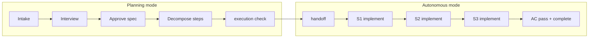

# Walkthrough — Interview to Autonomous Execution

End-to-end example: **M03 — OAuth Login** on a fictional app **acme-app**.
Shows human PM + agent collaboration, then autonomous execution after handoff.

**Fixture (handoff-ready state):**  
`tests/fixtures/projects/walkthrough-oauth/`

**Related:** [EXECUTION-MODES.md](./EXECUTION-MODES.md), [PM-WORKFLOWS.md](./PM-WORKFLOWS.md)

---

## Cast

| Role | Who |
|------|-----|
| **PM (human)** | You — triage, approve specs, handoff, unblock |
| **Planner agent** | Interviews, writes plan via `mp`, code-zone research |
| **Executor agent** | After handoff — `next-step` loop only |

**Fictional app:** Rust API + web client. M01–M02 already shipped in the fixture.

---

## Timeline overview



---

## Phase 0 — Project context (already done in fixture)

M01 Foundation and M02 Session Auth are `verified` / `done`.  
M03 depends on `02`. Track `BF-01` is a resolved example in history.

```bash
cd tests/fixtures/projects/walkthrough-oauth
MP_HOME=/path/to/master-plan-repo mp status
```

Expected shape:

```json
{
  "planning_status": "ready-for-execution",
  "milestones": { "total": 3, "by_execution_status": { "done": 2, "planned": 1 } }
}
```

---

## Phase 1 — Intake (PM + agent)

**User says:** “We need Google OAuth login.”

### PM triage

```bash
mp inbox
```

Agent recommends **milestone** (not track): new capability, multiple ACs, touches auth module.

| Too small | This request |
|-----------|--------------|
| Track bugfix | New OAuth flow, callbacks, sessions |

### Code zone (research only)

Agent reads `src/auth/` (fictional), finds existing session from M02.  
Records paths for spec — **does not edit** `master-plan/`.

### Plan zone

```bash
mp interview checklist --type milestone
```

**Sample interview (agent → user):**

1. Which providers? → Google first, GitHub later (out of scope).
2. Mobile? → Web only for M03.
3. Existing users? → Link by email on first OAuth login.

```bash
mp milestone create --json @- <<'EOF'
{
  "title": "OAuth Login",
  "change_kind": "greenfield",
  "intent": { "outcome": "Users sign in with Google OAuth." },
  "problem": { "description": "Password-only auth blocks low-friction signup." },
  "scope": {
    "in_scope": ["Google OAuth", "callback route", "session linking"],
    "out_of_scope": ["GitHub OAuth", "Mobile SDK", "Password removal"]
  },
  "acceptance_criteria": [
    { "id": "AC-01", "description": "OAuth redirect returns valid session", "verification": "cargo test oauth_callback" },
    { "id": "AC-02", "description": "Unknown email creates linked account", "verification": "cargo test oauth_link" },
    { "id": "AC-03", "description": "Invalid state rejected", "verification": "cargo test oauth_csrf" }
  ],
  "context": { "references": ["src/auth/session.rs", "src/api/routes.rs"] }
}
EOF
```

```bash
mp milestone set-spec-status 03 review
# PM reads summary in human format
raul show 03
```

**PM:** “Looks good — approve.”

```bash
mp milestone approve 03
mp validate
```

**State:** `spec_status: ready`, `execution_status: planned`, **no steps yet** → `execution_ready: false`.

---

## Phase 2 — Decompose (PM confirms impl plan)

```bash
mp milestone decompose 03
mp plan gaps 03
```

Agent adds work package + steps:

```bash
mp wp add 03 --id WP1 --name "OAuth flow" --goal "Google OAuth end-to-end"
mp step add 03 --wp WP1 --id S1 \
  --action "Add OAuth config keys and Google client setup" \
  --files "src/auth/oauth.rs,config/oauth.example.toml" \
  --tests "cargo test oauth_config" \
  --done-when "Config loads in test" \
  --covers-ac AC-01

mp step add 03 --wp WP1 --id S2 \
  --action "Implement /auth/google/callback handler" \
  --files "src/api/auth_callback.rs" \
  --tests "cargo test oauth_callback" \
  --done-when "Callback tests pass" \
  --covers-ac AC-01,AC-03

mp step add 03 --wp WP1 --id S3 \
  --action "Link OAuth identity to user on first login" \
  --files "src/auth/link.rs" \
  --tests "cargo test oauth_link" \
  --done-when "Link tests pass" \
  --covers-ac AC-02

mp validate
```

**State:** `execution_ready: true` (computed on `show milestone`; see `walkthrough-execution-check` scenario).

```bash
mp execution check
```

**Expected (target JSON — see fixture `expected/execution-check.json`):**

```json
{
  "ok": true,
  "mode": "planning",
  "execution_ready_milestones": ["03"],
  "not_ready": [],
  "can_handoff": true,
  "validate_ok": true
}
```

---

## Phase 3 — Handoff (PM → autonomous)

**PM:** “Go execute M03 yourself.”

```bash
mp execution handoff
```

**Writes `plan.json`:**

```json
[execution]
mode = "autonomous"
handoff_at = "2026-06-17T14:00:00Z"
handoff_by = "user"
```

Handoff also captures a **plan baseline** for later diffing. After autonomous work:

```bash
mp plan diff --since-handoff    # agent: semantic plan deltas
mp execution handoff-show       # handoff metadata
raul digest --since-handoff                   # human: progress digest
```

See [EXECUTION-MODES.md §5.1](../01%20-%20Agent%20Integration/EXECUTION-MODES.md#51-handoff-sequence-m70-baseline).

Also sets `planning_status: in-execution`.

**Executor agent rules:** Only `next-step` items; escalate on ambiguity; `mp execution pause` if spec must change.

---

## Phase 4 — Autonomous loop

### Iteration 1 — S1

```bash
mp next
```

```json
{
  "type": "step",
  "milestone": "03",
  "step": "S1",
  "display": "M3 — OAuth Login / S1",
  "action": "Add OAuth config keys and Google client setup",
  "files": ["src/auth/oauth.rs", "config/oauth.example.toml"],
  "tests": "cargo test oauth_config"
}
```

Agent implements in **code zone** → runs tests →:

```bash
mp step done 03 S1 --evidence "cargo test oauth_config ok"
mp validate
```

### Iteration 2 — S2

```bash
mp next
# → S2 callback handler
# implement …
mp step done 03 S2 --evidence "oauth_callback + oauth_csrf tests pass"
mp validate
```

### Iteration 3 — S3

```bash
mp next
# → S3 link identity
mp step done 03 S3 --evidence "oauth_link tests pass"
mp validate
```

### Escalation example (if agent hit ambiguity)

```bash
mp milestone block 03 --reason "Google client ID not in secrets — need PM"
mp execution pause --reason "Blocked on M03"
```

PM provides secret → `mp milestone unblock 03` → `mp execution handoff` again.

---

## Phase 5 — Verify & complete

All steps done — ACs still `pending` until verified:

```bash
mp milestone criterion pass 03 AC-01 --evidence "oauth_callback tests"
mp milestone criterion pass 03 AC-02 --evidence "oauth_link tests"
mp milestone criterion pass 03 AC-03 --evidence "oauth_csrf tests"
mp milestone complete 03 --evidence "M03 OAuth shipped"
mp validate
```

**Final state:** `spec_status: verified`, `execution_status: done`.

```bash
mp execution pause --reason "M03 complete"
raul status
```

---

## Parallel lane — track during planning

While M03 was in interview, a typo fix landed in tracks:

```bash
mp track add tweak --title "Fix login button contrast" ...
mp track start tweak TW-01
# quick fix
mp track done tweak TW-01 --evidence "screenshot"
```

Tracks don't need handoff — agent or human can run them in planning mode.

---

## State cheat sheet (M03)

| Stage | spec_status | execution_status | execution_ready | mode |
|-------|-------------|------------------|-----------------|------|
| After create | interview | planned | false | planning |
| After approve | ready | planned | false (no steps) | planning |
| After decompose | ready | planned | **true** | planning |
| After handoff | ready | planned → in-progress | true | **autonomous** |
| S1 running | ready | in-progress | true | autonomous |
| Done | verified | done | n/a | pause |

---

## Fixture layout

```text
tests/fixtures/projects/walkthrough-oauth/
└── master-plan/
    ├── plan.json              # ready-for-execution, execution.mode=planning
    ├── milestones/
    │   ├── 01-foundation.json # done
    │   ├── 02-session-auth.json
    │   └── 03-oauth-login.json  # ready + steps (handoff-ready)
    └── …

tests/scenarios/walkthrough-validate-ok/
    ├── scenario.json
    └── expected/validate.json
```

Load fixture:

```bash
cd tests/fixtures/projects/walkthrough-oauth
MP_HOME=$PWD/../../../.. mp validate   # from repo root as MP_HOME
```

---

## What this walkthrough tests (future runner)

| Scenario | Assert |
|----------|--------|
| `walkthrough-validate-ok` | Fixture passes `validate` today |
| `walkthrough-execution-check` | `execution check` → `can_handoff: true` (P1.9) |
| `walkthrough-handoff` | `handoff` sets mode; `fs` diff on plan.json (P1.9) |

---

## References

- [EXECUTION-MODES.md](./EXECUTION-MODES.md) — handoff rules
- [PM-WORKFLOWS.md](./PM-WORKFLOWS.md) — daily cadence
- [tests/README.md](../tests/README.md) — fixture conventions
