# mp — Command Reference

CLI for spec-driven master plan management. Normative command spec for the `mp` binary.

> **RAUL** = *Review, Approval, Unblock Loop* — the human-facing PM CLI.
> `mp` emits JSON for agents; `raul` displays for humans.

**Rust (v1):** See [AGENT-READINESS.md](./AGENT-READINESS.md) for the implementation matrix.  
**Surface aligned with:** M45 (2026-06-29). Post-M51 install CLI out of scope.

---

## 0. Command hierarchy

```mermaid
graph TD
    mp["mp"] --> Init["init"]
    mp --> Install["install / uninstall"]
    mp --> Doctor["doctor"]
    mp --> Validate["validate"]
    mp --> Sync["sync"]
    mp --> Status["status"]
    mp --> Next["next"]
    mp --> Path["path<br/>pin / unpin / focus / suggest"]
    mp --> Graph["graph<br/>explain"]
    mp --> Inbox["inbox"]
    mp --> Hygiene["hygiene"]
    mp --> Digest["digest"]

    mp --> MilestoneGroup["milestone"]
    mp --> TrackGroup["track"]
    mp --> PlanGroup["plan"]
    mp --> SpecsGroup["specs"]
    mp --> IdeaGroup["idea"]
    mp --> SessionGroup["session"]
    mp --> BriefGroup["brief"]
    mp --> NoteGroup["note"]
    mp --> BacklogGroup["backlog"]
    mp --> DecisionGroup["decision"]
    mp --> AnnotationGroup["annotation"]
    mp --> ConfigGroup["config"]
    mp --> ReleaseGroup["release"]
    mp --> ChangelogGroup["changelog"]
    mp --> SkillGroup["skill"]
    mp --> ListGroup["list"]
    mp --> ShowGroup["show"]
    mp --> InterviewGroup["interview"]
    mp --> ExecutionGroup["execution"]
    mp --> GitGroup["git"]

    MilestoneGroup --> MCreate["create"]
    MilestoneGroup --> MUpdate["update"]
    MilestoneGroup --> MApprove["approve"]
    MilestoneGroup --> MSetSpecStatus["set-spec-status"]
    MilestoneGroup --> MBulk["bulk<br/>set-priority / set-spec-status<br/>depends-on add | remove"]
    MilestoneGroup --> MSetStatus["set-status"]
    MilestoneGroup --> MBlock["block / unblock"]
    MilestoneGroup --> MDefer["defer"]
    MilestoneGroup --> MReopen["reopen"]
    MilestoneGroup --> MDelete["delete"]
    MilestoneGroup --> MSplit["split"]
    MilestoneGroup --> MComplete["complete"]
    MilestoneGroup --> MVerify["verify"]
    MilestoneGroup --> MGroom["groom"]
    MilestoneGroup --> MDependents["dependents / deps / impact"]
    MilestoneGroup --> MCriterion["criterion<br/>pass / fail / add"]
    MilestoneGroup --> MQuestion["question<br/>add / resolve"]
    MilestoneGroup --> MChallenge["challenge<br/>start / audit / add / list<br/>resolve / dismiss / done"]
    MilestoneGroup --> MStep["step<br/>add / update / set-status<br/>done / fail / split"]
    MilestoneGroup --> MWp["wp<br/>add / update"]
    MilestoneGroup --> MDesignDecision["design-decision<br/>add"]

    TrackGroup --> TList["list"]
    TrackGroup --> TShow["show"]
    TrackGroup --> TAdd["add"]
    TrackGroup --> TStart["start"]
    TrackGroup --> TDone["done"]
    TrackGroup --> TCancel["cancel"]
    TrackGroup --> TPromote["promote"]
    TrackGroup --> TArchive["archive<br/>milestone / track-item"]
    TrackGroup --> TRestore["restore"]
    TrackGroup --> TPurge["purge"]

    PlanGroup --> PShow["show"]
    PlanGroup --> PSet["set"]
    PlanGroup --> PGoals["goals"]
    PlanGroup --> PNongoals["nongoals"]
    PlanGroup --> PPrinciples["principles"]
    PlanGroup --> PGaps["gaps"]
    PlanGroup --> PCoverage["coverage"]
    PlanGroup --> PDiff["diff"]
    PlanGroup --> PMetrics["metrics"]

    mp --> ReviewsGroup["reviews"]
    ReviewsGroup --> RPending["pending"]
    ReviewsGroup --> RPass["pass"]
    ReviewsGroup --> RList["list"]
    ReviewsGroup --> RShow["show"]

    SpecsGroup --> SList["list"]
    SpecsGroup --> SShow["show"]
    SpecsGroup --> SInit["init"]
    SpecsGroup --> SDelta["delta"]

    BriefGroup --> BTodo["todo"]
    BriefGroup --> BList["list"]
    BriefGroup --> BShow["show"]
    BriefGroup --> BEdit["edit"]
    BriefGroup --> BAdd["add"]
    BriefGroup --> BRm["rm"]
    BriefGroup --> BSkip["skip"]
    BriefGroup --> BDone["done"]
    BriefGroup --> BReopen["reopen"]
    BriefGroup --> BPromote["promote"]

    IdeaGroup --> ICreate["create"]
    IdeaGroup --> IList["list"]
    IdeaGroup --> IShow["show"]
    IdeaGroup --> IUpdate["update"]
    IdeaGroup --> IDismiss["dismiss"]
    IdeaGroup --> IArchive["archive"]
    IdeaGroup --> IPromote["promote"]

    SessionGroup --> SStart["start"]
    SessionGroup --> SShow["show"]
    SessionGroup --> SList["list"]
    SessionGroup --> SFocus["focus / unfocus"]
    SessionGroup --> SArchive["archive"]
    SessionGroup --> SExport["export"]
    SessionGroup --> SPromote["promote"]

    AnnotationGroup --> ACreate["create"]
    AnnotationGroup --> AList["list"]
    AnnotationGroup --> AShow["show"]
    AnnotationGroup --> AUpdate["update"]
    AnnotationGroup --> AAddressed["addressed"]
    AnnotationGroup --> AResolve["resolve"]
    AnnotationGroup --> AReopen["reopen"]
    AnnotationGroup --> ARemove["remove"]

    ExecutionGroup --> ECheck["check"]
    ExecutionGroup --> EHandoff["handoff"]
    ExecutionGroup --> EHandoffShow["handoff-show"]
    ExecutionGroup --> EPause["pause"]
    ExecutionGroup --> EStatus["status"]
    ExecutionGroup --> EReport["report"]

    ListGroup --> LMilestones["milestones"]
    ListGroup --> LSteps["steps"]
    ListGroup --> LBacklog["backlog"]
    ListGroup --> LDecisions["decisions"]
    ListGroup --> LArchived["archived"]
    ListGroup --> LTracks["tracks"]

    ShowGroup --> SMilestone["milestone"]
    ShowGroup --> SArchived["archived"]

    GitGroup --> GStatus["status"]
    GitGroup --> GSuggest["suggest-message"]
    GitGroup --> GCommit["commit"]
```



---

## 1. Invocation

```text
mp [GLOBAL OPTIONS] <command> [subcommand] [args]
```

### Global options

| Option | Description |
|--------|-------------|
| `--project-root <path>` | Project root (default: git root or cwd) |
| `--plan-dir <path>` | Plan directory (default: `<project-root>/master-plan`) |
| `--format <fmt>` | `json` (default) \| `raw` (debug) |
| `--quiet` | Suppress non-essential output |
| `--verbose` | Extra diagnostic output |

### Environment

| Variable | Description |
|----------|-------------|
| `MP_HOME` | Toolkit root (default: `~/.agents/master-plan`) |
| `MP_PROJECT` | Project root override |

### Exit codes

| Code | Meaning |
|------|---------|
| `0` | Success |
| `1` | User error (bad args, not found) |
| `2` | Validation failed |
| `3` | Internal error |

### Output formats

| Format | Audience | Content |
|--------|----------|---------|
| `json` | Agents | Structured JSON (default — omit `--format`) |
| `raw` | Debugging | Verbatim on-disk JSON passthrough (`show milestone`, `track show`) or GraphViz DOT (`graph`) |

### Agent conventions

- **Reads:** `mp <cmd>` — JSON stdout is the default contract (omit `--format json`)
- **Field projection:** `mp show milestone <id> --fields 'milestone.spec_status,steps[].status'`
- **Health rollup:** `mp show milestone <id> --summary` — prefer over `mp show | jq`
- **Validate rollup:** `mp validate --summary`
- **Findings:** `mp reviews finding list/resolve` — not `milestone update --json`
- **User display:** raul CLI/TUI or summarize JSON in natural language. `mp` is agent-only.
- **Writes:** `--json @-` or `--file path.json` for rich payloads
- **After every write:** run `mp validate`

**mp → raul human mapping:**
| mp (agent) | raul (human) |
|------------|--------------|
| `mp status` | `raul status` |
| `mp list milestones` | `raul milestones` |
| `mp show milestone <id>` | `raul show <id>` |
| `mp next` | `raul next` |
| `mp path` | `raul path` |
| `mp digest` | `raul digest` (supports `--since-handoff`, `--since`, `--days`, `--open`) |
| `mp status` (poll) | `raul watch --once`, `raul watch --interval 30` |
| `mp graph` | `raul graph` |
| `mp idea create --json @-` | `raul idea` |
| `mp annotation ...` | `raul annotation ...` |
| `mp validate` | `raul validate` |
| `mp inbox` | `raul inbox` |
| `mp list decisions` | `raul decisions` |
| `mp execution status` | `raul execution` |
| `mp milestone design-decision add` | `raul design-decision` (planned) |
| `mp annotation list --open` | `raul approval list`, `raul approval approve <id>` |
| | `raul explain why-blocked <id>`, `raul explain gates`, `raul explain health` |
| | `raul onboard` |

---

## 2. Bootstrap & Health

<!-- mp:include generated/install.md -->

### `mp install` (P0.9 — implemented)

Install toolkit and harness wiring on the developer machine. See [INSTALL.md](./INSTALL.md).

`mp install` mirrors `make install` (same layout). Use `make install` when developing this repo.

```bash
mp install                              # Cursor + OpenCode (default)
mp install --harness opencode           # ~/.agents/skills only
mp install --harness cursor             # ~/.agents + ~/.cursor/skills
mp install --dev --source /path/to/repo # cargo build + symlink (contributors)
```

**Installs:**

| Target | Contents |
|--------|----------|
| `~/.agents/master-plan/` | `bin/mp`, `templates/`, `schemas/`, `docs/` |
| `~/.agents/skills/mp-flow/` (+ `mp-runner`, `mp-coordinator`) | Default CPD skills (OpenCode-native) |
| `~/.cursor/skills/mp-flow/` (+ mirrors) | Skill mirrors (Cursor) |

**JSON output:**
```json
{
  "ok": true,
  "mp_home": "/Users/you/.agents/master-plan",
  "harness": { "opencode": true, "cursor": true },
  "path_snippet": "export PATH=\"$HOME/.agents/master-plan/bin:$PATH\""
}
```

---

### `mp init`

Create the `master-plan/` skeleton in the current project.

```bash
mp init
mp init --project-root /path/to/project
mp init --profile full              # personal — full tree (default)
mp init --profile hybrid            # work repo — tracks + ideas + session milestones
mp init --profile session           # single branch/PR scope only
mp init --profile hybrid --from-repo   # brownfield bootstrap
mp init --with-cursor-skill            # .cursor/skills/mp-flow
mp init --with-opencode-skill          # .opencode/skills/mp-flow
```

**`--profile`** writes `config.json` from [templates/defaults/config.*.json](../templates/defaults/)
and a sparse file tree per [ADOPTION-PROFILES.md](./ADOPTION-PROFILES.md).

| Profile | Plan location | In git | Typical artifacts |
|---------|---------------|--------|-------------------|
| `full` | `master-plan/` | yes | brief, backlog, milestones, tracks, ideas |
| `hybrid` | `.mp/` (default) | no | tracks, ideas, `sessions/` |
| `session` | `.mp/` (default) | no | `sessions/` only |

When `workflow.plan.in_repo = false`, init should suggest or append plan path to `.gitignore`.

**Creates (v1 RC):**
- `master-plan/AGENTS.md`, `config.json`, `plan.json`, `backlog.json`, `decisions.json`
- `brief.json` (profile `full`), `ideas.json` (when enabled)
- `milestones/`, `tracks/bugfix.json`, `tracks/tweak.json`, `archive/` structure
- Sets `planning_phase` per profile (`brief` for `full`, `milestones` for `hybrid`/`session`)

Does **not** copy toolkit templates into the project.

**JSON output:**
```json
{
  "ok": true,
  "plan_dir": "/path/to/project/master-plan",
  "created": ["AGENTS.md", "config.json", "plan.json", "brief.json", "backlog.json", "milestones/", "decisions.json"]
}
```

**Also sets (P0.5 target):** `plan.json` → `planning_phase = "brief"`; `brief.json` → eight
built-in placeholder topics (`T01`–`T08`).

**Profile-specific init (P3.1 target):**

| Profile | `planning_phase` after init | Extra dirs |
|---------|----------------------------|------------|
| `full` | `brief` | `brief.json`, `backlog.json`, `milestones/` |
| `hybrid` | `milestones` (session-ready) | `sessions/`, `ideas.json`, tracks |
| `session` | `milestones` | `sessions/` only |

---

### `mp session` (P3.1 — implemented)

Scoped branch/PR work. See [ADOPTION-PROFILES.md](./ADOPTION-PROFILES.md).  
**Status:** ✅ Implemented — start, show, list, focus, unfocus, archive, export, promote.  
**Session focus (M13):** `mp session focus <id>` / `mp session unfocus` for explicit session switching when `auto_bind_branch=false`.

#### `mp session start`

```bash
mp session start
mp session start --branch feature/oauth
mp session start --title "Google OAuth login"
```

Creates `sessions/<id>/` with `session.json` + milestone skeleton. When
`workflow.session.auto_bind_branch = true`, default branch name from `git branch --show-current`.

**JSON output:**
```json
{
  "ok": true,
  "session_id": "feature-oauth",
  "branch": "feature/oauth",
  "milestone_id": "03",
  "plan_dir": "/path/to/.mp"
}
```

#### `mp session show`

```bash
mp session show
mp session show feature-oauth```

#### `mp session archive <id>`

Move session to `archive/sessions/<id>/`. Refuse if steps still `in-progress` unless `--force`.

```bash
mp session archive feature-oauth
```

#### `mp session export <id>`

Human-readable summary for PR description or chat.

```bash
mp session export feature-oauth# (human-readable export via raul ; mp is agent-only)
```

#### `mp session promote <id>` (optional)

Copy session milestone into `milestones/` when graduating a work repo to `full` profile.

```bash
mp session promote feature-oauth --milestone 03
```

#### `mp session focus <id>`

Explicitly set the active session (stored in `config.json` under `workflow.session.focus`). Used when `auto_bind_branch` is false and multiple sessions exist.

```bash
mp session focus auth-feature
mp session show        # resolves focused session
mp session list        # shows focused: true/false
```

#### `mp session unfocus`

Clear the active session focus.

```bash
mp session unfocus
```

---

### `mp skill context`

Generate an agent-context report: project overview, milestone queue, inbox count, and
suggested next action. Intended for skill embeddings / session-start preamble.

```bash
mp skill context```

**JSON output:**
```json
{
  "ok": true,
  "project": {
    "name": "my-app",
    "phase": "milestones",
    "milestone_count": 6,
    "inbox_count": 3
  },
  "next_action": {
    "type": "step",
    "milestone": "03",
    "step": "S1",
    "action": "Implement callback handler"
  }
}
```

---

### `mp doctor`

Check toolkit installation and **project readiness**. Use at bootstrap, when switching
projects, or when the agent is unsure whether planning can start.

```bash
mp doctor
mp doctor```

**Phase:** P0 — toolkit checks implemented today; project detection and suggestions are
specified here for a single Rust pass with P4 prep.

#### Toolkit checks

| Check | Pass when |
|-------|-----------|
| `mp` version | Binary runs |
| `MP_HOME` | Resolves to directory with `templates/` and `schemas/` |
| Templates | `templates/defaults/`, `templates/views/` present |
| Schemas | `schemas/*.schema.json` present |

#### Harness checks (P0.9 — implemented)

| Check | Pass when |
|-------|-----------|
| OpenCode skill | `~/.agents/skills/mp-flow/SKILL.md` exists |
| Cursor skill | `~/.cursor/skills/mp-flow/SKILL.md` exists |
| `mp` on PATH | `which mp` resolves to `MP_HOME/bin/mp` or equivalent |

See [INSTALL.md](./INSTALL.md).

#### Project checks (implemented — `mp doctor --project`)

| Check | Pass when |
|-------|-----------|
| Plan directory | `master-plan/` exists (or `--plan-dir` valid) |
| Writable | Plan dir is writable |
| Core files | `plan.json`, `config.json`, `tracks/`, `AGENTS.md` |
| Workflow profile | `config.workflow.profile` set; artifacts match dirs on disk (P3.1) |
| Plan gitignore | If `workflow.plan.in_repo = false`, plan path listed in `.gitignore` (P3.1) |
| Validate summary | `mp validate` ok, or error count surfaced |
| Project root | `MP_PROJECT` / git root / cwd resolved |

#### Detection heuristics (implemented — brownfield detect)

Lightweight manifest and layout probes — **not** a full codebase index.

| Signal | Source | Use |
|--------|--------|-----|
| `stack` | `Cargo.toml`, `package.json`, `pyproject.toml`, `go.mod` | Suggest charter prefill |
| `layout` | Monorepo vs single crate | Context for interview |
| `brownfield_likely` | `src/` or `lib/` + tests + manifest | Suggest delta routing for behavior changes |
| `planning_phase` | `plan.json` | Suggest `brief todo` vs milestones |

#### JSON output (target shape)

```json
{
  "ok": true,
  "toolkit": {
    "version": "0.1.0",
    "mp_home": "/path/to/toolkit",
    "templates": true,
    "schemas": true
  },
  "project": {
    "project_root": "/path/to/app",
    "plan_dir": "/path/to/app/master-plan",
    "plan_present": true,
    "writable": true,
    "validate_ok": true,
    "validate_errors": 0
  },
  "detected": {
    "stack": ["rust"],
    "layout": "cargo-workspace",
    "brownfield_likely": true,
    "planning_phase": "brief"
  },
  "suggestions": [
    "Run mp brief todo before first milestone",
    "Charter stack can be prefilled: rust"
  ]
}
```

`ok` is false if toolkit is broken or plan dir is missing when `--require-plan` is set
(future flag). Today: toolkit-only `ok`.

See [BROWNFIELD.md](./BROWNFIELD.md) for how `brownfield_likely` affects routing.

---

### `mp validate`

Run all consistency checks and lifecycle gates (see [SPEC.md](./SPEC.md#gates)).
Includes **W03 drift detection**: warns if the `plan.json` index's `spec_status`,
`execution_status`, or `title` disagrees with the per-milestone file (auto-synced
since M32; a W03 warning signals the need for a manual `mp sync` recovery).

```bash
mp validate
mp validate```

**JSON output:**
```json
{
  "ok": false,
  "errors": [
    { "code": "G1", "milestone": "03", "message": "in-progress requires spec_status ready" }
  ],
  "warnings": [
    { "code": "W01", "message": "milestone 05 not listed in plan.json index" },
    { "code": "W03", "milestone": "01", "message": "index spec_status=\"draft\" does not match file spec_status=\"review\"" }
  ]
}
```

---

### `mp sync`

**Status:** Implemented (v1 RC). Index auto-sync added in M32.

Rebuild the `[[milestones]]` index in `plan.json` from the per-milestone files on disk. The
index is normally auto-synced after every state mutation (create, approve, set-spec-status,
set-status, complete, block, split, update, delete), so a manual `mp sync` is only needed as a
**recovery path** after external edits or if the index somehow falls out of sync.

```bash
mp sync
```

Outputs a report of how many entries were added, updated, or removed.

**Related:** `mp validate` detects stale-value drift (W03) between the index and milestone
files for `spec_status`, `execution_status`, and `title`.

---

### `mp export`

Generate human-readable markdown exports.

```bash
mp export
mp export --output master-plan/exports/
```

---

## 3. Project Brief (bootstrap brainstorm)

> **Status:** Implemented (v1 RC).

The Project Brief is a high-level brainstorm created at init. Agents fill placeholder
topics with the user before charter or milestone interviews. *Start messy. Structure later.*

**File:** `master-plan/brief.json`

### `mp brief todo`

List pending placeholder topics (`status = pending`, empty body). These are what the
agent should work through with the user next.

```bash
mp brief todo
mp brief todo```

**JSON output:**
```json
{
  "ok": true,
  "pending_count": 5,
  "topics": [
    {
      "id": "T01",
      "key": "problem",
      "title": "Problem & motivation",
      "prompt": "What problem are you solving? Why does this project exist? Why now?",
      "required": true
    }
  ]
}
```

---

### `mp brief list`

List filled topics only — content the agent should treat as established context.
Does **not** include pending placeholders, skipped, or N/A topics.

```bash
mp brief list
mp brief list```

---

### `mp brief show [id]`

Show one topic or the full brief (human view when no id).

```bash
mp brief show
mp brief show T03
mp brief show problem          # by key
mp brief show T03```

---

### `mp brief edit <id>`

Fill or update a topic body. Sets `status = filled` when body is non-empty.

```bash
mp brief edit T01 --body "Local-first markdown viewer for large Obsidian vaults."
mp brief edit problem --body "..."```

**Flags:**

| Flag | Description |
|------|-------------|
| `--body <text>` | Topic content (required) |
| `--status <s>` | Override: `filled` \| `skipped` \| `na` \| `pending` |

---

### `mp brief add`

Add a custom topic (not one of the built-in placeholders).

```bash
mp brief add --title "Mobile apps?" --prompt "Native iOS/Android or web-only?"
mp brief add --title "Integrations" --prompt "Third-party services?" --required
```

Assigns next `Txx` ID, `builtin = false`, `status = pending` until edited.

---

### `mp brief rm <id>`

Remove a custom topic. Built-in topics cannot be removed — use `skip` or `na`.

```bash
mp brief rm T09
```

---

### `mp brief skip <id>`

Mark a topic as explicitly deferred without writing body content.

```bash
mp brief skip T05
```

Sets `status = skipped`. Topic disappears from `todo` and `list`.

---

### `mp brief done`

Mark the brief complete and advance planning phase.

```bash
mp brief done
mp brief done```

**Checks (gate B1):** every `required = true` topic must be `filled`, `skipped`, or `na`.

**On success:**
- `brief.status` → `done`
- `brief.completed` → today's date
- `plan.json` → `planning_phase = "charter"`

**On failure:** exit code `2`, JSON lists pending required topics.

```json
{
  "ok": false,
  "errors": [
    { "code": "B1", "topic": "T03", "message": "required topic still pending" }
  ]
}
```

**Reopen:** `mp brief reopen` sets `brief.status = in_progress` for edits after done.

---

### `mp brief promote <id>` (implemented)

Copy a filled topic into another planning layer.

```bash
mp brief promote T03 --to-idea
mp brief promote T08 --to-backlog
```

---

## 4. Query & Reporting

### `mp status`

High-level plan metrics.

```bash
mp status
mp status --summary
mp status --lane execution
```

**Legacy `--summary` branch:** when `--summary` is passed without `--lane`,
`mp status` picks `report.lanes[0].head` and emits a per-lane summary block
(`head` + `lanes` map of name → item_count) rather than silently ignoring the
flag. This is the M102 R3 fix at `crates/mp/src/commands/status.rs` (legacy
branch). Prefer an explicit `--lane <name>` when you need a single lane's head
and top items.

**JSON output:**
```json
{
  "planning_status": "in-execution",
  "milestones": {
    "total": 8,
    "by_spec_status": { "ready": 3, "verified": 2, "interview": 1 },
    "by_execution_status": { "done": 2, "in-progress": 1, "planned": 5 }
  },
  "backlog_active": 4,
  "open_questions": 1,
  "track_pending": 3,
  "ideas_open": 2,
  "archived_count": 2,
  "blockers": [],
  "suggested_path": {
    "strategy": "resume_then_ready",
    "next_action": {
      "type": "step",
      "milestone": "02",
      "step": "S1",
      "display": "M2 — Config / S1"
    },
    "preview": ["M2/S1", "M2/S2", "M4/S1", "M3/S1"],
    "blocked_count": 1
  }
}
```

**`suggested_path`** is a preview (≈5 actions). Full queue: `mp path`.
See [EXECUTION-PATH.md](./EXECUTION-PATH.md).

---

### `mp list milestones`

Compact index of milestones — id, title, statuses, step progress. Use `mp show milestone`
for full detail.

```bash
mp list milestones
mp list milestones --filter all
mp list milestones --filter pending
mp list milestones --filter in-progress
mp list milestones --filter partial
mp list milestones --filter done
mp list milestones --filter grooming
mp list milestonesmp list milestones```

**Filter presets** (see [GROOMING.md](./GROOMING.md#2-milestone-listing)):

| Filter | Meaning |
|--------|---------|
| `all` | Default — all non-archived milestones |
| `pending` | Not started |
| `in-progress` | Active execution or any step in progress |
| `partial` | Started but incomplete, or spec ready with no steps yet |
| `done` | Execution complete |
| `grooming` | Needs spec, decomposition, or open challenge findings |
| `blocked` | Blocked execution or unmet dependencies |

**Legacy filters** (still supported): `--status`, `--spec-status`, `--blocked`.

**Human output:** compact table (id, display title, spec status, exec status, steps, progress).

**JSON output:**
```json
{
  "filter": "partial",
  "count": 1,
  "milestones": [
    {
      "id": "03",
      "display": "M03 — OAuth Login",
      "title": "OAuth Login",
      "spec_status": "ready",
      "execution_status": "in-progress",
      "steps": { "done": 2, "total": 5, "in_progress": 1 },
      "progress_percent": 40,
      "blocked": false,
      "needs_grooming": false
    }
  ]
}
```

> **Note:** “List milestone 03” means `mp show milestone 03`, not `list`.

---

### `mp show milestone <id>`

Full milestone detail. **Canonical command name** — always `show milestone`, not
`milestone show`.

```bash
mp show milestone 03                  # JSON (default)
mp show milestone 03 --summary        # health rollup for remediation/review
mp show milestone 03 --fields 'milestone.spec_status,steps[].status'
mp show milestone 03 --format raw     # verbatim on-disk JSON (debug)
```

---

### `mp list steps`

Steps across milestones or for one milestone.

```bash
mp list steps
mp list steps --milestone 03
mp list steps --milestone 03 --status pending,in-progress
```

**JSON output:**
```json
{
  "milestone": { "id": "03", "display": "M03 — OAuth Login" },
  "steps": [
    {
      "id": "S2",
      "work_package": "WP1",
      "status": "in-progress",
      "action": "Implement callback handler",
      "files": ["src/auth/callback.rs"],
      "tests": "cargo test oauth_callback",
      "done_when": "Tests pass"
    }
  ]
}
```

---

### `mp milestone groom <id>`

Entry point: what does this milestone need next? Returns phase, step progress, and
recommended commands. See [GROOMING.md](./GROOMING.md#4-groom--entry-point).

```bash
mp milestone groom 03
mp milestone groom 03```

---

### `mp milestone trace <id>`

AC/step/test linkage audit for reviewers and agents before completion.

```bash
mp milestone trace 70```

```json
{
  "milestone_id": "70",
  "display": "M70",
  "acceptance_criteria": [
    {
      "id": "AC-01",
      "verification_kind": "runnable",
      "ac_status": "pending",
      "covered_by_steps": ["S1"]
    }
  ],
  "steps": [
    { "id": "S1", "tests_kind": "runnable", "status": "pending" }
  ],
  "gaps": [
    { "kind": "uncovered_ac", "message": "AC AC-02 has no covering step" }
  ]
}
```

---

### `mp plan gaps <id>`

Machine-readable gaps in the implementation plan (phase 2). Alias for
`mp interview checklist --type implementation-plan --id <id>`.

```bash
mp plan gaps 03
mp plan gaps 03```

Returns missing WPs, steps without tests, AC coverage holes, etc.

**Coverage section** (see [GROOMING.md](./GROOMING.md#51-ac-coverage-acceptance-criteria--steps)):

```json
{
  "coverage": {
    "ok": false,
    "acceptance_criteria": [
      { "id": "AC-01", "covered_by": ["S1", "S2"], "status": "covered" },
      { "id": "AC-03", "covered_by": [], "status": "uncovered" }
    ],
    "orphan_steps": ["S4"]
  }
}
```

### `mp plan coverage <id>` (implemented)

Shorthand for coverage section only.

```bash
mp plan coverage 03```

---

### `mp plan verify-lint`

Soft WARN-only lint for broad-scope and macOS-portability patterns in milestone
`verification` / `tests` strings. Walks every `milestones/*.json` file.
Exit code is always **0** (WARN, never FAIL).

**Output channels:** JSON report on **stdout** (agent default). Human-readable
`WARN:` lines on **stderr** so agents parsing JSON are not polluted.

**Scope rules:**

- Global broad patterns: `cargo test --workspace`, `cargo test --all`,
  `make test` (with boundary-aware matching).
- Per-milestone crate scope: derived approximately from `steps[].files[]`
  (`crates/mp/`, `crates/raul/`). Milestones with no step files skip `-p`
  checks but still get global patterns.
- Portability heuristics: `| wc -l` without `| xargs` after the match,
  `| grep -l` without `|| true` after the match, raw `jq .field` without
  `| jq`.

```bash
mp plan verify-lint
make verify-lint   # build-release + mp plan verify-lint
```

```json
{
  "ok": true,
  "warning_count": 1,
  "warnings": [
    {
      "code": "W-VERIFY-LINT",
      "milestone_file": "99-broad-scope-fixture.json",
      "line": 27,
      "field": "verification",
      "pattern": "cargo[[:space:]]+test[[:space:]]+--workspace",
      "value": "cargo test --workspace && mp validate"
    }
  ]
}
```

---

### `mp path`

Suggested execution path — ordered queue of steps (and optional track/groom actions).
Single source of truth for `mp next`.

```bash
mp path
mp pathmp pathmp path --horizon 20
```

See [EXECUTION-PATH.md](./EXECUTION-PATH.md) for algorithm, strategies, and scenarios.

---

### `mp path pin` / `mp path unpin` / `mp path list-pins`

Soft reorder among dependency-ready milestones (writes `plan.json` adoption_order).

```bash
mp path pin 04 --before 03 --reason "CLI before search"
mp path pin 02 --rank 1
mp path unpin 04
mp path list-pins
```

---

### `mp path focus` / `mp path clear-focus`

Temporary boost for a milestone (and optional through-step bound).

```bash
mp path focus 04
mp path focus 04 --through S3
mp path clear-focus
```

---

### `mp path suggest` (implemented — M06)

Propose soft ordering changes **without applying**. Review output, then `mp path pin` to confirm.
See [EXECUTION-PATH.md §3.1](./EXECUTION-PATH.md#31-automatic-vs-manual).

```bash
mp path suggest```

---

### `mp next`

Head of the suggested action queue (one step, track item, or groom action). Collapses the former
`mp next` (single action) into one command; `mp next-step` is deprecated.

```bash
mp next
mp next```

**Selection logic (P1.8):** `actions[0]` from the same path engine as `mp path`:

1. Respect hard constraints (`depends_on`, step deps, spec gates)
2. Apply `execution.strategy` (default: resume in-progress, then priority, pins, topo)
3. Expand steps per `execution.interleave` (`milestone` or `step` round-robin)

**JSON output:**
```json
{
  "milestone": { "id": "03", "title": "OAuth Login", "display": "M03 — OAuth Login" },
  "work_package": { "id": "WP1", "name": "OAuth endpoints" },
  "step": {
    "id": "S2",
    "action": "Implement callback handler",
    "files": ["src/auth/callback.rs"],
    "tests": "cargo test oauth_callback",
    "done_when": "Tests pass"
  }
}
```

---

### `mp graph`

Dependency and coverage graph — structural view shared with `mp path` (P1.8.1).
See [EXECUTION-PATH.md](./EXECUTION-PATH.md#12-mp-graph-integration).

```bash
mp graph
mp graph --format raw          # GraphViz DOT output (debug)
mp graph --milestone 03
mp graph --with steps
mp graph --with ac
mp graph explain 03
```

**JSON output (summary):**

```json
{
  "nodes": [
    { "type": "milestone", "id": "03", "display": "M3 — OAuth Login", "status": "planned" },
    { "type": "step", "id": "S2", "milestone": "03", "status": "pending" },
    { "type": "ac", "id": "AC-01", "milestone": "03", "criterion_status": "pending" }
  ],
  "edges": [
    { "type": "depends_on", "from": "02", "to": "03" },
    { "type": "covers", "from": "03/S2", "to": "03/AC-01" }
  ],
  "baseline_order": ["01", "02", "03", "04"]
}
```

**`mp graph explain`** — why a milestone is blocked, what it waits on, downstream impact,
and coverage gaps.

**`--format raw`** — Graphviz dot output for visual review (solid = hard deps, dashed = soft pins).

---

### `mp list backlog`

```bash
mp list backlog
mp list backlog --status active
```

---

### `mp list decisions`

```bash
mp list decisions
```

---

## 5. Plan (Charter)

### `mp plan show`

```bash
mp plan show
mp plan show```

---

### `mp plan diff`

Read-only diff of plan artifacts since a handoff, timestamp, or git ref. JSON groups
changes by milestone with field-level summaries. `--since-handoff` compares against the
**baseline snapshot** captured at the last `mp execution handoff` (semantic diff, not file
mtime). Includes `plan_changes` for `plan.json` index and execution fields.

**Note:** Plans handed off before M70 remediation have no baseline — run handoff once to
establish it.

```bash
mp plan diff --since-handoffmp plan diff --since 2026-06-30mp plan diff --git HEAD~1mp plan diff --since-handoff --markdown
```

```json
{
  "ok": true,
  "clean": false,
  "since": "2026-06-30T12:00:00Z",
  "plan_changes": [
    { "field": "plan.json:milestones.02.spec_status", "from": "draft", "to": "ready", "summary": "draft → ready" }
  ],
  "changed_milestones": [
    {
      "id": "70",
      "display": "M70",
      "title": "Agent session continuity",
      "changes": [
        { "field": "milestone.spec_status", "from": "draft", "to": "ready", "summary": "draft → ready" }
      ]
    }
  ]
}
```

Exits 0 when the tree is clean (`clean: true`).

---

### `mp plan set`

```bash
mp plan set --planning-status in-execution
mp plan set --target-version v1.0.0 --stack rust,clap
```

---

### `mp plan goals add`

```bash
mp plan goals add "Read-only markdown viewer"
```

---

### `mp plan nongoals add`

```bash
mp plan nongoals add "AI features"
```

---

### `mp plan metrics set` / `mp plan metrics show`

```bash
mp plan metrics set --unit-tests 79 --lines-of-code 4200
mp plan metrics show
```

---

## 6. Interview

### `mp interview checklist`

Return missing spec fields and suggested questions.

```bash
mp interview checklist --type brief
mp interview checklist --type charter
mp interview checklist --type milestone
mp interview checklist --type milestone --id 03
mp interview checklist --type implementation-plan --id 03
mp interview checklist --type track-item --kind bugfix
mp interview checklist```

**JSON output:**
```json
{
  "type": "milestone",
  "milestone_id": "03",
  "missing": ["scope.out_of_scope", "acceptance_criteria"],
  "suggested_questions": [
    "What is in scope for this milestone specifically?",
    "What are we NOT doing? (Minimum 2 exclusions.)",
    "How do we verify each outcome? Test commands or manual checks."
  ],
  "ready_for_review": false
}
```

---

### `mp interview gaps`

Shorthand for missing required fields on a milestone spec or implementation plan.

```bash
mp interview gaps 03
mp plan gaps 03              # implementation plan only (alias)
```

---

## 7. Ideas (quick captures)

> **Implemented** (v1 RC). See [AGENT-READINESS.md](./AGENT-READINESS.md).

Ideas are reminders captured mid-conversation — lighter than tracks or backlog.

### `mp idea create`

```bash
mp idea create --title "App installer design"
mp idea create --title "..." --body "..." --tags installer,distribution
mp idea create --json @-
```

**Required:** `--title`. **Optional:** `--body`, `--tags`, `--source` (default: `conversation`). Similar titles warn on create (dup-check).

---

### `mp note add`

Capture meeting notes as ideas (`source=meeting`, tag `meeting`).

```bash
mp note add --title "Sprint review" --body "Ship M07 next"
mp note add --title "..." --body "..." --to idea
```

---

### `mp idea list`

```bash
mp idea list
mp idea list --status open
mp idea list```

---

### `mp idea show <id>`

```bash
mp idea show ID-01
mp idea show ID-01```

---

### `mp idea update <id>`

```bash
mp idea update ID-01 --body "Expanded notes..."
mp idea update ID-01 --status refined
```

---

### `mp idea dismiss <id>`

```bash
mp idea dismiss ID-01
```

Sets `status: dismissed`.

---

### `mp idea archive <id>`

```bash
mp idea archive ID-01
```

Soft-delete via archive model (inline in `ideas.json` or `archive/ideas/` — TBD at implementation).

---

### `mp annotation create <target> <kind> <body> <author>`

```bash
mp annotation create M03 review-request "Please review the approach" alice
mp annotation create M04 approval-request "Block until reviewed" bob
```

Creates a new annotation item with auto-assigned `AN-##` id, `status: open`, and `created_at` stamped.

**Valid kinds:** `review-request`, `break-down`, `decouple`, `change-suggestion`, `approval-request`, `note`

**JSON output:**
```json
{
  "ok": true,
  "annotation": {
    "id": "AN-01",
    "target": "M03",
    "kind": "review-request",
    "body": "Please review the approach",
    "author": "alice",
    "status": "open",
    "created_at": "2026-06-28",
    "resolved_at": ""
  }
}
```

---

### `mp annotation list`

```bash
mp annotation list
mp annotation list --open
mp annotation list --target M03
mp annotation list --kind approval-request
mp annotation list --author alice```

Lists all annotations; supports optional filters.

---

### `mp annotation show <id>`

```bash
mp annotation show AN-01
mp annotation show AN-01```

Displays a single annotation item.

---

### `mp annotation update <id>`

```bash
mp annotation update AN-01 --body "Updated body"
mp annotation update AN-01 --kind change-suggestion --author alice
```

Edits fields of an open annotation. Only works when `status: open`.

---

### `mp annotation addressed <id>`

```bash
mp annotation addressed AN-01
```

Marks an open annotation as addressed (`open → addressed`). Only valid from `open` status.

---

### `mp annotation resolve <id>`

```bash
mp annotation resolve AN-01
```

Marks as resolved, stamping `resolved_at`. Valid from `open` or `addressed` status.

---

### `mp annotation reopen <id>`

```bash
mp annotation reopen AN-01
```

Reopens a resolved annotation (`resolved → open`). Not valid from `addressed`.

---

### `mp annotation remove <id>`

```bash
mp annotation remove AN-01
```

Deletes the annotation item from `annotations.json`.

---

### Gate G14 — approval-request blocks `ready`

An open (non-resolved) `approval-request` annotation targeting a milestone blocks that milestone from reaching `spec_status: ready`. This is enforced at `mp validate`, `mp milestone set-spec-status <id> ready`, and `mp milestone approve`. Resolving the annotation unblocks it.

---

### `mp idea promote <id>`

```bash
mp idea promote ID-01 --to-milestone
mp idea promote ID-01 --to-backlog
mp idea promote ID-01 --to-track bugfix
```

Creates the target entity from idea fields; sets idea `status: promoted` and `promoted_to`.

**JSON output (create):**
```json
{
  "ok": true,
  "id": "ID-01",
  "title": "App installer design",
  "status": "open"
}
```

---

## 8. Tracks (perpetual lightweight work)

### `mp track list`

```bash
mp track list
mp track list```

Lists active tracks with pending/in-progress item counts. Excludes archived items.

---

### `mp track show <kind>`

```bash
mp track show bugfix
mp track show tweak```

`<kind>`: `bugfix` or `tweak`.

---

### `mp track add <kind>`

```bash
mp track add bugfix --title "Fix symlink walk" --problem "..." --verification "go test ..."
mp track add tweak --json @-
```

---

### `mp track start <kind> <id>`

```bash
mp track start bugfix BF-01
```

Sets item status to `in-progress`.

---

### `mp track done <kind> <id>`

```bash
mp track done bugfix BF-01 --evidence "test passed"
```

---

### `mp track cancel <kind> <id>`

```bash
mp track cancel bugfix BF-01
```

If `archive_on_track_cancel` is true (default), sets status to `archived`.

---

### `mp track promote <kind> <id>` (P1)

**Status:** Implemented (v1 RC).

```bash
mp track promote bugfix BF-03 --to-milestone
```

Spawns draft milestone from track item; marks track item promoted/archived.

---

## 9. Archive & lifecycle (track archive / restore / purge)

### `mp track archive milestone <id>`

```bash
mp track archive milestone 03
```

Moves `milestones/NN.json` to `archive/milestones/`.

---

### `mp track archive track-item <kind> <id>`

```bash
mp track archive track-item bugfix BF-02
```

Sets item `status = archived` with `archived_at` timestamp.

---

### `mp track restore archived <type> <id>`

Restore an archived milestone or track item back to active status.

```bash
mp track restore archived milestone 03
mp track restore archived track-item bugfix BF-02 --kind bugfix
```

---

### `mp track purge archived <type> <id>`

Hard-delete an archived entity from disk. Requires `--confirm`.

```bash
mp track purge archived milestone 03 --confirm
mp track purge archived --older-than 90d --confirm
```

---

### `mp list archived`

```bash
mp list archived
mp list archived --type milestone
mp list archived --type track-item
mp list archived```

---

### `mp show archived <type> <id>`

```bash
mp show archived milestone 03
mp show archived track-item bugfix BF-02```

---

### `mp release list`

**Status:** Implemented (M36).

List all releases in the registry, with their status (planned/shipped), date, and assigned milestones.

```bash
mp release list```

### `mp release map`

**Status:** Implemented (M36).

Show the planned-vs-shipped release map, grouping releases by their status.

```bash
mp release map
mp release map```

### `mp release show <version>`

**Status:** Implemented (M36).

Show details for a specific release version: status, date, and assigned milestones.

```bash
mp release show 1.0.0
mp release show 1.0.0```

### `mp release ship <version>`

**Status:** Implemented (M36).

Mark a planned release as shipped, stamping today's date. Refuses if any member milestone is not `execution_status=done` (use `--force` to bypass, which records the bypass).

```bash
mp release ship 1.0.0
mp release ship 1.0.0 --force
```

**Related:** Milestones are assigned to a release via `mp milestone set-target-version <id> <ver>`.

---

## 10. Milestone — Spec Phase

<!-- mp:include generated/milestone.md -->

### `mp milestone create`

Create a new milestone (spec fields only; no implementation plan).

```bash
mp milestone create --title "OAuth Login" --json @-
mp milestone create --file milestone.json
```

**Minimal JSON example:**
```json
{
  "title": "OAuth Login",
  "depends_on": ["02"],
  "effort": "M",
  "risk": "med",
  "intent": {
    "outcome": "User can sign in with GitHub OAuth."
  },
  "problem": {
    "description": "Auth required before sync."
  },
  "scope": {
    "in_scope": ["GitHub OAuth"],
    "out_of_scope": ["Google OAuth", "Password login"]
  },
  "acceptance_criteria": [
    {
      "description": "OAuth flow completes successfully",
      "verification": "cargo test oauth_flow"
    }
  ]
}
```

Auto-assigns next ID if omitted. Sets `spec_status: draft`.

---

### `mp milestone update <id>`

Patch milestone fields.

```bash
mp milestone update 03 --json @-
mp milestone update 03 --if-updated 2026-06-01 --title "New title"

# M165: post-completion evidence amend — flip the [force-bypassed marker
# after a follow-up milestone closes the debt, or stamp a tombstone
# describing a remediation that landed after the milestone completed.
mp milestone update 159 --verification "evidence amended; no force-bypass marker"
mp milestone update 159 --verification-file ./long-evidence.txt
mp milestone update 159 --verification-date 2026-07-14 --verification-branch m165-fixup
```

**`--if-updated <date>`** — optimistic concurrency: fails if `updated_at` on disk differs from the given date (RFC 3339 date or datetime).

**`--replace-arrays`** — **M93 escape hatch**: opt into whole-array
replacement for `acceptance_criteria` and `steps`. By default these arrays
are **rejected** in `--json` because agents should use fragment commands
(`mp milestone ac …`, `mp milestone step …`) instead of rebuilding the
document. Migration scripts and one-off repairs only.

**`--verification <text>` / `--verification-file <path>` /
`--verification-date <YYYY-MM-DD>` / `--verification-branch <name>`** —
**M165**: rewrite the milestone-level `verification` block on any
lifecycle, including `complete`. Absent flags preserve the existing
field; supplying a subset (e.g. only `--verification-date`) keeps the
unsupplied fields intact by reading the on-disk verification first. The
block-as-a-whole (date + branch + evidence) replaces the on-disk copy;
the `verification.force_bypassed` flag in `mp show milestone --summary`
re-evaluates on every read, so clearing the `[force-bypassed` marker
from the evidence string also clears `force_bypassed: true`.

```bash
# Default: rejected with structured error pointing to fragment commands.
mp milestone update 03 --json '{"acceptance_criteria":[...]}'
# → unsupported field(s): 'acceptance_criteria' is a guarded document array ...

# Migration: pass --replace-arrays to opt into whole-array replacement.
mp milestone update 03 --json '{"acceptance_criteria":[...]}' --replace-arrays
```

---

### `mp milestone set-spec-status <id> <status>`

```bash
mp milestone set-spec-status 03 interview
mp milestone set-spec-status 03 review
mp milestone set-spec-status 03 ready
```

Valid: `draft`, `interview`, `review`, `ready`, `implemented`, `verified`

---

### `mp milestone bulk set-priority` / `set-spec-status` / `depends-on add|remove` (M94)

Apply a milestone-level metadata change across many targets in one command.
Use `--ids` (comma-separated) and/or `--where` (same filter syntax as
`list milestones`); the two are unioned and deduped. Sequential execution
with per-id result reporting; `--dry-run` resolves targets and reports
planned mutations without writing.

```bash
# Bump three milestones in one command:
mp milestone bulk set-priority --ids 82,92,93 --priority high

# Bump every milestone matching a filter:
mp milestone bulk set-priority --where 'spec_status==review' --priority high

# Append the same depends_on entry to multiple milestones (cycle-checked per id):
mp milestone bulk depends-on add --ids 91,92 --depends-on 87

# Strip a depends_on entry from many milestones:
mp milestone bulk depends-on remove --where 'priority==high' --depends-on 87

# Preview without writing:
mp milestone bulk set-spec-status --where 'priority==high' --status review --dry-run
```

Response shape:

```json
{
  "ok": true,
  "operation": "set-priority",
  "dry_run": false,
  "target_count": 3,
  "succeeded": 3,
  "failed": 0,
  "results": [
    { "id": "82", "ok": true, "operation": "set-priority", "before": "normal", "after": "high" },
    { "id": "92", "ok": true, "operation": "set-priority", "before": "normal", "after": "high" },
    { "id": "93", "ok": true, "operation": "set-priority", "before": "normal", "after": "high" }
  ]
}
```

**Errors:**

- Empty target set (`--ids` and `--where` both absent) → exits non-zero with
  `bulk milestone requires at least one target via --ids or --where`.
- `depends-on add` that would introduce a cycle → per-id row has
  `ok: false` with `error: "adding depends_on=X on Y would create a cycle"`.
  The other ids in the batch still process.
- Partial failure (any id fails mid-batch) → stdout still lists every result,
  `failed > 0`, exit code `2`.

**Anti-pattern:** do **not** shell-loop over single-id commands for multi-id
writes. The bulk layer exists precisely to avoid the cost, the lack of
per-id reporting, and the cross-id cycle/validation gaps that come with
for-loops:

```bash
# ✗ Forbidden:
for id in 82 92 93; do mp milestone set-priority "$id" high; done
for id in 91 92;   do mp milestone update --json "{\"id\":\"$id\",...}"; done
```

---

### `mp milestone approve <id>`

Shorthand: validates gates for `ready`, sets `spec_status: ready`, logs decision.

```bash
mp milestone approve 03
```

---

### `mp milestone criterion add <id>`

```bash
mp milestone criterion add 03 \
  --description "OAuth flow completes" \
  --verification "cargo test oauth_flow"
```

---

### `mp milestone criterion pass <id> <ac-id>`

```bash
mp milestone criterion pass 03 AC-01 --evidence "test passed, 3/3"
```

---

### `mp milestone criterion fail <id> <ac-id>` (P1)

Record failed verification without completing milestone.

```bash
mp milestone criterion fail 03 AC-02 --evidence "oauth_link test failed on CI run 123"
```

Sets AC `status: failed`. Milestone remains not `verified`.

---

### `mp milestone ac show <id> <ac-id>`

Read a single acceptance criterion as a fragment-only JSON object
(`id`, `description`, `verification`, `status`, `evidence`).
**M93 fragment-first read path** — no full milestone document is loaded.

```bash
mp milestone ac show 03 AC-03
```

The `ac` subcommand is a short alias for `criterion`. The legacy
`mp milestone criterion` namespace is preserved for backward compatibility.

---

### `mp milestone ac list <id>`

List all acceptance criteria for a milestone as a JSON array of fragments.

```bash
mp milestone ac list 03
```

Useful when an agent needs the AC inventory without the full milestone JSON.

---

### `mp milestone ac update <id> <ac-id>`

Update one acceptance criterion in place. Returns only the **changed fields**
plus `id` — e.g. updating only `--description` returns
`{ ok, acceptance_criterion: { id, description } }`, not the full AC.
**M93 fragment-first write path** — agents edit one AC by id; they never
rebuild the `acceptance_criteria` array.

```bash
mp milestone ac update 03 AC-03 --description "..." --verification "..."
mp milestone ac update 03 AC-03 --verification "cargo test oauth_csrf"
```

Requires at least one of `--description` or `--verification`. The returned
`acceptance_criterion` object contains exactly `id` plus the fields the
caller asked to change.

---

### `mp milestone ac remove <id> <ac-id>`

Remove an acceptance criterion. **Refuses when any step `covers_ac` includes
the target** — the error names the covering step(s). Use this to detect
leftover ACs after a step is removed: remove the covering step first, then
the AC.

```bash
mp milestone ac remove 03 AC-04    # ok when no step covers AC-04
# stderr: cannot remove acceptance criterion AC-01 from milestone 03:
#   covered by step(s) S1, S2
```

On success returns `{ ok, removed: "<ac-id>" }`.

---

### `mp milestone design-decision add <id>`

Record a design decision for a milestone without editing the full spec JSON.

```bash
mp milestone design-decision add 03 \
  --decision "Signed JWT in httpOnly cookie" \
  --rationale "Stateless, works with single binary deployment"
```

Appends to `[[design_decisions]]`. Suppresses validation warning W42
(risk=medium/high milestone with no design decisions).

---

### `mp milestone question add <id> "<question>"`

### `mp milestone question add <id> "<question>"`

```bash
mp milestone question add 03 "Session TTL — 24h or 7d?"
```

---

### `mp milestone question resolve <id> <q-id> "<answer>"`

```bash
mp milestone question resolve 03 Q-01 "24h; refresh token deferred to backlog"
```

---

### `mp milestone set-status <id> <status>`

Execution status (requires spec gates).

```bash
mp milestone set-status 03 in-progress
mp milestone set-status 03 done
```

---

### `mp milestone delete <id>`

```bash
mp milestone delete 03
mp milestone delete 03 --force
```

---

## 11. Milestone — Implementation Plan (Phase 2)

> Only valid when `spec_status >= ready`.

### `mp milestone decompose <id>`

Guided flow to break an approved milestone into work packages and steps.
See [GROOMING.md](./GROOMING.md#5-decompose--break-milestone-into-steps).

```bash
mp milestone decompose 03
mp milestone decompose 03 --work-packages 3
mp milestone decompose 03```

**Requires:** `spec_status >= ready`.

**Flow:** `show` → `milestone plan` (if empty) → `plan gaps` → agent fills via
`wp add` / `step add` → `validate`.

---

### `mp milestone split <id>`

Split an oversized milestone. Parent keeps id (`03` / M3); children get decimal ids
(`03.1` / M3.1, `03.2` / M3.2). See [IDS.md](./IDS.md).

```bash
mp milestone split 03
mp milestone split 03 --into 2 --titles "OAuth core,OAuth UI"
# → 03 (trimmed), 03.1, 03.2
```

See [GROOMING.md](./GROOMING.md#62-split-a-milestone).

---

### `mp milestone plan <id>`

Scaffold implementation plan structure (empty WPs + closure WP).

```bash
mp milestone plan 03
mp milestone plan 03 --work-packages 3
```

Does not generate step content — agent fills via `wp` and `step` commands.

---

### `mp milestone wp add <milestone>`

```bash
mp milestone wp add 03 --name "OAuth endpoints" --goal "Wire GitHub OAuth flow"
```

---

### `mp milestone wp update <milestone> <wp>`

```bash
mp milestone wp update 03 WP1 --name "OAuth endpoints" --goal "Updated goal"
```

---

### `mp milestone wp remove <milestone> <wp>`

Remove a work package. **Refuses when any step still references it via
`work_package`** — the error names the referencing step(s). Use this after
moving all steps out of a WP (reassign them with `step update --wp` first).

```bash
mp milestone wp remove 03 WP3    # ok when no step references WP3
# stderr: cannot remove work package WP1 from milestone 03: referenced by step(s) S1, S2, S3
```

On success returns `{ ok, removed: "<wp-id>" }`.

---

### `mp milestone step add <milestone>`

```bash
mp milestone step add 03 --wp WP1 \
  --action "Implement callback handler" \
  --files "src/auth/callback.rs" \
  --tests "cargo test oauth_callback" \
  --done-when "Tests pass" \
  --covers-ac AC-01,AC-02
mp milestone step add 03 --id S4 --wp WP1 --action "..."   # explicit id (else auto S next)
```

Auto-assigns next outline id (`S3`, `S4`, …) within the milestone. See [IDS.md](./IDS.md).

---

### `mp milestone step update <milestone> <step>`

```bash
mp milestone step update 03 S2 --action "Updated action"
mp milestone step update 03 S2 --action "..." --files "a.rs,b.rs" --tests "cargo test x" --done-when "..."
```

`<step>` is outline id: `S1`, `S3.1`, etc.

---

### `mp milestone step show <milestone> <step>`

Read a single step as a fragment-only JSON object (id, action, done_when,
tests, covers_ac, work_package, status, …). **M93 fragment-first read path**
— agents inspect one step by id without loading the whole milestone.

```bash
mp milestone step show 03 S1
```

Outline ids (`S1.1`, `S3.2`) are accepted.

---

### `mp milestone step remove <milestone> <step>`

Remove a step. Refuses when another step's `depends_on_steps` includes the
target, or when split children (e.g. `S3.1`, `S3.2`) still exist under it.
**M93 fragment-first write path** — delete one step by id; no full-doc edit.

```bash
mp milestone step remove 03 S4
# stderr: cannot remove step S4 from milestone 03: depended on by step(s) S5
```

On success returns `{ ok, removed: "<step-id>" }`.

---

### `mp milestone step split <milestone> <step>`

Break one step into smaller steps. Parent keeps id; children get decimal suffixes
(`S3` → `S3`, `S3.1`, `S3.2`). Does **not** renumber later steps.

```bash
mp milestone step split 03 S3
mp milestone step split 03 S3 --json @-
```

See [IDS.md](./IDS.md) and [GROOMING.md](./GROOMING.md#61-split-a-step).

---

### `mp milestone step set-status <milestone> <step> <status>`

```bash
mp milestone step set-status 03 S2 in-progress
mp milestone step set-status 03 S2 done
```

Alias: `mp milestone step done 03 S2`

---

### `mp milestone step claim` / `mp milestone step release`

Soft lease for parallel agent sessions. Claimed steps are skipped by `mp next` and
`mp path` until released or the lease expires. Completing a step clears its claim.

```bash
mp milestone step claim 70 S1 --by agent-a --lease 2h
mp milestone step release 70 S1
```

`mp next` includes a `claim` object when the current step is claimed.

---

### `mp milestone step fail <milestone> <step>` (P1)

Record failed attempt; step stays not `done`. See [EDGE-CASES.md](./EDGE-CASES.md).

```bash
mp milestone step fail 03 S2 --evidence "cargo test oauth_callback failed"
```

---

### `mp milestone reopen <id>` (P1.10)

Reopen a completed milestone for more work (rare).

```bash
mp milestone reopen 03 --reason "Regression in OAuth callback"
```

Sets `spec_status: ready`, `execution_status: planned`; preserves `verification` history.

---

### `mp milestone complete <id>`

Mark milestone verified and done. Attaches evidence.

```bash
mp milestone complete 03 --evidence-file /tmp/verify.txt
mp milestone complete 03 --evidence "all tests pass"
mp milestone complete 107 --force            # bypass AC verification (recorded debt)
mp milestone complete 106 --skip-verify     # skip all verifications (recorded debt)
```

**Sets:** all pending ACs checked, `spec_status: verified`, `execution_status: done`.

**Flags:**

| Flag            | Effect |
|-----------------|--------|
| `--force`       | Bypass failing AC verifications. The bypass is **recorded as debt** in each affected AC's evidence field — use only when the underlying work is verifiably green but the verifier can't reach it (e.g., broad-scope ACs that exceed the per-AC timeout). |
| `--skip-verify` | Skip AC verifications AND step tests entirely. **Recorded as debt** in `verification.evidence` (“skip-verify: AC and step verifications skipped”). Use only when the verifier path itself is broken (e.g., deadlock, panic) and you have a separate confirmation that the work is green. |

**Environment variables (M107 / AC-02):**

| Variable                              | Default | Effect |
|---------------------------------------|---------|--------|
| `MP_VERIFY_TIMEOUT_SECS`              | `300`   | Per-AC verifier wall-clock budget. Increase for broad-scope ACs (e.g., `cargo test --workspace`); keep under `~15 min` for incremental milestones scoped to affected crates. |
| `MP_COMPLETE_GLOBAL_DEADLINE_SECS`    | `1800`  | Wall-clock cap for the **entire** `mp milestone complete` verifier run (covers AC + step tests in serial). On timeout, the orchestrator (M107/S3) flips a cooperative cancel flag and `killpg`\-es each child; the verifier returns a `global-deadline` gate payload and exits non-zero. |

The orchestrator's cancel layer (M107 S3 design: `crates/mp/docs/verifier-cancellation.md`) replaces the pre-M107 `std::mem::forget(verifier_handle)` leak with `AtomicBool` cancellation plus per-child `killpg` reaping. The drain-thread `bounded_join` overflow branch in `ac_verify::execute` retains its documented “accepted thread leak” (`comments inline at crates/mp/src/ac_verify.rs::bounded_join`); it's a localized macOS read-ready/close race that costs ~one thread per overflow event, in exchange for never blocking the verifier.

> `mp milestone verify <id>` is a single-threaded CLI invocation (no
> worker thread, no process-group registration) and does **not** honor
> `MP_COMPLETE_GLOBAL_DEADLINE_SECS` or `MP_VERIFY_TIMEOUT_SECS`. Use
> `mp milestone complete <id>` for the orchestrated flow with cancel.
> — M108 / ER-4

Triggers git commit if configured in `config.json`.

---

## 12. Backlog

### `mp backlog add`

```bash
mp backlog add --desc "Google OAuth provider" --priority medium --source planning
```

**Stdout (M170 / TW-03):** the first line is always `Assigned: B-<n>` so the
new id is grab-able without parsing JSON. The usual JSON payload
(`{ "ok": true, "item": … }`) follows on subsequent lines. Agents that parse
stdout as pure JSON must skip the first line (or scan for the first `{`).

Example:

```text
Assigned: B-42
{
  "ok": true,
  "item": { "id": "B-42", "description": "…", … }
}
```

---

### `mp backlog show <id>`

```bash
mp backlog show B-01
```

---

### `mp backlog resolve <id>`

```bash
mp backlog resolve B-01 --into-milestone 06
mp backlog resolve B-01 --wont-fix --reason "Out of scope for v1"
```

---

## 13. Decisions

### `mp decision add`

```bash
mp decision add --summary "Use JSON for on-disk format" --context "Agent I/O via JSON — persist what you serve"
```

---

### `mp decision list`

```bash
mp decision list
```

---

### `mp decision search` (📋 documented — not yet shipped)

Full-text search across decision summaries and context.

```bash
mp decision search --query "OAuth"
mp decision search --query "JWT" --milestone 03```

**JSON output:**
```json
{
  "ok": true,
  "query": "OAuth",
  "results": [
    { "id": "D-001", "summary": "Use OAuth 2.0 for auth", "milestone": "03", "score": 0.95 }
  ]
}
```

---

## 14. Challenge (structured plan review)

> **Status:** Implemented (v1 RC) — see [GROOMING.md](./GROOMING.md#7-challenge--structured-plan-review).

Stress-test specs and implementation plans with recorded findings and resolutions.

### `mp changelog show`

**Status:** Implemented (M37).

Print the full CHANGELOG.md, or slice a single version with `--version`.

```bash
mp changelog show
mp changelog show --version 1.0.0
```

### `mp changelog add`

**Status:** Implemented (M37).

Add an entry under a version and section, creating the version header or section if missing. Idempotent — duplicate entries are silently skipped.

```bash
mp changelog add "New feature" --version 1.0.0 --section Added
mp changelog add "Fix login bug" --version 2.0.0 --section Fixed --milestone 07
```

### `mp changelog init`

**Status:** Implemented (M37).

Scaffold a Keep-a-Changelog-style CHANGELOG.md file with all standard sections (Added, Fixed, Changed, Deprecated, Removed, Security) under an `[Unreleased]` header.

```bash
mp changelog init
```

### `mp changelog generate --version <ver>`

**Status:** Implemented (M37).

Generate a version section from milestones completed in the release, reading from the release registry (M36). Milestones are grouped by work package with step summaries.

```bash
mp changelog generate --version 1.0.0
```

### `mp challenge start <id>`

```bash
mp challenge start 03 --scope plan
mp challenge start 03 --scope spec
mp challenge start 03 --scope full
mp challenge start --scope sequence    # roadmap ordering (no milestone id)
```

Creates `master-plan/reviews/challenges/<id>-<nn>.json`.

---

### `mp challenge audit <id>`

Auto-detect gaps and add findings.

```bash
mp challenge audit 03
mp challenge audit 03 --scope plan```

---

### `mp challenge list [id]`

```bash
mp challenge list
mp challenge list 03 --status open```

---

### `mp challenge add <id>`

```bash
mp challenge add 03 --title "Step S2 has no tests" --severity major --target step:S2
```

---

### `mp challenge resolve <id> <finding-id>`

```bash
mp challenge resolve 03 F-01 --action update-step --payload @-
mp challenge resolve 03 F-01 --action split-step --payload @-
mp challenge resolve 03 F-01 --action no-change --resolution "Accepted risk"
```

**Actions:** `update-step`, `add-step`, `split-step`, `split-milestone`, `update-spec`,
`defer-backlog`, `no-change`, `resequence`.

---

### `mp challenge dismiss <id> <finding-id>`

```bash
mp challenge dismiss 03 F-02 --reason "Out of scope for v1"
```

---

### `mp challenge done <id>`

Close the open challenge session for a milestone.

```bash
mp challenge done 03
```

---

## 15. Config

### `mp config show`

```bash
mp config show
mp config show```

Shows merged global + project config with source annotations.

---

### `mp config get <key>`

```bash
mp config get git.auto_commit
```

---

### `mp config set <key> <value>`

Writes to project `master-plan/config.json` (or `workflow.plan.location` when set).

```bash
mp config set git.auto_commit true
mp config set workflow.profile hybrid
mp config set workflow.plan.in_repo false
mp config set workflow.gates.strictness relaxed
```

**Workflow keys (P3.1):** `workflow.profile`, `workflow.artifacts.*`, `workflow.plan.*`,
`workflow.gates.strictness`, `workflow.session.*`. See [ADOPTION-PROFILES.md §5](./ADOPTION-PROFILES.md#53-project-master-planconfigtoml).

---

## 16. Reviews

<!-- mp:include generated/reviews.md -->

### `mp reviews l5-check` (M142)

Run the L5 evidence audit on a milestone's hand-off records. Detects three
violation classes: `same_session_across_role_boundary`,
`missing_session_identity`, and `role_inversion`.

```bash
mp reviews l5-check <milestone-id>
```

**JSON output shape:** `{ok, violations, summary}`. Exit code is `0` for both
clean and violation cases (advisory, not blocking). Also surfaces as an
advisory rollup on `mp validate`.

Related: `mp reviews finding list/add/resolve`, `mp reviews pass`,
`mp reviews handoff add` — see [AGENT-READINESS.md](../01%20-%20Agent%20Integration/AGENT-READINESS.md).

---

### `mp reviews status` (M171/TW-17)

Unified review queue — one read for "what is waiting on me to review next".
Combines the **execution-review** queue (milestones whose runner has marked
the milestone complete and is awaiting an independent `mp reviews pass`
verdict) with the **spec-review** queue (milestones whose spec is in
`spec_status: review` and is awaiting `mp milestone approve`).

```bash
mp reviews status
```

**JSON output shape (illustrative):**

```json
{
  "pending_review_count": 2,
  "spec_review_count": 1,
  "execution_review": {
    "count": 2,
    "pending": [
      {
        "milestone_id": "171",
        "display": "M171",
        "title": "Inbox + reviews perf + doc pass — close M90/TW debt and dashboard parity",
        "completed_at": "2026-07-17T02:51:55Z",
        "spec_path": "milestones/171-inbox-reviews-perf-doc-pass-close-m90-tw-debt-and-dashboard-parity.json"
      }
    ]
  },
  "spec_review": {
    "count": 1,
    "milestones": [
      {
        "milestone_id": "175",
        "display": "M175",
        "title": "M158–M162 follow-up: recursive skill deploy + full top-5 suite"
      }
    ]
  },
  "suggested_next": {
    "type": "spec-review",
    "milestone_id": "175",
    "display": "M175",
    "action": "mp milestone approve 175"
  }
}
```

**Field semantics:**

| Field | Type | Meaning |
|-------|------|---------|
| `pending_review_count` | integer | Number of milestones in the execution-review queue (awaiting `mp reviews pass`). |
| `spec_review_count` | integer | Number of milestones in the spec-review queue (awaiting `mp milestone approve`). |
| `execution_review.count` | integer | Same value as `pending_review_count` (preserved for callers that filter on the nested shape). |
| `execution_review.pending[]` | array | Items in the execution-review queue, sorted by milestone id. Each carries `milestone_id`, `display`, `title`, `completed_at`, `spec_path`. |
| `spec_review.count` | integer | Same value as `spec_review_count`. |
| `spec_review.milestones[]` | array | Items in the spec-review queue, sorted by milestone id. Each carries `milestone_id`, `display`, `title`. |
| `suggested_next` | object \| `null` | The single next action the agent or PM should take: prefer spec-review items first (lower latency — review has not yet started), then execution-review. Carries `type` (`"spec-review"` \| `"execution-review"`), `milestone_id`, `display`, and the exact `action` string to invoke. `null` when both queues are empty. |

The same unified queue is also surfaced via `mp inbox --filter review`
(which mixes both kinds into one `items[]` stream) and via
`mp inbox --filter spec-review` / `mp inbox --filter execution-review`
for the slices. `mp reviews status` is the canonical read when you
want the typed, pre-sorted structure (and the `suggested_next` pointer).
See [`mp inbox`](#mp-inbox) below and
[AGENT-READINESS.md](../01%20-%20Agent%20Integration/AGENT-READINESS.md)
for the inbox --filter presets.

---

## 17. Git Integration (optional)

### `mp git status`

Plan file changes vs last commit.

```bash
mp git status
```

---

### `mp git suggest-message`

```bash
mp git suggest-message
```

---

### `mp git commit`

Commit only `master-plan/` changes.

```bash
mp git commit
mp git commit --message "plan(03): mark OAuth Login complete"
```

---

## 18. Search (✅ shipped M95)

### `mp search <query>`

Fuzzy-search plan artifacts and return ranked hits. M95 makes search the
default discovery path for both agents and humans — replacing `grep
master-plan/` and fan-out `mp show` calls.

**Flags:**

| Flag | Default | Description |
|------|---------|-------------|
| `--type <type>` | all | Narrow scope: `milestone`, `title`, `step`, `ac`, `wp`, `idea`, `backlog`, `track`, `decision` |
| `--include <mode>` | `snippet` | `snippet` returns compact hit; `object` embeds the full matched fragment under `hit.object` |
| `--group-by <dim>` | none | `milestone` groups hits under their parent |
| `--limit <N>` | `20` | Max results |
| `--format <fmt>` | `json` | JSON output (default; omit flag) |

**Artifact types:**

| Type | artifact_type | Fields searched | Hit id format |
|------|---------------|-----------------|---------------|
| `milestone` | `milestone` | intent.outcome, problem.description | `M<NN>` |
| `title` | `milestone` | title only | `M<NN>` |
| `ac` | `acceptance_criterion` | description, verification | `M<NN>/<AC-id>` |
| `wp` | `work_package` | name, goal | `M<NN>/<WP-id>` |
| `step` | `step` | action, done_when, tests | `M<NN>/<step-id>` |
| `idea` | `idea` | title, body | `ID-NN` |
| `backlog` | `backlog` | description | `BL-NN` |
| `track` | `track` | title, problem | `<prefix>-<id>` |
| `decision` | `decision` | summary | `D-NN` |

**Examples:**

```text
mp search install
mp search "OAuth" --type ac
mp search "rendering" --type wp
mp search "narrow terminal" --type step
mp search "robustness" --type title
mp search "OAuth" --type ac --include object
mp search "markdown" --type ac --group-by milestone
```

**JSON output** (default `snippet` mode):

```json
{
  "results": [
    {
      "score": 1.0,
      "artifact_type": "acceptance_criterion",
      "id": "M01/AC-01",
      "title": "Markdown rendering robustness",
      "matched_field": "description",
      "snippet": "…OAuth login flow completes…",
      "source": "/…/master-plan/milestones/01-markdown-rendering-robustness.json",
      "parent_milestone_id": "M01",
      "suggested_action": "mp milestone ac show M01 AC-01"
    }
  ]
}
```

With `--include object`, each hit carries an additional `object` field with
the full matched fragment (e.g. the entire `AcceptanceCriterion` JSON),
so an agent can skip the round-trip to `mp show`.

With `--group-by milestone`, the response is `{ groups: [{ milestone,
hits: [...] }, ...] }` instead of a flat `results` array.

**`suggested_action` per type:**

| Type | suggested_action |
|------|------------------|
| milestone / title | `mp show milestone <id> --summary` |
| acceptance_criterion | `mp milestone ac show <parent> <AC-id>` |
| work_package | `mp show milestone <parent> --fields work_packages` |
| step | `mp milestone step show <parent> <step-id>` |
| idea | `mp idea show <id>` |
| backlog | `mp backlog show <id>` |
| track | `mp track show <kind> <id>` |
| decision | `mp decision show <id>` |

**Edge cases:**

- Empty query (`mp search ""`) → `{ results: [] }`, exit 0.
- Non-matching query (`mp search "zzz-nonexistent"`) → `{ results: [] }`, exit 0.
- Invalid `--include` / `--group-by` value → clear error, exit non-zero.

---

## 19. Brownfield & domain specs (P4)

**Status:** Implemented (v1 RC). See [BROWNFIELD.md](./BROWNFIELD.md).

### `mp specs list`

List domain spec files under `master-plan/specs/`.

```bash
mp specs list```

### `mp specs show`

Show current truth for a domain.

```bash
mp specs show apimp specs show api```

### `mp brownfield scan`

Assist brownfield interviews — **suggestions only**, no disk writes.

```bash
mp brownfield scan --domain apimp brownfield scan --query "rate limit middleware"```

**JSON output (illustrative):**

```json
{
  "domain": "api",
  "signals": [
    { "kind": "entry_point", "path": "src/api/router.rs", "confidence": "high" },
    { "kind": "test", "path": "tests/api_rate.rs", "confidence": "medium" },
    { "kind": "config", "key": "RATE_LIMIT", "path": ".env.example" }
  ],
  "gaps": [
    "No tests matching rate limit"
  ],
  "notes": "Use code zone search in harness; this command is structured assist."
}
```

Implementation: targeted ripgrep/git heuristics first — not a persistent search index.

### Milestone delta fields

Delta milestones use `change_kind: delta` plus `delta` and `delta.added` /
`delta.modified` / `delta.removed` in the milestone JSON. On
`mp milestone complete`, merge into `specs/{domain}.json` and bump domain version.

Gates G11–G13: see [BROWNFIELD.md §6](./BROWNFIELD.md#6-delta-milestones-p4).

---

## 19. PM surface (P1.9)

**Status:** Documented — closes PM workflow gaps. See [PM-WORKFLOWS.md](./PM-WORKFLOWS.md),
[EXECUTION-MODES.md](./EXECUTION-MODES.md).

### `mp inbox`

Unified **PM attention queue** — one read for standup and triage.

```bash
mp inbox
mp inbox --filter actionable    # default: needs PM or agent decision
```

**Includes (non-archived):**

| Source | When listed |
|--------|-------------|
| Milestones | `needs_grooming`, `blocked`, `partial`, spec in `review`, execution review (post-run, awaiting verdict) |
| Track items | `pending` or `in-progress` |
| Ideas | `open` (excludes `dismissed`/`archived`) |
| Backlog | `active` (excludes `dismissed`/`archived`) |
| Validate | Error/warning summary |

**Filter semantics (M171/TW-16, TW-17):**

| Filter | Meaning | `count_kind` |
|--------|---------|--------------|
| `actionable` *(default)* | Items needing PM or agent decision. Excludes ideas/backlog in `dismissed`/`archived`. Includes **both** spec-review and execution-review items. | `"actionable"` |
| `all` | Same items as actionable today, but tagged so callers can distinguish a request for the unactionable pile from the active queue. | `"all"` |
| `spec-review` | Slice of the actionable queue: only items where `kind == "spec-review"` (milestone awaiting `mp milestone approve`). | `"actionable"` |
| `execution-review` | Slice of the actionable queue: only items where `kind == "execution-review"` (milestone awaiting `mp reviews pass`). | `"actionable"` |
| `review` | Slice of the actionable queue: both spec-review and execution-review items together (the unified review queue). | `"actionable"` |

**Examples — one per preset (M171/TW-17):**

```bash
mp inbox --filter actionable      # default; includes both spec-review and execution-review
mp inbox --filter all             # tag the response count_kind=all
mp inbox --filter spec-review     # only items awaiting mp milestone approve
mp inbox --filter execution-review # only items awaiting mp reviews pass
mp inbox --filter review          # the unified review queue (both kinds)
```

**JSON output fields (M171/TW-16):**

| Field | Type | Meaning |
|-------|------|---------|
| `count` | integer | Always equals `items.length`. The size of the filtered queue returned. |
| `count_kind` | `"actionable" \| "all"` | Discriminator naming what `count` is counting. Set to `"all"` only when `--filter all` was used; otherwise `"actionable"` (regardless of whether the filter was `actionable`, `spec-review`, `execution-review`, or `review` — those are review slices of the actionable queue). |
| `items` | array | The filtered queue. Same items whose count `count` reports. |
| `validate_ok` | boolean | Whether the plan's `mp validate` gate passed during this render. |
| `filter` | string \| absent | Echoes the requested filter (omitted when `--filter actionable` was used, since that is the default). |

**Per-item fields (M171/TW-16, external-review F-04):**

| Field | Type | Per-kind coverage | Meaning |
|-------|------|-------------------|---------|
| `kind` | string | all | One of `milestone`, `spec-review`, `execution-review`, `track`, `idea`, `backlog`, `annotation`, `validate`. |
| `id` | string | all | Stable identifier (milestone id without the `M` prefix, track item id like `BF-02`/`TW-03`, idea id like `ID-01`, etc.). |
| `display` | string \| absent | most | Human-readable label. Omitted for `kind: validate` (the validate row has no displayable subject). |
| `reason` | string | all | Why the item is in the inbox (e.g., `spec_status review — awaiting approval`, `open idea`, `pending bugfix`). |
| `priority` | string \| absent | `milestone`, `backlog` only | Priority bucket from the source (`urgent` / `high` / `normal` / `low`). **Absent** (not `null`) for kinds that have no priority — the field uses `#[serde(skip_serializing_if = "Option::is_none")]`. JSON consumers should use `"priority" in obj` to test presence; a `serde::Deserialize` round-trip requires `#[serde(default)]` on the field to handle the absent case. |
| `action` | string | all | The exact `mp` subcommand to invoke (informational; the user / agent picks the next step). |

**JSON output (illustrative):**

```json
{
  "count": 5,
  "count_kind": "actionable",
  "items": [
    {
      "kind": "spec-review",
      "id": "03",
      "display": "M03 — OAuth Login",
      "reason": "spec_status review — awaiting approval",
      "priority": "high",
      "action": "mp milestone approve 03"
    },
    {
      "kind": "execution-review",
      "id": "142",
      "display": "M142 — ...title...",
      "reason": "execution done — awaiting independent review",
      "action": "mp reviews pass 142 --verdict ok --reviewer <who>"
    },
    {
      "kind": "track",
      "id": "BF-02",
      "reason": "pending bugfix",
      "action": "mp track start bugfix BF-02"
    },
    {
      "kind": "idea",
      "id": "ID-01",
      "reason": "open idea",
      "action": "mp idea show ID-01"
    }
  ],
  "validate_ok": false
}
```

---

### `mp milestone block` / `mp milestone unblock`

Record **why** work stopped. Sets `execution_status: blocked` and persists reason.

```bash
mp milestone block 03 --reason "Waiting on design review"
mp milestone unblock 03
```

**On milestone file (P1.9):**

```json
{
  "milestone": {
    "execution_status": "blocked",
    "blocked_at": "2026-06-17T10:00:00Z",
    "block_reason": "Waiting on design review",
    "blocked_by": "user"
  }
}
```

`mp status` → `blockers[]` includes `{ milestone, reason, since }`.

Alias: `mp milestone defer 03 --reason "..."` sets `execution_status: deferred`.

---

### `mp execution check`

Readiness report before autonomous handoff. Computes `execution_ready` per milestone.

```bash
mp execution check
```

See [EXECUTION-MODES.md §5](./EXECUTION-MODES.md#5-handoff-ceremony) for output shape.

---

### `mp execution handoff`

Human confirms autonomous execution. Sets `plan.json`:

```json
{
  "execution": {
    "mode": "autonomous",
    "handoff_at": "2026-06-17T12:00:00Z",
    "handoff_by": "user"
  }
}
```

```bash
mp execution handoff
mp execution handoff --allow-tracks-only   # only track work ready
mp execution handoff```

Handoff JSON includes `changed_milestone_ids` — milestones whose files changed since
the previous handoff (empty on first handoff).

**Requires:** `mp validate` ok. At least one `execution_ready` milestone **or**
`--allow-tracks-only` when only track work is ready.

Updates `planning_status` to `in-execution` when appropriate.

---

### `mp execution handoff-show`

Read last handoff context without mutating plan state.

```bash
mp execution handoff-show```

```json
{
  "ok": true,
  "handoff_at": "2026-06-30T12:00:00Z",
  "handoff_by": "user",
  "changed_milestone_ids": ["74"],
  "changed_milestones": ["M74"]
}
```

---

### `mp execution pause`

Return to planning mode. Agent must not implement until handoff again.

```bash
mp execution pause --reason "Replanning M4"
```

Sets `execution.mode = planning`. Does not revert in-progress steps.

---

### `mp execution status`

```bash
mp execution status```

```json
{
  "mode": "planning",
  "handoff_at": null,
  "execution_ready_count": 2,
  "autonomous_allowed": false
}
```

---

### `mp hygiene`

Weekly stale-item scan.

```bash
mp hygiene
mp hygiene --stale-days 30```

**Reports:**

- Ideas `open` older than N days
- Milestones in `interview` / `draft` older than N days
- Backlog `active` with no `suggested_when`
- Track items `in-progress` older than N days (stuck WIP)

**Does not auto-archive** — suggests actions (`idea dismiss`, `milestone block`, etc.).

---

### `mp digest`

Stakeholder summary for a time window.

```bash
mp digest                         # default window: last 7 days
mp digest --since 7dmp digest --since 2026-06-01mp digest --days 14mp digest --since-handoff        # since last mp execution handoff
mp digest --since-handoff --markdown           # stakeholder markdown to stdout
mp digest --since 7d --markdown --out digest.md # write markdown export
```

**Since flags (mutually exclusive):** `--since-handoff`, `--since <7d|YYYY-MM-DD>`, `--days N`.
When none are given, defaults to `7d`.

**Includes:** milestones completed, steps done, tracks closed, decisions added, blockers
resolved, validate trend.

Human-readable tables: `raul digest` (see §22).

---

### Enhanced `mp status` (P1.9)

Extends status JSON:

```json
{
  "execution": {
    "mode": "planning",
    "execution_ready_milestones": ["02", "03"]
  },
  "blockers": [
    { "milestone": "05", "reason": "API key from vendor", "since": "2026-06-15" }
  ],
  "inbox_count": 4
}
```

**Legacy `--summary` branch:** same contract as the base `mp status` section —
`--summary` without `--lane` returns `head` (from `report.lanes[0]`) plus a
per-lane summary block. Documented here so P1.9 readers see the M102 R3
behavior without scrolling back to the Query & Reporting section.

---

## 21. Implementation Phases

| Phase | Commands | Goal | v1 shipped |
|-------|----------|------|------------|
| **P0** | `init`, `validate`, `status`, `list`, `show milestone`, `interview checklist` | Agent can query | ✓ |
| **P0.9** | `mp install`, harness doctor (Cursor + OpenCode) | Documented — [INSTALL.md](./INSTALL.md) | ✓ |
| **P0.5** | `brief *` | Bootstrap brainstorm | ✓ |
| **P1** | `milestone create/update/approve`, `step add/update`, `milestone plan`, `milestone complete` | Spec + execution | ✓ |
| **P1.5** | `track *`, `next` track integration | Lightweight work | ✓ |
| **P1.6** | `idea *` | Quick captures | ✓ |
| **P1.7** | `groom`, `challenge *`, `decompose`, `list --filter` | Grooming | ✓ |
| **P1.8** | `path`, `path pin/focus`, `status.suggested_path`, unified `next` | Execution path | ✓ |
| **P1.8.1** | `blocks`, `depends_on_steps`, `mp graph` + path shared builder | Graph + blockers | ✓ |
| **P1.8.2** | `interleave = step`, `plan coverage`, `path suggest` | AC coverage + suggest | ✓ |
| **P1.9** | `inbox`, `milestone block/unblock`, `execution check/handoff/pause`, `hygiene` | PM + autonomous handoff | ✓ |
| **P1.10** | `milestone reopen`, `delta rebase`, `step fail`, `criterion fail` | Recovery + brownfield rebase | ✓ |
| **P2** | `archive *`, `list archived`, `restore`, `purge` | Soft delete | ✓ |
| **P3** | `backlog *`, `plan *`, `config *`, `export`, `git *`, `review *` | Full grooming | ✓ |
| **P3.1** | `init --profile`, `session *`, `[workflow]` config, `init --from-repo` | Adoption profiles — [ADOPTION-PROFILES.md](./ADOPTION-PROFILES.md) | ✓ |
| **P3.2** | `hygiene` (extended rules) | Stale detection | ✓ |
| **P3.3** | `digest` | Stakeholder comms | ✓ |
| **P4** | `specs list/show`, `brownfield scan`, delta merge on `milestone complete` | Brownfield specs | ✓ |
| **M13** | `session focus/unfocus`, session-focused path/next | Session UX depth | ✓ |
| **M14** | Homebrew formula (`brew install lthiagol/tap/mp`) | macOS distribution | ✓ |

---

## 22. Raul — Human CLI & TUI

> **Human PM entry guide:** [RAUL.md](../02%20-%20Getting%20Started/RAUL.md) — daily commands,
> dashboard/TUI, and links to workflows. **TUI key reference:**
> [raul-tui-walkthrough.md](../raul-tui-walkthrough.md).
>
> This section is intentionally slim. Command tables and methodology live in RAUL.md;
> the **mp → raul mapping** is at the top of this document (§ Human surface).

raul is the human-facing PM CLI. All views read from `mp`. Writes delegate
to `mp` via shell-out — raul never mutates plan files directly.

| Surface | Entry | Notes |
|---------|-------|-------|
| CLI tables | `raul status`, `raul milestones`, `raul show <id>`, … | See RAUL.md command tables |
| Live poll | `raul watch --once`, `raul watch --interval 30` | Wraps status + inbox |
| Progress digest | `raul digest --since-handoff`, `--days 7` | Pairs with `mp plan diff --since-handoff` |
| Home dashboard | `raul` (no args) or `raul -i` | Keys: `m` milestones · `t` tracks · `b` backlog · `r` refresh |
| Review / approval | TUI co-approval, `raul approval list` | G14 gate via approval-request annotations |

For the full command list, onboarding path, and workflow links, see **[RAUL.md](../02%20-%20Getting%20Started/RAUL.md)**.

---

## 23. References

- [SPEC.md](./SPEC.md) — data model, gates, workflows
- [PM-WORKFLOWS.md](./PM-WORKFLOWS.md) — PM cadences
- [EXECUTION-MODES.md](./EXECUTION-MODES.md) — planning vs autonomous
- [BROWNFIELD.md](./BROWNFIELD.md) — greenfield vs brownfield, delta specs
- [INSTALL.md](./INSTALL.md) — v1 Cursor + OpenCode install
- [RAUL.md](../02%20-%20Getting%20Started/RAUL.md) — human PM entry (raul CLI & TUI)
- [ADOPTION-PROFILES.md](./ADOPTION-PROFILES.md) — full / session / hybrid workflow config
- [EXECUTION-PATH.md](./EXECUTION-PATH.md) — suggested work order
- [IDS.md](./IDS.md) — hierarchical outline IDs (M, S, splits)
- [PLANNING-STATUS.md](./PLANNING-STATUS.md) — design snapshot
- [GROOMING.md](./GROOMING.md) — challenge, decompose, split, list filters
- [../schemas/brief.schema.json](../schemas/brief.schema.json) — brief JSON Schema (P0.5)
- [../schemas/challenge.schema.json](../schemas/challenge.schema.json) — challenge JSON Schema (P1.7)
- [../schemas/milestone.schema.json](../schemas/milestone.schema.json) — JSON Schema
- [../schemas/spec-domain.schema.json](../schemas/spec-domain.schema.json) — domain spec (P4)
- [../templates/AGENTS-TEMPLATE.md](../templates/AGENTS-TEMPLATE.md) — agent contract
