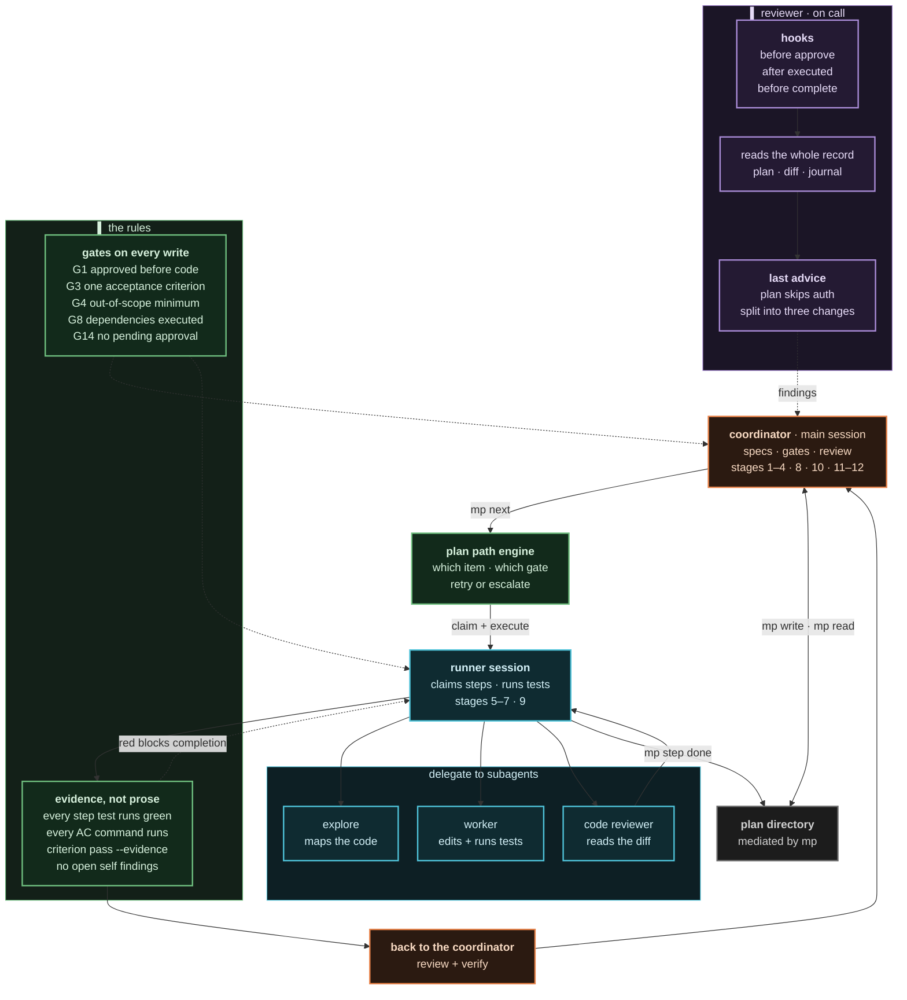

# Diagrams

Visual maps of the system: who does what, in which order, and which gate stops
them. Everything here is [Mermaid](https://mermaid.js.org), so it renders in
Obsidian, GitHub, and any Mermaid-aware renderer — and it diffs cleanly because
it is text.

| File | Shows |
|------|-------|
| [`README.md`](./README.md) | The agent console — the whole picture in one graph, plus the color legend |
| [`agent-roles.md`](./agent-roles.md) | Roles, skills, delegation, and the three-pane autopilot topology |
| [`flow-and-gates.md`](./flow-and-gates.md) | The 12-stage timeline, the lifecycle state machine, and the gates on every edge |
| [`cli-and-plan.md`](./cli-and-plan.md) | `mp` vs `raul`, the inside of `mp`, intake lanes, and the plan directory |

Every diagram uses the same palette, so a color means the same thing everywhere:

| Color | Meaning |
|-------|---------|
| 🟠 orange | coordinator — plans the spec, runs the external review |
| 🔵 cyan | runner — executes steps, remediates findings |
| 🟣 violet | reviewer rail — reads everything, writes findings only |
| 🟢 green | gates and the path engine — the rules, not the work |
| 🟡 amber | human — `raul`, approvals, escalation |
| ⚪ gray | the store — the plan directory and its journal |

---

## The agent console

The whole system in one graph. Read it top-down: the coordinator decides, the
path engine picks the next drivable item, a runner session executes it,
evidence comes back, and an independent reviewer — never the same session —
signs off before anything reaches `complete`.

Four things worth noticing:

1. **The plan directory has no inbound edge from a human.** Nothing but `mp`
   writes it. `raul` is a renderer, not an editor.
2. **The reviewer never shares a session with the runner.** That separation is
   the entire trust model — it is why `complete` is reachable only through
   `mp reviews pass`, never through `complete` alone.
3. **The path engine is a gate, not a worker.** It answers *what is drivable
   now*; it never edits code.
4. **Evidence flows back, claims do not.** An AC is passed by running its
   verification command, not by asserting that it would pass.

The store itself, and the split between the two CLIs, is in
[`cli-and-plan.md`](./cli-and-plan.md).

## Related reading

- [`../agent-guide/`](../agent-guide/) — orientation plus per-workflow detail
- [`../milestones/`](../milestones/) — the lifecycle, the gates, the milestone anatomy
- [`../skills/`](../skills/) — what each shipped skill teaches an agent
- [`../mp/commands.md`](../mp/commands.md) — the full command surface
- [`../raul/`](../raul/) — the seven lanes and their key bindings
