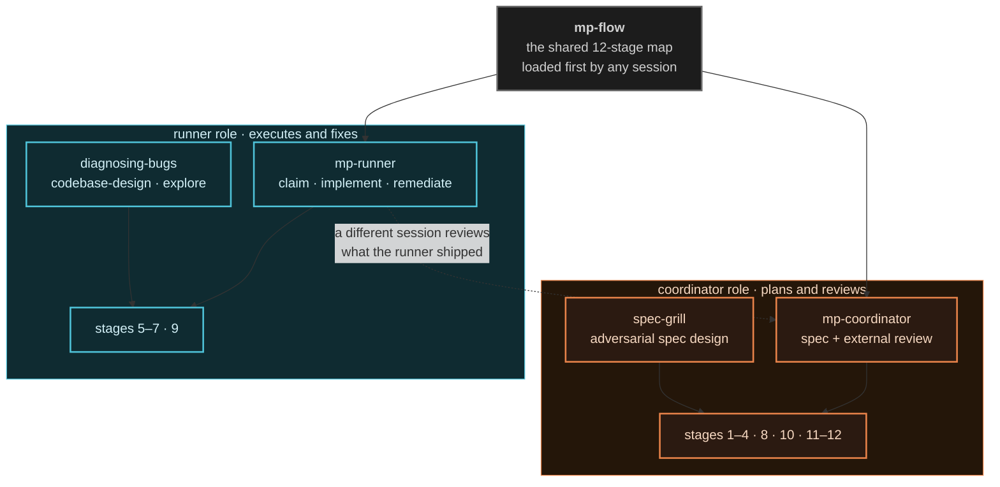
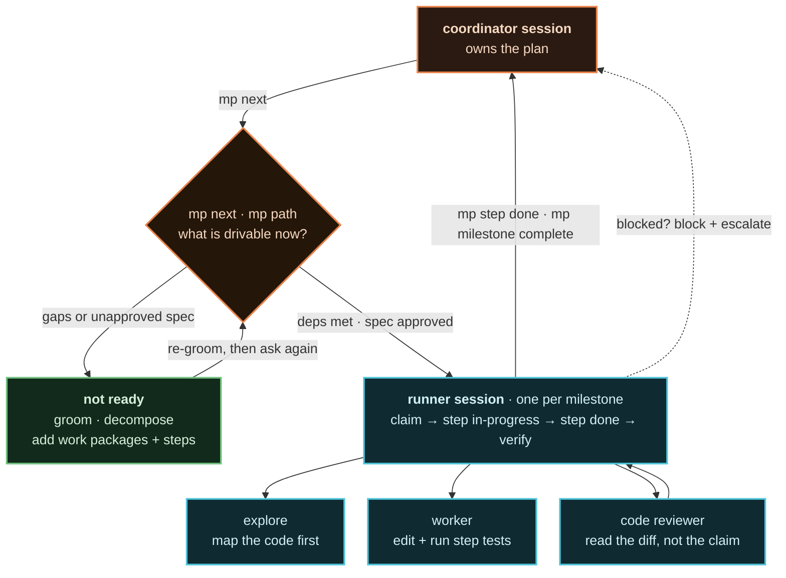
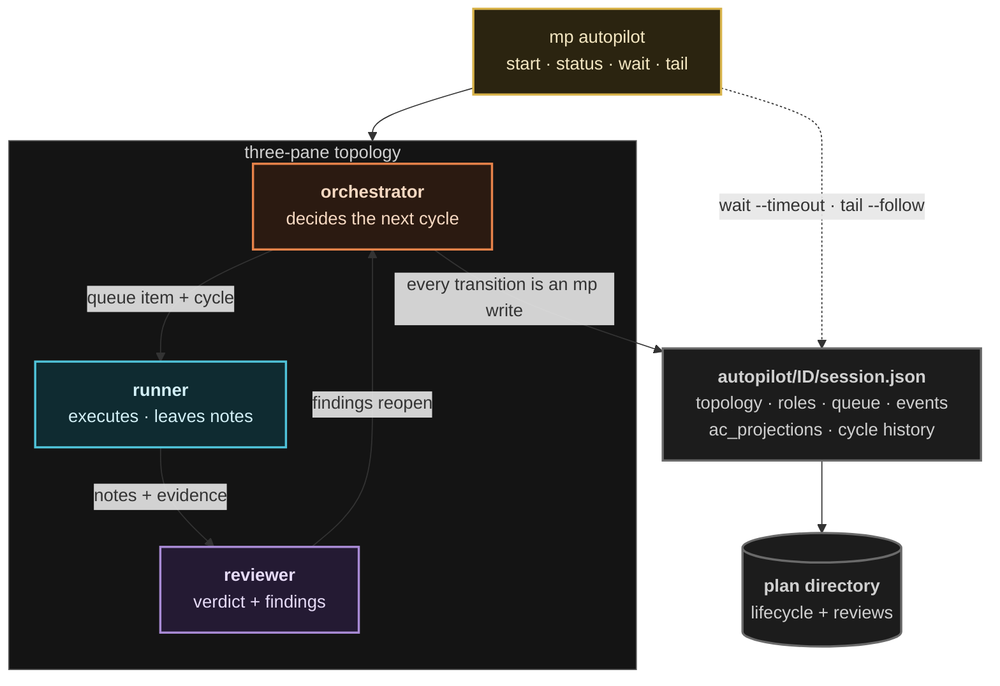

# Roles, delegation, and topology

Who holds which role, what skill teaches it, and how work fans out from one
coordinator session to many runners and their subagents.

Related: [`README.md`](./README.md) for the console view,
[`flow-and-gates.md`](./flow-and-gates.md) for the stage timeline.

---

## Two agents, two roles, one shared map

The system is deliberately small: a **coordinator** that plans and reviews, a
**runner** that executes and fixes, and the `mp-flow` skill both load so they
share the same 12-stage map. The split exists for one reason — the agent that
executes a milestone must not be the agent that reviews it.

| Role | Owns | Never does |
|------|------|-----------|
| **Coordinator** | Spec authoring (stages 1–4), external review (8), re-review (10), documenting and hand-off (11–12) | Edit application code during review |
| **Runner** | Execution (5–7) and remediation (9) | Approve its own spec or sign off on its own work |

> Autopilot sessions use a finer split of the same idea: **orchestrator**
> (cycle decisions) + **runner** + **reviewer**. See
> [the topology below](#autopilot-topology).

---

## How work fans out

One coordinator owns the whole plan. It asks the path engine what is drivable,
hands that item to a runner session, and takes the verified result back. The
runner's own subagents each get one bounded task.

Three escape hatches are load-bearing here:

- **Not drivable yet** → go back to grooming, not forward to coding. A milestone
  without approved specs has no executable path.
- **Blocked** → `mp milestone block --reason` plus escalation. `--force` is
  recorded debt, not a shortcut.
- **One milestone at a time per runner** → a runner session's blast radius is
  its own diff, which is what makes the independent review tractable.

---

## Autopilot topology

`mp autopilot` turns the manual dance into a supervised run: three panes, one
durable session file, and a queue that advances cycle by cycle. The state lives
in `<plan_dir>/autopilot/<id>/session.json`, so a run can be archived, diffed,
and recovered in isolation.

| Piece | What it is |
|-------|------------|
| `topology` | The three panes: `orchestrator`, `runner`, `reviewer` |
| `roles` | Per-role config snapshot, so a re-spawned pane resumes with the same model, harness, and skill |
| `queue` | Ordered milestones with a `stage` and a `cycle` counter per item |
| `role_state` | Per-role `idle` / `starting` / `working` / `blocked` / `done` |
| `runner_notes` | Typed handoffs from runner to reviewer — the structured version of "here's what I did" |
| `events` | The journal `mp autopilot tail` streams, one compact object per line |
| `ac_projections` | Per-AC status the verifier reads without re-deriving it |

Two knobs decide how patiently a run waits on a slow agent:
`--prompt-settle-ms` (how long a harness must report idle *continuously* before
a prompt lands — a fresh pane's TUI is still booting) and
`agent.automation.stall_timeout_minutes` (how long a stalled runner is tolerated
— the timer only accrues while the runner is *not* working, so a long build is
never mistaken for a hang).

---

## Skill catalog

| Skill | Category | Teaches |
|-------|----------|---------|
| `mp-flow` | core | The 12-stage timeline and which role owns each stage |
| `mp-coordinator` | core | Spec authoring, external review, re-review, hand-off |
| `mp-runner` | core | Claiming steps, implementing, self-review, remediation |
| `spec-grill` | catalog | Multi-round adversarial questioning before a spec is written |
| `mp-orchestrator` | catalog | Autopilot cycle decisions and state writes |
| `mp-reviewer` | catalog | Autopilot independent verification and verdict writes |
| `codebase-design` | catalog | Deep-module vocabulary: small interface, clean seam |
| `diagnosing-bugs` | catalog | Build a tight feedback loop first, then bisect and instrument |

`core` skills deploy on a bare `mp install`. `catalog` skills are opt-in with
`mp install --skills <id>`.

See [`../skills/`](../skills/) for the full manifests and authoring rules.
