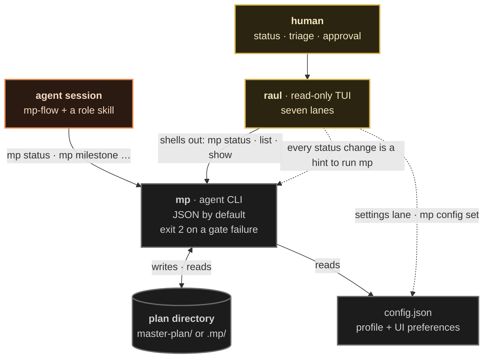
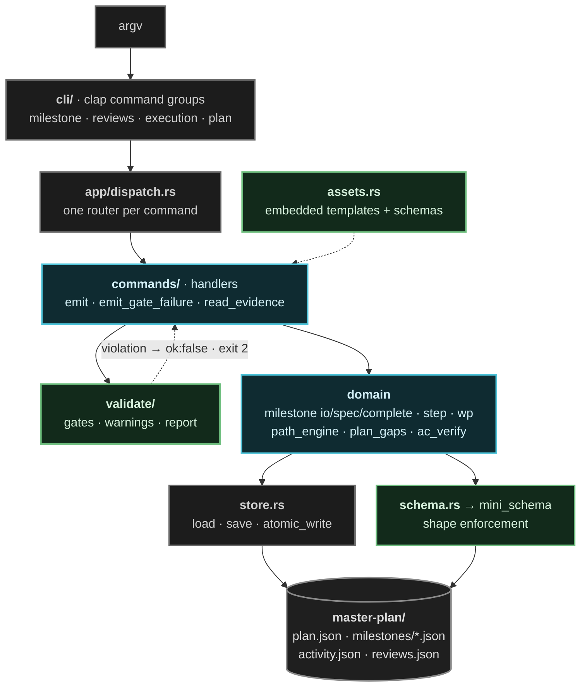
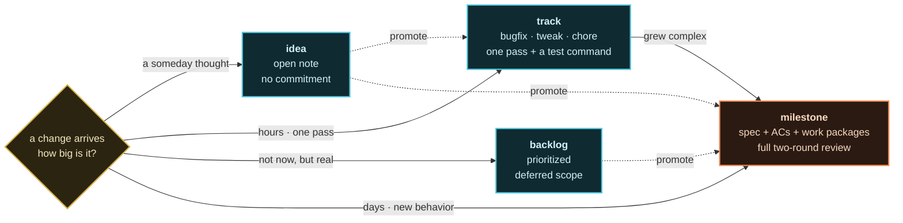
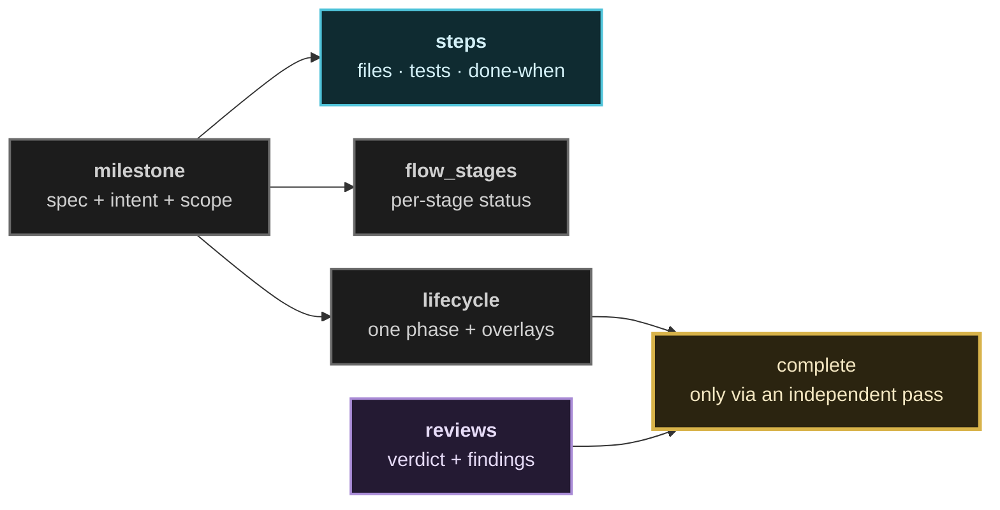

# The CLIs and the plan directory

`mp` is the agent's instrument, `raul` is the human's window, and the plan
directory is the only state either of them has. This file shows how they
connect, what happens inside `mp`, and how a change finds its lane.

Related: [`README.md`](./README.md) for the console view,
[`../mp/commands.md`](../mp/commands.md) for every command.

---

## Two CLIs, two audiences, one store

The routing rule is non-negotiable: agents speak to `mp` and get JSON; humans
launch `raul` and get a TUI. `raul` never writes plan files — every status
change it offers is a hint to run the equivalent `mp` command.

Two consequences fall out of the picture, and both are load-bearing:

- **`raul` is always consistent with `mp`.** There is no second data path — it
  renders the same JSON the agent reads, so a view can never drift from the plan.
- **`raul` needs `mp` on `PATH`.** Without it, it falls back to defaults and
  shows an empty plan rather than inventing data.

---

## Inside `mp`

Argument in, validated write out. The layering is a single downward flow, and
`store.rs` is the only seam that touches the filesystem.

The output contract is uniform, which is what lets `raul`, scripts, and agents
all consume the same commands:

| Shape | When |
|-------|------|
| `{ "ok": true, … }` | the write landed |
| `{ "ok": false, "errors": [ … ] }` | a gate or a schema rejected it — **exit code 2** |
| JSON (default) | every read; add `--fields 'a.b,c[].d'` to project |
| `--summary` | rollups instead of full documents |

---

## Intake lanes

Not every change deserves a full milestone. Four lanes, sized by commitment.

| Lane | Commitment | External review |
|------|------------|-----------------|
| `idea` | none — a parked thought | no |
| `track` | minutes to hours, one pass | no — low blast radius |
| `backlog` | deferred, promotable later | no |
| `milestone` | days, full spec | **yes** — higher risk earns the loop |

A track that outgrows itself is promoted to a milestone and inherits the full
flow, so the cheap lane never becomes a place where risky work hides.

---

## The plan directory

One resource per file, so a write is a targeted write and a diff is readable.
`mp` owns all of it.

| Path | Holds |
|------|-------|
| `plan.json` | project config, the milestone index, adoption order and pins |
| `config.json` | workflow profile — `full` / `hybrid` / `session` — plus UI preferences |
| `milestones/<nn>-<slug>.json` | one self-contained milestone: spec, acceptance criteria, work packages, steps, stage map |
| `tracks/` | `bugfix` / `tweak` / `chore` item lists |
| `backlog.json` | formally deferred scope |
| `ideas.json` | parked ideas |
| `brief.json` | project brief topics from the first planning session |
| `decisions.json` | decision records |
| `annotations.json` | review requests, approval requests, notes |
| `reviews.json` + `reviews/` | verdicts, findings, challenge sessions |
| `activity.json` | the journal: who did what, when |
| `autopilot/<id>/session.json` | one autopilot run, self-contained and archivable |
| `archive/` | soft-deleted milestones and backlog items |
| `AGENTS.md` | generated session-start instructions for agents |

A milestone is a small document with four parts, and they are read by different
consumers — which is why the stage map is stored rather than derived:

`flow_stages` is the single source of truth for *which stage* a milestone is
on — both the CLI overview rollup and the TUI stage cell read it, so the two
views cannot disagree.

> Plans created by older versions carry TOML artifacts. `mp` detects them and
> refuses to initialize over them, pointing at the migration example rather than
> mixing formats in one directory.

---

## Related reading

- [`../mp/README.md`](../mp/README.md) — global flags and output conventions
- [`../mp/config.md`](../mp/config.md) — profiles and every config key
- [`../raul/README.md`](../raul/README.md) — the seven lanes and key bindings
- [`../../ARCHITECTURE.md`](../../ARCHITECTURE.md) — the module map, in prose
