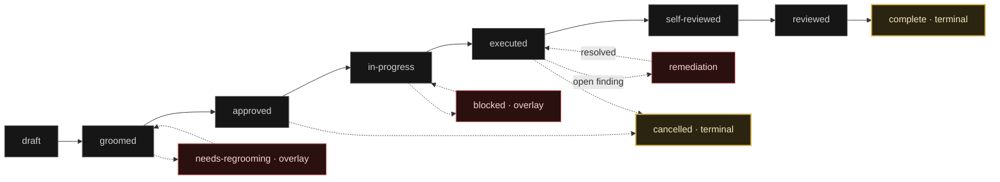
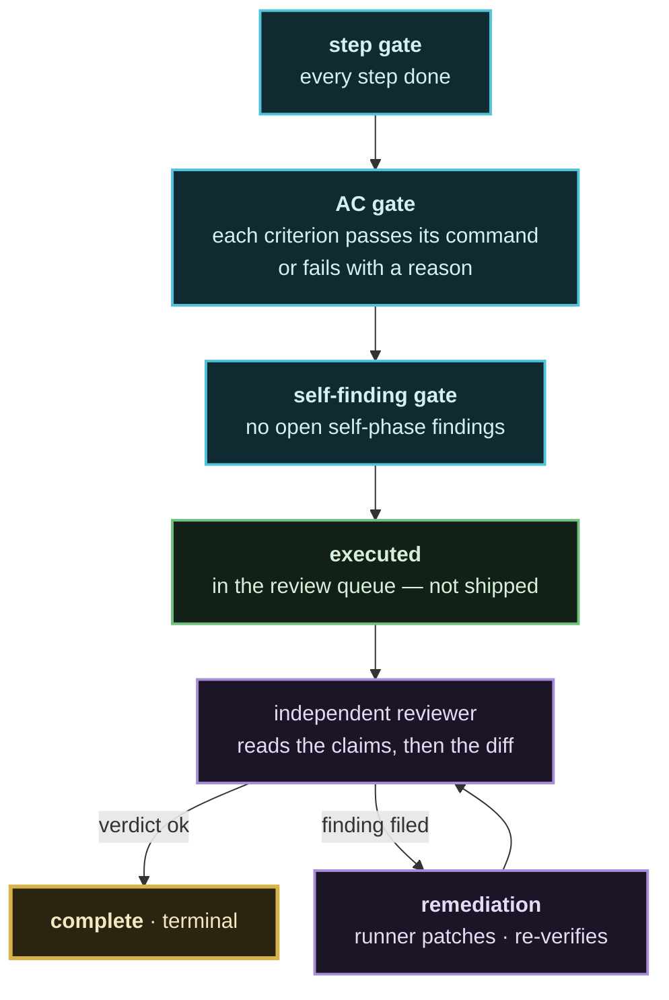
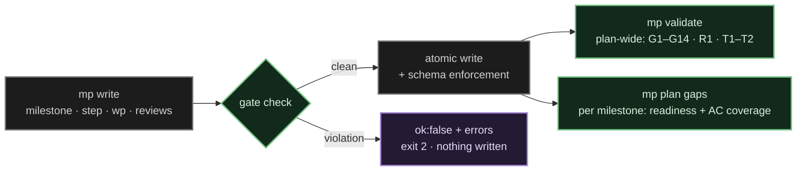

# Flow stages and gates

The 12-stage timeline an agent walks a milestone through, the lifecycle state
machine underneath it, and the checks that stand on every edge.

Related: [`agent-roles.md`](./agent-roles.md) for who owns each stage,
[`../milestones/lifecycle.md`](../milestones/lifecycle.md) for the prose version.

---

## The 12-stage timeline

Stages 1–4 are spec authoring, 5–7 are execution, 8–10 are the two-round
review, and 11–12 close out. The role binding is not a convention — the stage
manifest that ships with the `mp-flow` skill is lint-locked against the skill
document, so a stage cannot be renamed in one place and left stale in the other.

```mermaid
%%{init: {"flowchart": {"wrappingWidth": 300, "nodeSpacing": 28, "rankSpacing": 42}} }%%
flowchart LR

  subgraph SPEC["spec · coordinator"]
    S1["1 · Draft<br/>interview → create"]
    S2["2 · Groom<br/>decompose · challenge"]
    S3["3 · Specify<br/>lock the spec"]
    S4["4 · Approve<br/>lifecycle approved"]
    S1 --> S2 --> S3 --> S4
  end

  subgraph EXEC["execute · runner"]
    S5["5 · Claim & execute<br/>step in-progress → done"]
    S6["6 · Self-review<br/>self-phase findings"]
    S7["7 · Complete<br/>executed, not shipped"]
    S5 --> S6 --> S7
  end

  S4 --> S5

  class S1,S2,S3,S4 coord
  class S5,S6,S7 run

  style SPEC fill:#241609,stroke:#e8834a,stroke-width:1px,color:#f7d9c2
  style EXEC fill:#0f2b31,stroke:#4fc3d9,stroke-width:1px,color:#d3f0f7

  classDef coord fill:#2b1a11,stroke:#e8834a,stroke-width:2px,color:#f7d9c2
  classDef run fill:#0f2b31,stroke:#4fc3d9,stroke-width:2px,color:#d3f0f7
  classDef rev fill:#241a33,stroke:#a98bd6,stroke-width:2px,color:#e6dbf7
  classDef gate fill:#122a1b,stroke:#6fbf7f,stroke-width:2px,color:#d6f0dc
  classDef human fill:#2b2410,stroke:#d8b34a,stroke-width:2px,color:#f4e7c2
  classDef done fill:#2b2410,stroke:#d8b34a,stroke-width:3px,color:#f4e7c2
  classDef store fill:#1c1c1c,stroke:#6a6a6a,stroke-width:2px,color:#d0d0d0
```

Stage 7 lands on `executed` — in the review queue, **not** shipped. From there
the two-round review takes over, and it is the only road to stage 11:

```mermaid
%%{init: {"flowchart": {"wrappingWidth": 300, "nodeSpacing": 28, "rankSpacing": 42}} }%%
flowchart LR

  S7["7 · Complete<br/>executed, not shipped"]

  subgraph REVIEW["two-round review"]
    S8["8 · External review<br/>verify the claims"]
    S9["9 · Remediate<br/>patch each finding"]
    S10["10 · Re-review<br/>reviews pass"]
    S8 --> S9 --> S10
  end

  subgraph CLOSE["close out · coordinator"]
    S11["11 · Document<br/>capture the lesson"]
    S12["12 · Hand off<br/>commit · next"]
    S11 --> S12
  end

  S7 --> S8
  S10 -->|"clean"| S11
  S10 -->|"new findings"| S9

  class S8,S10,S11,S12 coord
  class S9 run
  class S7 done

  style REVIEW fill:#1b1526,stroke:#a98bd6,stroke-width:1px,color:#e6dbf7
  style CLOSE fill:#241609,stroke:#e8834a,stroke-width:1px,color:#f7d9c2

  classDef coord fill:#2b1a11,stroke:#e8834a,stroke-width:2px,color:#f7d9c2
  classDef run fill:#0f2b31,stroke:#4fc3d9,stroke-width:2px,color:#d3f0f7
  classDef rev fill:#241a33,stroke:#a98bd6,stroke-width:2px,color:#e6dbf7
  classDef gate fill:#122a1b,stroke:#6fbf7f,stroke-width:2px,color:#d6f0dc
  classDef human fill:#2b2410,stroke:#d8b34a,stroke-width:2px,color:#f4e7c2
  classDef done fill:#2b2410,stroke:#d8b34a,stroke-width:3px,color:#f4e7c2
  classDef store fill:#1c1c1c,stroke:#6a6a6a,stroke-width:2px,color:#d0d0d0
```

| Stages | Owner | Commands it runs |
|-------:|-------|------------------|
| 1–4 | coordinator | `mp interview checklist`, `mp milestone create --json @-`, `mp milestone groom`, `mp milestone decompose`, `mp milestone challenge …`, `mp milestone set-spec-status … ready`, `mp milestone approve` |
| 5–7 | runner | `mp milestone set-status … in-progress`, `mp milestone step done`, `mp milestone criterion pass --evidence`, `mp milestone complete` |
| 8–10 | coordinator → runner → coordinator | `mp reviews finding list`, `mp reviews finding add --phase external`, `mp reviews finding resolve`, `mp milestone verify`, `mp reviews pass` |
| 11–12 | coordinator | `mp note add`, `git commit` |

The loop is 8 → 9 → 10: a re-review that finds new findings returns to
remediation. A clean re-review is the only road to stage 11.

---

## The lifecycle underneath

Each milestone sits in exactly one lifecycle phase. Four *overlays* — blocked,
deferred, cancelled, needs-regrooming — are separate fields that can ride along
with any phase; they are not phases themselves.

`complete` and `cancelled` are the only terminal phases. The executor's end
state is `executed`, deliberately distinct from `complete`: "the work finished"
is not "the work shipped".

---

## What "executed" actually requires

`milestone complete` is a gate, not a label flip — and passing it does not
finish the job, it queues the milestone for independent review.

| Gate | Rule |
|------|------|
| **G1** | `in-progress` requires `approved` or later — no code before the spec is approved |
| **G3** | Promoting to review requires at least one acceptance criterion |
| **G4** | Promoting to review requires the configured minimum out-of-scope items |
| **G8** | Every `depends_on` milestone must be executed before this one starts |
| **G14** | A pending `approval-request` annotation blocks the milestone |
| **AC completion** | Each criterion is `pass`ed with non-prose evidence, or `fail`ed with a reason |

Three permanent rules ride on top of the gates:

- **Never complete on red tests.** A step's `tests` value is a gate, not a
  suggestion — non-`manual:` values are executed from the project root.
- **`--force` is recorded debt.** It stores a reason and leaves visible evidence
  of the bypass; a force-bypassed milestone cannot reach `complete` until the
  bypass is resolved or explicitly accepted.
- **Evidence is test output, not prose.** Record the test name and its exit
  code. "Test X verifies Y" is a claim, not evidence.

---

## Where the gates run

`mp validate` is plan-wide integrity (shape, index drift, annotation rules).
`mp plan gaps` is per-milestone execution readiness (missing work packages, AC
coverage). The overlap on an empty `step.tests` is intentional: `validate`
enforces it, `plan gaps` reports it as something to groom.

