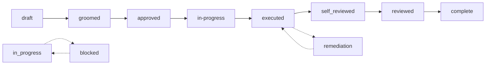

# Milestones

A milestone is the **primary unit of work** in master-plan — a single JSON
document owned by `mp` that captures one crafted prompt from intent through
shipping. Every step, every acceptance criterion, every review finding lives
on the milestone; the agent drives the lifecycle forward by running `mp`
commands, never by hand-editing the file.

This folder consolidates what was previously split across
`docs/milestone-details/` and `docs/milestone-lifecycle/`:

| File | Covers |
|------|--------|
| [`anatomy.md`](./anatomy.md) | Every part of a milestone document — field, purpose, how to mutate it |
| [`lifecycle.md`](./lifecycle.md) | The canonical state machine — phases, transitions, gates, overlays |
| [`planning.md`](./planning.md) | `draft → groomed → approved` — the spec stage in detail |
| [`execution.md`](./execution.md) | `in-progress → executed` — the runner's stage in detail |
| [`review.md`](./review.md) | `executed → complete` + `remediation` — the two-round review loop |

## What is a milestone?

A milestone is one JSON document with a fixed shape. It answers three
questions:

1. **What are we doing?** — `intent`, `problem`, `scope`, `acceptance_criteria`
2. **How will we do it?** — `work_packages`, `steps`, `design_decisions`
3. **What happened?** — `verification`, `findings`, `open_questions`

The lifecycle field rides alongside the document and tells you *which*
question is currently active: planning (draft → approved), execution
(in-progress → executed), or review (executed → complete).

```
milestone document
├── milestone          ← identity + lifecycle + meta
├── intent             ← outcome (one sentence)
├── problem            ← why this is needed
├── scope              ← in_scope / out_of_scope boundaries
├── acceptance_criteria[] ← observable, verifiable proof points
├── design_decisions[] ← trade-offs worth recording
├── open_questions[]   ← unresolved items (must clear before approval)
├── work_packages[]    ← implementation groupings
├── steps[]            ← the implementation plan
├── verification       ← completion stamp (date/branch/evidence)
├── findings[]         ← review feedback + remediation record
└── delta              ← brownfield change descriptor (optional)
```

Every field is documented in [`anatomy.md`](./anatomy.md). The full state
machine — what transitions are legal, what gates block them, what overlays
sit on top — is in [`lifecycle.md`](./lifecycle.md).

## The lifecycle at a glance

Eight canonical phases in the forward path, plus the two-round review
sub-loop and a `remediation` overlay that loops back to `executed`:



| Phase | What happens | Who drives it |
|-------|--------------|---------------|
| `draft` | Spec exists but is rough | Coordinator (planner) |
| `groomed` | Spec is interview-checked, gap-free | Coordinator (groomer) |
| `approved` | Spec is approved; ready to implement | Human (approver) |
| `in-progress` | Actively being implemented | Runner |
| `executed` | All steps done + ACs verified with evidence | Runner |
| `self-reviewed` | Executor self-reviewed their work | Runner |
| `reviewed` | Independent review passed, no findings | Reviewer (different session) |
| `complete` | **Terminal.** Verified + reviewed | — |

`complete` and `cancelled` are the only terminal states. `cancelled` can be
reached from any non-terminal phase and is irreversible (restore from
archive to re-open).

> **Vocabulary note:** `executed` is the canonical name for the
> executor's end-state (renamed from `done` so it could not be
> confused with the terminal-reviewed `complete`). Step status remains
> `done` — only the *milestone* lifecycle was renamed. The legacy `done`
> string is still accepted for read compatibility during the migration
> window.

For the full state machine — legal transitions, gates (G1/G3/G4/G8/G14),
overlay semantics, and the `mp` commands that drive each phase — see
[`lifecycle.md`](./lifecycle.md).

## Where each part of the doc is edited

| Phase | Relevant doc parts |
|-------|--------------------|
| **Planning** (`draft → groomed → approved`) | `intent`, `problem`, `scope`, `acceptance_criteria`, `open_questions`, `design_decisions` |
| **Execution** (`in-progress → executed`) | `work_packages`, `steps`, `verification`, per-step `evidence`, per-AC `evidence` |
| **Review** (`executed → complete`) | `findings`, `verification` (re-stamped on re-review) |
| **Brownfield** (any phase) | `delta` — change descriptor (added/modified/removed) |

Each row is one *job to be done*, not a workflow you have to follow in
order. A milestone can be captured in a single `mp milestone create`
(providing JSON), then grown by `mp milestone ac add`, `mp milestone
step add`, `mp milestone design-decision add`, etc. — fragment commands
that touch one element at a time. Don't rebuild the document; let `mp`
keep it valid.

## Reading milestones efficiently

You rarely need the whole document:

```bash
# One field path
mp show milestone 42 --fields 'milestone.lifecycle,steps[].status'

# Health rollup
mp show milestone 42 --summary

# One AC
mp milestone ac show 42 AC-03

# One step
mp milestone step show 42 S2

# Find something
mp search "config validation" --type ac --include object
```

Project specific paths instead of loading the whole document — it keeps
agent context small and your scripts fast.

## Where the human stays

The agent handles:
- Running `mp` commands
- Writing valid JSON to the plan directory
- Composing, grooming, and self-reviewing prompts
- Generating evidence (commands, exit codes)

The human stays at:
- Scope decisions — *"this is two milestones, not one"*
- Approval gates — *"ship it"*
- Ambiguity resolution — *"the AC for password strength — what's the policy?"*
- Cross-prompt integration — *"does this break the migration we're planning?"*

The fewer seams you take, the more autonomy the agent has. The more
seams you take, the more control you keep. master-plan supports either.

## See also

- [`../workflows/`](../workflows/) — concrete prompt recipes for the
  human-facing day-to-day flow
- [`../agent-guide/`](../agent-guide/) — orientation the agent reads at
  session start
- [`../mp/commands.md`](../mp/commands.md) — full `mp` command surface