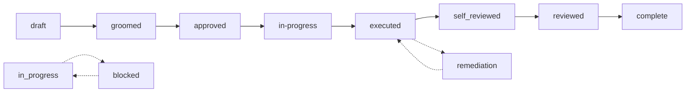

# The milestone lifecycle

A milestone is in **exactly one** lifecycle phase at any time. Lifecycle is a
single linear field (`milestone.lifecycle`); a few orthogonal *overlays*
(`blocked`, `deferred`, `cancelled`, `needs_regrooming`) ride alongside it
without being lifecycle values themselves.

The phase is owned by the milestone document. **Two-round review** (runner
self-review + external review) is a separate discipline driven by the
**review registry** (`mp reviews …`), not by the plain lifecycle setters.

## Lifecycle phases

| Phase | Meaning | Who puts it here |
|-------|---------|------------------|
| `draft` | Spec exists but is incomplete/rough | `milestone create` (default) |
| `groomed` | Spec is interview-checked and gap-free | `milestone set-spec-status review` |
| `approved` | Spec is approved; ready to implement | `milestone approve` |
| `in-progress` | Actively being implemented | `milestone set-status in-progress` |
| `executed` | All steps done + ACs verified | `milestone complete` (executor gate) |
| `self-reviewed` | Executor self-reviewed their work | review registry |
| `reviewed` | Independent review passed, no findings | `reviews pass --verdict ok` |
| `complete` | **Terminal.** Verified + reviewed | `reviews pass` auto-promotes `executed → complete` |
| `remediation` | Review found issues; re-opened to fix | filing an open external finding (auto) |

> **Vocabulary note:** the executor's end-state was renamed from
> `done` to `executed` so the "work finished" state is unambiguously
> distinct from the terminal-reviewed `complete` state. Step status
> remains `done` (a *step* is finished; the *milestone* is executed).
> The legacy `done` string is still accepted for read compatibility
> during the migration window; new writes always emit `executed`.

> **Vocabulary note:** `self-reviewed` and `reviewed` are review-flow
> states recorded via the reviews registry. They are intentionally NOT
> produced by milestone transition setters (block/unblock/defer/complete/
> reopen); the reviews subcommand owns those rungs.

`complete` and `cancelled` are the only terminal states. A terminal milestone
cannot transition further except in narrow, deliberate cases (a migration
escape hatch).

## The forward path

The review sub-path (`executed → self-reviewed → reviewed → complete`) is
driven by the **review registry**, not by the plain lifecycle setters. In
practice:

1. The executor runs `milestone complete` (after self-verifying all steps and
   ACs) → the milestone moves to `executed` and enters the review queue.
2. An **independent** reviewer (a different session/context than the executor)
   verifies the claims against the diff and tests.
3. `reviews pass --verdict ok` records the verdict and promotes the milestone
   to `complete` (terminal) when verified. A finding opened in review routes
   the milestone into `remediation`.

See [`./review.md`](./review.md) for the full review + remediation flow.

## Phase-by-phase detail

- [`./planning.md`](./planning.md) — `draft → groomed → approved`
- [`./execution.md`](./execution.md) — `in-progress → executed`
- [`./review.md`](./review.md) — `executed → complete`, plus `remediation`,
  `block`/`unblock`, `defer`, and `cancel`

## Orthogonal overlays

These are separate fields on the milestone, not lifecycle values. They
can coexist with any lifecycle phase.

| Overlay | Set by | Cleared by |
|---------|--------|------------|
| `blocked` (+ `blocked_at`, `block_reason`, `blocked_by`) | `milestone block --reason …` | `milestone unblock` |
| `deferred` (+ `deferred_reason`) | `milestone defer --reason …` | `milestone reopen` |
| `cancelled` (+ `cancelled_at`, `cancel_reason`) | `milestone set-status cancelled` | — (terminal; restore from archive instead) |
| `needs_regrooming` | validation when a previously-approved spec drifts | re-running `groom` |

## Legacy fields (`spec_status` / `execution_status`)

Older plans carry two legacy fields alongside `lifecycle`. They are read-only
views derived from the canonical phase:

| `lifecycle` | legacy `spec_status` | legacy `execution_status` |
|-------------|----------------------|---------------------------|
| `draft` | `draft` | `planned` |
| `groomed` | `review` | `planned` |
| `approved` | `ready` | `planned` |
| `in-progress` | `ready` | `in-progress` |
| `executed` / `self-reviewed` / `remediation` | `implemented` | `done` / `done` / `in-progress` |
| `reviewed` / `complete` | `verified` | `done` |

Setters that write `lifecycle` keep the legacy aliases in sync automatically, so
both views agree. Prefer reading `lifecycle` in new code/scripts; use the legacy
fields only when an older consumer expects them.

## Gates that guard transitions

`mp validate` (and the mutation commands themselves) enforce these gates. They
exist to stop inconsistent plans before they're written.

| Gate | Rule |
|------|------|
| **G1** | `in-progress` requires `lifecycle` of `approved` or later (i.e. the spec is approved before work starts) |
| **G3** | Promoting to `review` requires at least one acceptance criterion |
| **G4** | Promoting to `review` requires the configured minimum out-of-scope items (`full` = 2, `hybrid` = 1) |
| **G8** | Before execution, every `depends_on` milestone must be `executed` |
| **G14** | Pending `approval-request` annotations block the milestone |

Gate minimums are configurable: `planning.require_min_out_of_scope` and
`planning.require_min_acceptance_criteria`. See
[`../mp/config.md`](../mp/config.md).

## MP-flow stages

Separate from the lifecycle, each milestone also carries a
`flow_stages` map — a per-stage status of the 12-stage mp-flow timeline:

| # | Stage slug | Label | Maps to lifecycle |
|--:|------------|-------|-------------------|
| 1 | `draft` | Define outcome | `draft` |
| 2 | `groom` | Interview & shape | `groomed` |
| 3 | `specify` | Write acceptance | `groomed` |
| 4 | `approve` | Approve spec | `approved` |
| 5 | `execute` | Claim & execute | `in-progress` |
| 6 | `self-review` | Self-review | `executed` / `self-reviewed` |
| 7 | `complete` | Mark complete | `executed` |
| 8 | `external-review` | External review | `reviewed` |
| 9 | `remediate` | Remediate findings | `remediation` |
| 10 | `re-review` | Re-review | `remediation` |
| 11 | `document` | Document | `complete` |
| 12 | `hand-off` | Hand-off | `complete` |

Each stage carries a `status` (`pending` / `in_progress` / `done` / `skipped`)
plus an optional RFC3339 `at` timestamp. The mp-side overview rollup and the
raul `Stage` cell both read this map; `flow_stages` is the single source of
truth for "which stage is this milestone on." Pre-flow-stages milestones fall back to
[``legacy_lifecycle_to_mp_flow_stage`](https://github.com/lthiagol/master-plan)
so the dashboard grid doesn't dump them into `draft`.

## What "executed" actually requires

`milestone complete` is an honest gate, not a label flip:

1. **Step gate** — every step must be `done`.
2. **AC gate** — every acceptance criterion must be `pass`ed with non-prose
   evidence (a test name + exit code, a command), or `fail`ed with a reason.
   `--force` records a bypass in evidence (creates visible debt); `--skip-verify`
   skips both AC and step verification entirely (records `[skip-verify]`).
3. **Self-finding gate** — no open *self-phase* findings may remain.

Honest completion is what makes the review queue trustworthy. See
[`./execution.md`](./execution.md).